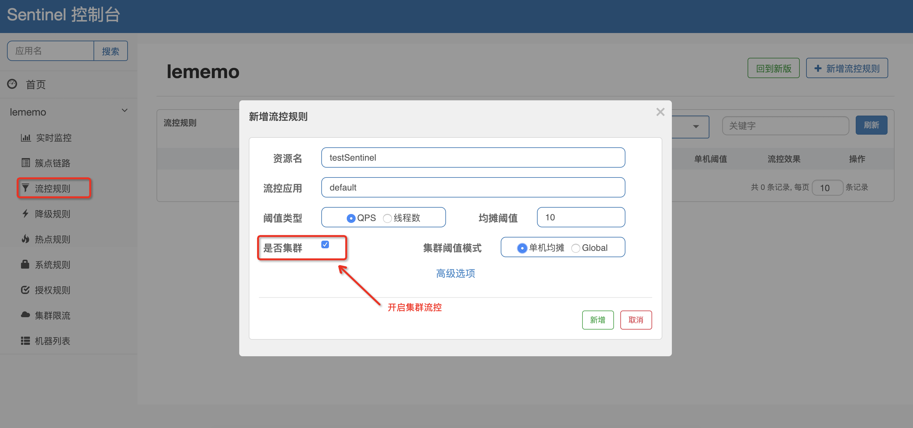
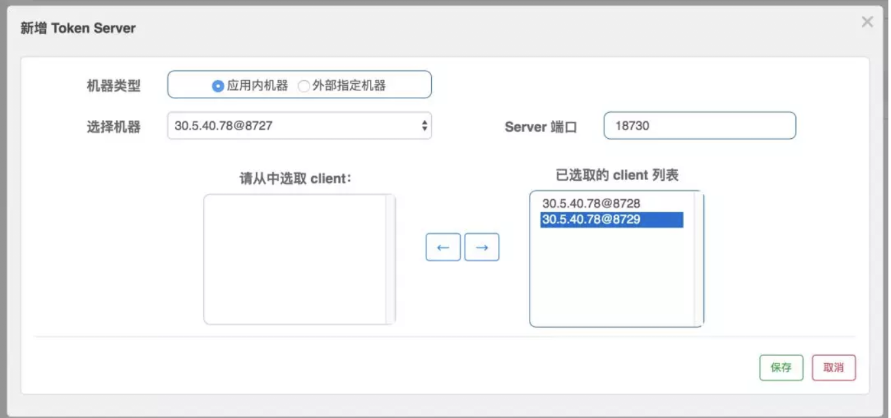
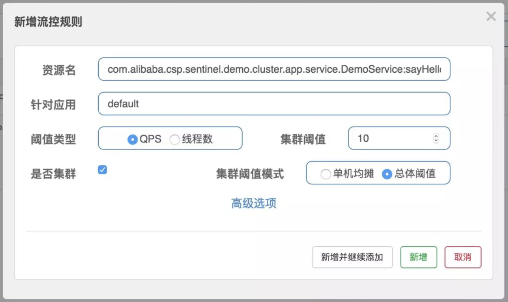

# Sentinel实战：在集群中实现流控

我们已经知道如何为应用接入限流了，但是到目前为止，这些还只是在单机应用中生效。也就是说，假如你的应用有多个实例，那么你设置了限流的规则之后，每一台应用的实例都会生效相同的流控规则，如下图所示：


假设我们设置了一个流控规则，qps是10，那么就会出现如上图所示的情况，当qps大于10时，实例中的 sentinel 就开始生效了，就会将超过阈值的请求 block 掉。

上图好像没什么问题，但是细想一下，我们可以发现还是会有这样的问题：

- 假设集群中有 10 台机器，我们给每台机器设置单机限流阈值为 10 qps，理想情况下整个集群的限流阈值就为 100 qps。不过实际情况下路由到每台机器的流量可能会不均匀，会导致总量没有到的情况下某些机器就开始限流。
- 每台单机实例只关心自己的阈值，对于整个系统的全局阈值大家都漠不关心，当我们希望为某个 api 设置一个总的 qps 时(就跟为 api 设置总的调用次数一样)，那这种单机模式的限流就无法满足条件了。

基于种种这些问题，我们需要创建一种集群限流的模式，这时候我们很自然地就想到，可以找一个 server 来专门统计总的调用量，其它的实例都与这台 server 通信来判断是否可以调用。这就是最基础的集群流控的方式。


## 原理

集群限流的原理很简单，和单机限流一样，都需要对 qps 等数据进行统计，区别就在于单机版是在每个实例中进行统计，而集群版是有一个专门的实例进行统计。

这个专门的用来统计数据的称为 Sentinel 的 token server，其他的实例作为 Sentinel 的 token client 会向 token server 去请求 token，如果能获取到 token，则说明当前的 qps 还未达到总的阈值，否则就说明已经达到集群的总阈值，当前实例需要被 block，如下图所示：


集群流控是在 Sentinel 1.4 的版本中提供的新功能，和单机流控相比，集群流控中共有两种身份：

- token client：集群流控客户端，用于向所属 token server 通信请求 token。集群限流服务端会返回给客户端结果，决定是否限流。
- token server：即集群流控服务端，处理来自 token client 的请求，根据配置的集群规则判断是否应该发放 token（是否允许通过）。

而单机流控中只有一种身份，每个 sentinel 都是一个 token server。

需要注意的是，集群限流中的 token server 是单点的，一旦 token server 挂掉，那么集群限流就会退化成单机限流的模式。在 ClusterFlowConfig 中有一个参数 fallbackToLocalWhenFail 就是用来确定当 client 连接失败或通信失败时，是否退化到本地的限流模式的。

Sentinel 集群流控支持限流规则和热点规则两种规则，并支持两种形式的阈值计算方式：

- **集群总体模式**：即限制整个集群内的某个资源的总体 qps 不超过此阈值。
- **单机均摊模式**：单机均摊模式下配置的阈值等同于单机能够承受的限额，token server 会根据连接数来计算总的阈值（比如独立模式下有 3 个 client 连接到了 token server，然后配的单机均摊阈值为 10，则计算出的集群总量就为 30），按照计算出的总的阈值来进行限制。这种方式根据当前的连接数实时计算总的阈值，对于机器经常进行变更的环境非常适合。

### 部署方式

token server 有两种部署方式：

- 一种是独立部署，就是单独启动一个 token server 服务来处理 token client 的请求，如下图所示：


如果独立部署的 token server 服务挂掉的话，那其他的 token client 就会退化成本地流控的模式，也就是单机版的流控，所以这种方式的集群限流需要保证 token server 的高可用性。

- 一种是嵌入部署，就是在多个 sentinel-core 中选择一个实例设置为 token server，随着应用一起启动，其他的 sentinel-core 都是集群中 token client，如下图所示：


嵌入式部署的模式中，如果 token server 服务挂掉的话，我们可以将另外一个 token client 升级为token server来，当然啦如果我们不想使用当前的 token server 的话，也可以选择另外一个 token client 来承担这个责任，并且将当前 token server 切换为 token client。Sentinel 为我们提供了一个 api 来进行 token server 与 token client 的切换：

```http
http://<ip>:<port>/setClusterMode?mode=<xxx>
```

其中 mode 为 `0` 代表 client，`1` 代表 server，`-1` 代表关闭。

**PS：注意应用端需要引入集群限流客户端或服务端的相应依赖。**


## 如何使用

下面我们来看一下如何快速使用集群流控功能。接入集群流控模块的步骤如下：

### 引入依赖

这里我们以嵌入模式来运行 token server，即在应用集群中指定某台机器作为 token server，其它的机器指定为 token client。

首先我们引入集群流控相关依赖：

``` xml
<dependency>
    <groupId>com.alibaba.csp</groupId>
    <artifactId>sentinel-cluster-client-default</artifactId>
    <version>1.4.1</version>
</dependency>
<dependency>
    <groupId>com.alibaba.csp</groupId>
    <artifactId>sentinel-cluster-server-default</artifactId>
    <version>1.4.1</version>
</dependency>
```


### 监听规则源

要想使用集群流控功能，我们需要在应用端配置动态规则源，并通过 Sentinel 控制台实时进行推送。如下图所示：


#### 集群客户端

以流控规则为例，假设我们使用 ZooKeeper 作为配置中心，则可以向集群客户端的 FlowRuleManager 或 ParamFlowRuleManager 注册 ZooKeeper 动态规则源：

``` java
ReadableDataSource<String, List<FlowRule>> flowRuleDataSource = new ZookeeperDataSource<>(remoteAddress, path, source -> JSON.parseObject(source, new TypeReference<List<FlowRule>>() {}));
FlowRuleManager.register2Property(flowRuleDataSource.getProperty());
```

**PS：FlowRuleManager 是管理普通限流的，ParamFlowRuleManager 是管理热点参数限流的**

**另外，我们还需要针对 token server 注册集群规则数据源。**

#### 集群服务端

token server 抽象出了命名空间（namespace）的概念，可以支持多个应用/服务，因此我们需要通过 ClusterFlowRuleManager 注册一个可以自动根据 namespace 创建动态规则源的生成器，即 Supplier。

Supplier 会根据 namespace 生成类型为 SentinelProperty<List\<FlowRule>> 的动态规则源，不同的 namespace 对应着不同的规则源，若不指定 namespace ，则默认为为应用名：${project.name} 的值。

ClusterFlowRuleManager 中是这样注册 Supplier 的：

``` java
setPropertySupplier(Function<String, SentinelProperty<List<FlowRule>>> propertySupplier)
```

参数接收的是一个 Function 的函数式接口，提供一个 String，则生成一个 SentinelProperty。

假设我们也用 ZooKeeper 作为集群服务端的配置中心，则可以这样注册一个 Supplier：

``` java
ClusterFlowRuleManager.setPropertySupplier(namespace -> {
    ReadableDataSource<String, List<FlowRule>> flowRuleDataSource = 
        new ZookeeperDataSource<>(remoteAddress, path+"/"+namespace, source -> JSON.parseObject(source, new TypeReference<List<FlowRule>>() {}));
    return flowRuleDataSource.getProperty();
});
```

**PS：ClusterFlowRuleManager 针对集群限流规则，ClusterParamFlowRuleManager 针对集群热点规则，配置方式类似。**

当集群限流服务端 namespace set 产生变更时，Sentinel 会自动针对新加入的 namespace 生成动态规则源并进行自动监听，并删除旧的不需要的规则源。


### 改造控制台推送动态规则

我们需要对 Sentinel 控制台进行简单的改造来将流控规则推送至配置中心。

从 Sentinel 1.4.0 开始，Sentinel 控制台提供了 DynamicRulePublisher 和 DynamicRuleProvider  接口用于实现应用维度的规则推送和拉取，并提供了 Nacos 推送的示例（位于 test 目录下）。

我们只需要实现自己的 DynamicRulePublisher 和 DynamicRuleProvider接口并在 FlowControllerV2类中相应位置通过 @Qualifier注解指定对应的 bean name 即可，类似于：

``` java
@Autowired
@Qualifier("flowRuleNacosProvider")
private DynamicRuleProvider<List<FlowRuleEntity>> ruleProvider;

@Autowired
@Qualifier("flowRuleNacosPublisher")
private DynamicRulePublisher<List<FlowRuleEntity>> rulePublisher;
```

Sentinel 控制台提供应用维度推送的页面（/v2/flow）。

在上述配置完成后，我们可以在此页面向配置中心推送规则：




### 在控制台中设置 token server

当上面的步骤都完成后，我们就可以在 Sentinel 控制台的“集群限流”页面中的 token server 列表页面管理分配 token server 了。假设我们启动了三个应用实例，我们选择一个实例为 token server，其它两个为 token client：



页面上机器的显示方式为 ip@commandPort，其中 `commandPort` 为应用端暴露给 Sentinel 控制台的端口。选择好以后，点击【保存】按钮，刷新页面即可以看到 token server 分配成功：


并且我们可以在页面上查看 token server 的连接情况：


### 配置并推送规则

接下来我们配置一条集群限流规则，限制 

`com.alibaba.csp.sentinel.demo.cluster.app.service.DemoService:sayHello(java.lang.String)` 

 资源的集群总 qps 为 10，选中“是否集群”选项，阈值模式选择总体阈值：




### 查看效果

模拟流量同时请求这三台机器，过一段时间后观察效果。

可以在监控页面看到对应资源的集群维度的总 qps 稳定在 10，如下图所示：


## 注意事项

集群流控能够精确地控制整个集群的 qps，结合单机限流兜底，可以更好地发挥流量控制的效果。

还有更多的场景等待大家发掘，比如：

- 在 API Gateway 处统计某个 api 的总访问量，并对某个 api 或服务的总 qps 进行限制
- Service Mesh 中对服务间的调用进行全局流控
- 集群内对热点商品的总访问频次进行限制

尽管集群流控比较好用，但它不是万能的，只有在确实有必要的场景下才推荐使用集群流控。

另外若在生产环境使用集群限流，管控端还需要关注以下的问题：

- Token Server 自动管理（分配/选举 Token Server）
- Token Server 高可用，在某个 server 不可用时自动 failover 到其它机器


## 我的公众号

如果你觉得该项目对您有帮助，欢迎您关注我的公众号「逅弈逐码」，了解更多原创文章。


