# Sentinel实战：在集群中实现流控

我们已经知道如何为应用接入限流了，但是到目前为止，这些还只是在单机应用中生效。也就是说，假如你的应用有多个实例，那么你设置了限流的规则之后，每一台应用的实例都会生效相同的流控规则，如下图所示：

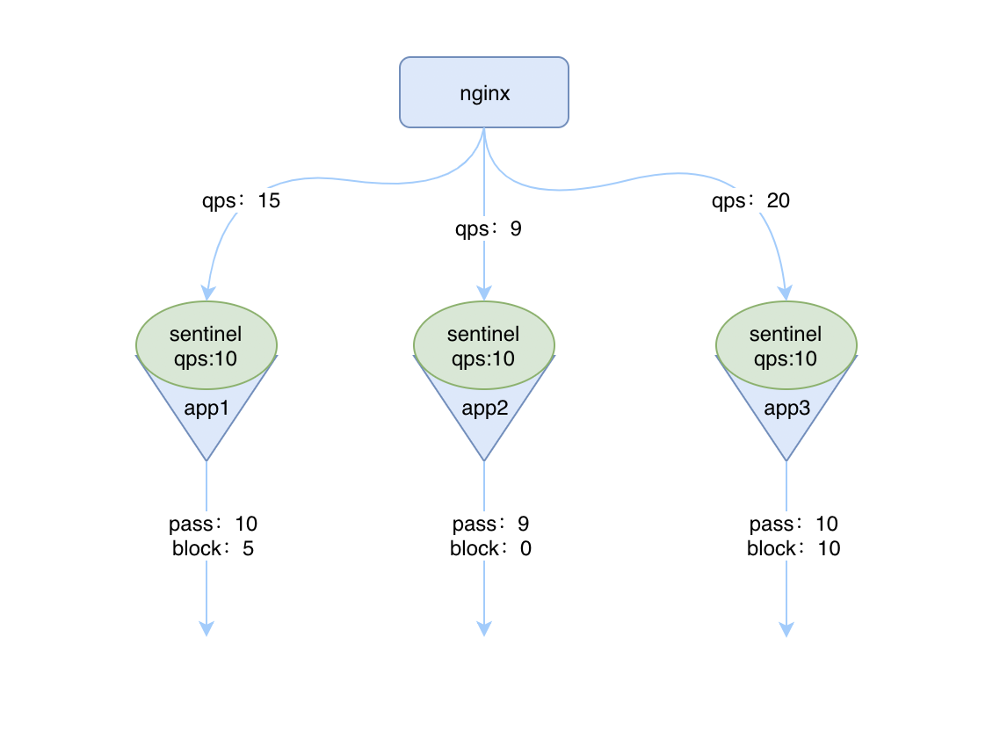

假设我们设置了一个流控规则，qps是10，那么就会出现如上图所示的情况，当qps大于10时，实例中的 sentinel 就开始生效了，就会将超过阈值的请求 block 掉。

上图好像没什么问题，但是细想一下，我们可以发现还是会有这样的问题：

- 假设集群中有 10 台机器，我们给每台机器设置单机限流阈值为 10 qps，理想情况下整个集群的限流阈值就为 100 qps。不过实际情况下路由到每台机器的流量可能会不均匀，会导致总量没有到的情况下某些机器就开始限流。
- 每台单机实例只关心自己的阈值，对于整个系统的全局阈值大家都漠不关心，当我们希望为某个 api 设置一个总的 qps 时(就跟为 api 设置总的调用次数一样)，那这种单机模式的限流就无法满足条件了。

基于种种这些问题，我们需要创建一种集群限流的模式，这时候我们很自然地就想到，可以找一个 server 来专门统计总的调用量，其它的实例都与这台 server 通信来判断是否可以调用。这就是最基础的集群流控的方式。


## 原理

集群限流的原理很简单，和单机限流一样，都需要对 qps 等数据进行统计，区别就在于单机版是在每个实例中进行统计，而集群版是有一个专门的实例进行统计。

这个专门的用来统计数据的称为 Sentinel 的 token server，其他的实例作为 Sentinel 的 token client 会向 token server 去请求 token，如果能获取到 token，则说明当前的 qps 还未达到总的阈值，否则就说明已经达到集群的总阈值，当前实例需要被 block，如下图所示：

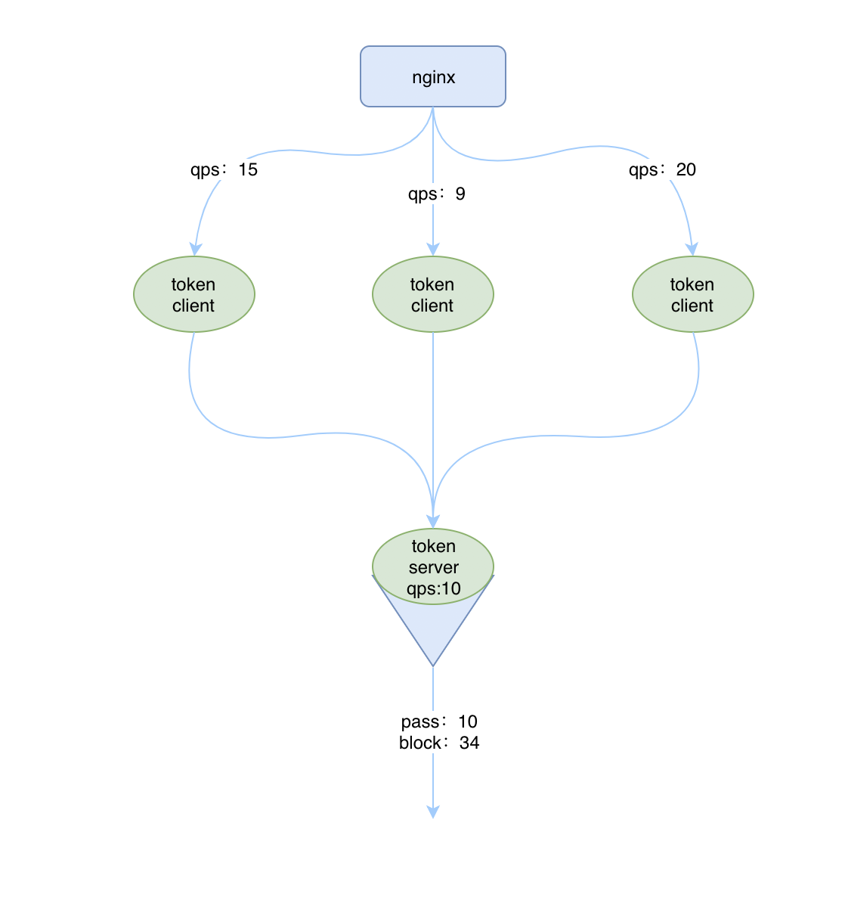

集群流控是在 Sentinel 1.4 的版本中提供的新功能，和单机流控相比，集群流控中共有两种身份：

- token client：集群流控客户端，用于向所属 token server 通信请求 token。集群限流服务端会返回给客户端结果，决定是否限流。
- token server：即集群流控服务端，处理来自 token client 的请求，根据配置的集群规则判断是否应该发放 token（是否允许通过）。

而单机流控中只有一种身份，每个 sentinel 都是一个 token server。

需要注意的是，集群限流中的 token server 是单点的，一旦 token server 挂掉，那么集群限流就会退化成单机限流的模式。在 ClusterFlowConfig 中有一个参数 fallbackToLocalWhenFail 就是用来确定当 client 连接失败或通信失败时，是否退化到本地的限流模式的。

Sentinel 集群流控支持限流规则和热点规则两种规则，并支持两种形式的阈值计算方式：

- **集群总体模式**：即限制整个集群内的某个资源的总体 qps 不超过此阈值。
- **单机均摊模式**：单机均摊模式下配置的阈值等同于单机能够承受的限额，token server 会根据连接数来计算总的阈值（比如独立模式下有 3 个 client 连接到了 token server，然后配的单机均摊阈值为 10，则计算出的集群总量就为 30），按照计算出的总的阈值来进行限制。这种方式根据当前的连接数实时计算总的阈值，对于机器经常进行变更的环境非常适合。

### 部署方式

token server 有两种部署方式：

- 一种是独立部署，就是单独启动一个 token server 服务来处理 token client 的请求，如下图所示：

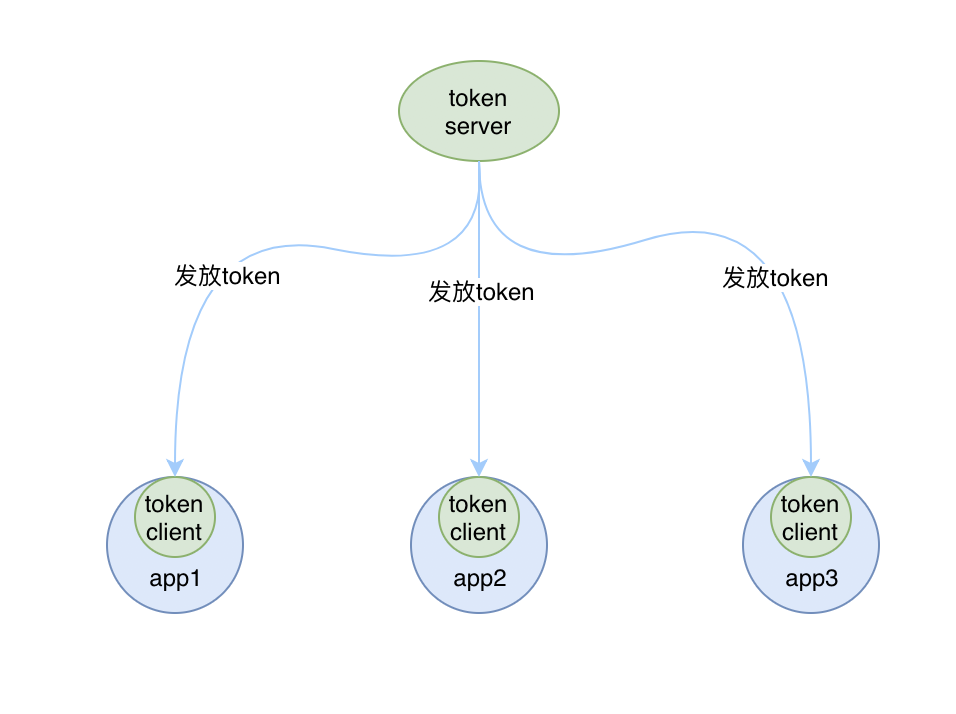

如果独立部署的 token server 服务挂掉的话，那其他的 token client 就会退化成本地流控的模式，也就是单机版的流控，所以这种方式的集群限流需要保证 token server 的高可用性。

- 一种是嵌入部署，就是在多个 sentinel-core 中选择一个实例设置为 token server，随着应用一起启动，其他的 sentinel-core 都是集群中 token client，如下图所示：

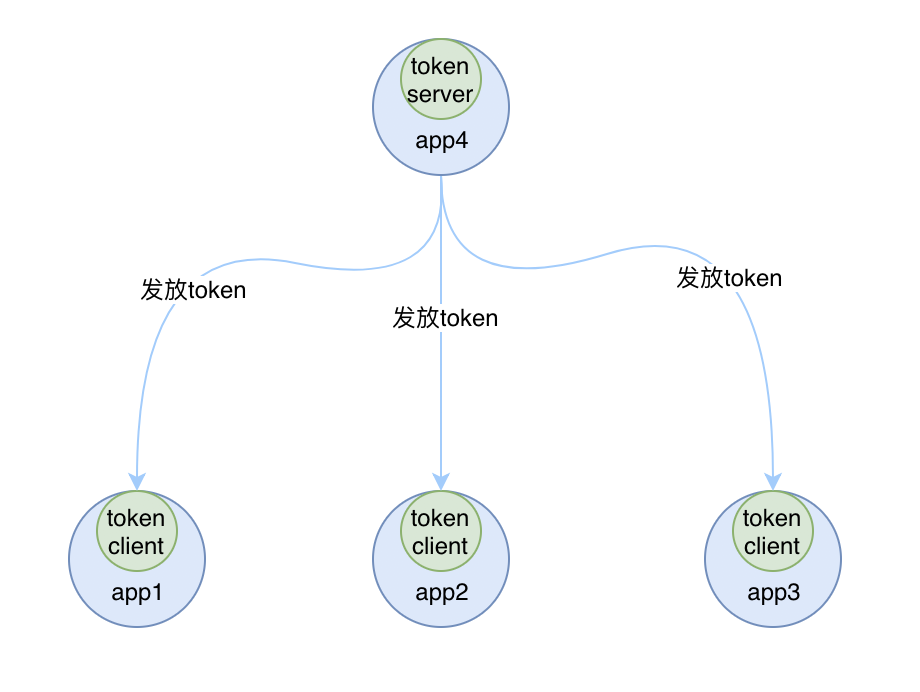

嵌入式部署的模式中，如果 token server 服务挂掉的话，我们可以将另外一个 token client 升级为token server来，当然啦如果我们不想使用当前的 token server 的话，也可以选择另外一个 token client 来承担这个责任，并且将当前 token server 切换为 token client。Sentinel 为我们提供了一个 api 来进行 token server 与 token client 的切换：

```http
http://<ip>:<port>/setClusterMode?mode=<xxx>
```

其中 mode 为 `0` 代表 client，`1` 代表 server，`-1` 代表关闭。

**PS：注意应用端需要引入集群限流客户端或服务端的相应依赖。**


## 如何使用

本文示例代码在：http://github.com/all4you/sentinel-tutorial/sentinel-practice/sentinel-cluster-flow-control 章节

下面我们来看一下如何快速使用集群流控功能。接入集群流控模块的步骤如下：

### 启动配置中心

要想使用集群流控功能，我们需要在应用端配置动态规则源，并通过 Sentinel 控制台实时进行推送。如下图所示：

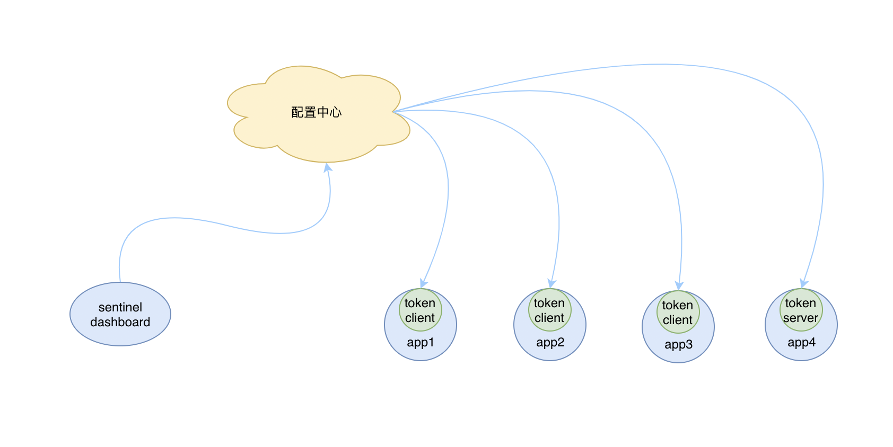

本次我们通过 Nacos 作为我们的规则源的配置中心，首先我们先下载 Nacos 然后在本地启动一个 Nacos 的服务，我是通过源码编译的 Nacos 服务：

```sh
## 解压源码
unzip nacos-master.zip
cd nacos-master
## 编译可执行文件
mvn -Prelease-nacos clean install -U
## 进入编译好的可执行文件中启动服务
cd distribution/target/nacos-server-0.8.0/nacos/bin
sh startup.sh -m standalone
```

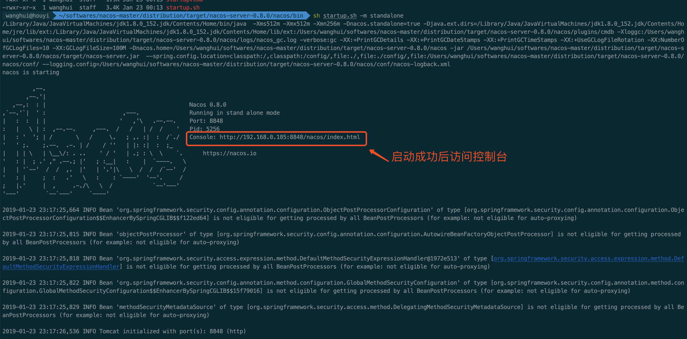

如上图所示，启动成功后，我们可以访问 Nacos 的控制台来进行控制了：

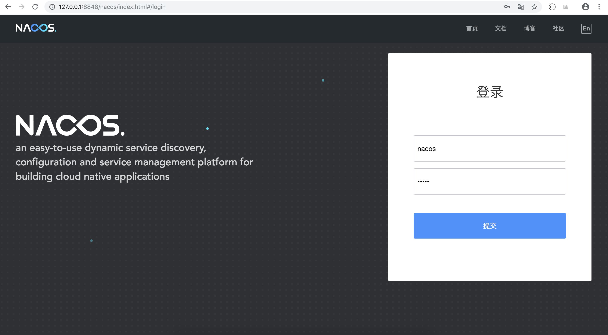

**PS：控制台默认的用户名，密码都是：nacos**


### 启动服务端

这里我们以独立模式来运行 token server，即单独启动某台机器作为 token server，其它的机器为 token client。

#### 引入服务端依赖

首先我们引入集群流控服务端所需的相关依赖：

``` xml
<dependencies>
    <dependency>
        <groupId>com.alibaba.csp</groupId>
        <artifactId>sentinel-transport-simple-http</artifactId>
        <version>1.4.1</version>
    </dependency>
    <dependency>
        <groupId>com.alibaba.csp</groupId>
        <artifactId>sentinel-cluster-server-default</artifactId>
        <version>1.4.1</version>
    </dependency>
    <dependency>
        <groupId>com.alibaba.csp</groupId>
        <artifactId>sentinel-datasource-nacos</artifactId>
        <version>1.4.1</version>
    </dependency>
    <dependency>
        <groupId>org.apache.logging.log4j</groupId>
        <artifactId>log4j-slf4j-impl</artifactId>
        <version>2.9.1</version>
    </dependency>
</dependencies>
```

#### 服务端配置

引入了依赖之后，就需要创建一个 ClusterTokenServer 的实例了，然后启动该实例。不过要启动 ClusterTokenServer 还需要先做一些配置，包括 namespace 和 ServerTransportConfig。

##### 手动载入配置

手动载入 namespace 和 ServerTransportConfig 的配置到 ClusterServerConfigManager 中，如下列代码所示：

``` java
private static final int CLUSTER_SERVER_PORT = 11111;
private static final String APP_NAME = "appA";
// 加载namespace
ClusterServerConfigManager.loadServerNamespaceSet(Collections.singleton(APP_NAME));
// 加载ServerTransportConfig
ClusterServerConfigManager.loadGlobalTransportConfig(new ServerTransportConfig()
        .setIdleSeconds(600)
        .setPort(CLUSTER_SERVER_PORT));
```

载入了这些配置到 ClusterServerConfigManager 中之后，ClusterTokenServer 在启动的时候，就会去 ClusterServerConfigManager 获取启动所需的配置信息。

##### 注册监听器(可选)

如果 ClusterTokenServer 启动之后想要更新一些设置，例如我想更换一个 namespace 或者我想更新 ServerTransportConfig，那该怎么办呢，这时我们可以通过为他们注册一个 SentinelProperty ，将配置信息保存到配置中心，当配置中心中的内容发生变更时，SentinelProperty 会通过 PropertyListener 来通知到 SentinelProperty 的注册方，此时就可以动态的更新配置信息了。

为 namespace 注册一个 SentinelProperty：

``` java
String namespaceSetDataId = "cluster-server-namespace-set";
// 初始化一个配置 namespace 的 Nacos 数据源
ReadableDataSource<String, Set<String>> namespaceDs = 
    new NacosDataSource<>(REMOTE_ADDRESS, GROUP_ID,
        namespaceSetDataId, source -> JSON.parseObject(source, new TypeReference<Set<String>>() {}));
ClusterServerConfigManager.registerNamespaceSetProperty(namespaceDs.getProperty());
```

为 ServerTransportConfig 注册一个 SentinelProperty：

``` java
String serverTransportDataId = "cluster-server-transport-config";
// 初始化一个配置服务端通道配置的 Nacos 数据源
ReadableDataSource<String, ServerTransportConfig> transportConfigDs = 
    new NacosDataSource<>(REMOTE_ADDRESS,
        GROUP_ID, serverTransportDataId,
        source -> JSON.parseObject(source, new TypeReference<ServerTransportConfig>() {}));
ClusterServerConfigManager.registerServerTransportProperty(transportConfigDs.getProperty());
```

以上是通过 Nacos 作为配置中心的，但是这个步骤对于 token server 来说，并不是必须的，只要启动的时候能获取到所需的配置信息即可，不过在实际的场景中配置信息还是要保存在配置中心的。

**PS：如果我们注册了相应的监听器，就需要到具体的配置中心中维护相应的信息，我们这里用的是 Nacos 配置中心，那么我们就需要到 Nacos 中创建具体的配置项。本次模拟我就不进行相应的监听器的注册了，直接通过硬编码把配置项load进去。**

##### 创建动态规则源

token server 抽象出了命名空间（namespace）的概念，可以支持多个应用/服务，因此我们需要通过 ClusterFlowRuleManager 注册一个可以自动根据 namespace 创建动态规则源的生成器，即 Supplier。

Supplier 会根据 namespace 生成类型为 SentinelProperty<List\<FlowRule>> 的动态规则源，不同的 namespace 对应着不同的规则源，若不指定 namespace ，则默认为为应用名：${project.name} 的值。

ClusterFlowRuleManager 中是这样注册 Supplier 的：

```java
setPropertySupplier(Function<String, SentinelProperty<List<FlowRule>>> propertySupplier)
```

参数接收的是一个 Function 的函数式接口，提供一个 String，则生成一个 SentinelProperty。

假设我们用 Nacos 作为集群服务端的配置中心，则可以这样注册一个 Supplier：

```java
private static final String REMOTE_ADDRESS = "localhost";
private static final String GROUP_ID = "SENTINEL_GROUP";
private static final String FLOW_POSTFIX = "-flow-rules";
ClusterFlowRuleManager.setPropertySupplier(namespace -> {
    ReadableDataSource<String, List<FlowRule>> ds = 
        new NacosDataSource<>(REMOTE_ADDRESS,GROUP_ID,namespace+FLOW_POSTFIX, source -> JSON.parseObject(source, new TypeReference<List<FlowRule>>() {}));
    return ds.getProperty();
});
```

**PS：ClusterFlowRuleManager 针对集群限流规则，ClusterParamFlowRuleManager 针对集群热点规则，配置方式类似。**

当集群限流服务端 namespace set 产生变更时，Sentinel 会自动针对新加入的 namespace 生成动态规则源并进行自动监听，并删除旧的不需要的规则源。

假设我们的 namespace 为 appA，那么我们在 Nacos 中创建服务端的动态规则源如下所示：

``` json
[
    {
        "resource" : "cluster-resource",     // 限流的资源名称
        "grade" : 1,                         // 限流模式为：qps
        "count" : 10,                        // 阈值为：10
        "clusterMode" :  true,               // 集群模式为：true
        "clusterConfig" : {
            "flowId" : 111,                  // 全局唯一id
            "thresholdType" : 1,             // 阈值模式伪：全局阈值
            "fallbackToLocalWhenFail" : true // 在 client 连接失败或通信失败时，是否退化到本地的限流模式
        }
    }
]
```

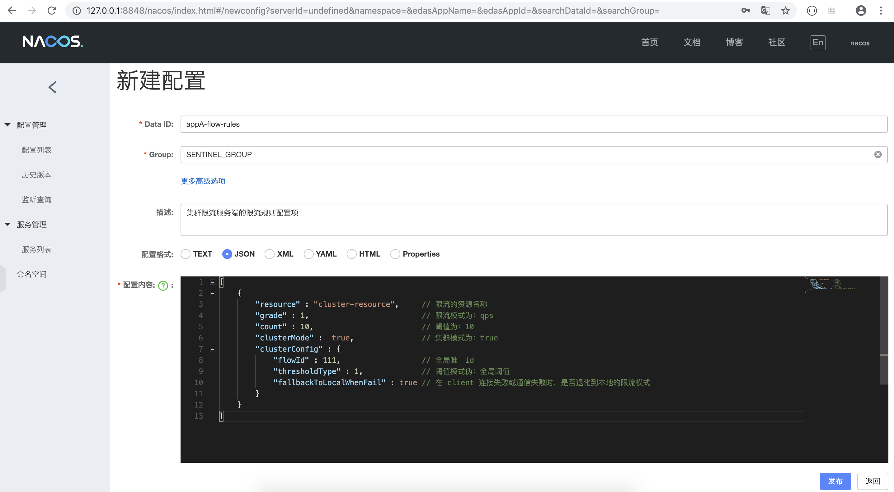

**PS：实际创建的时候，要把内容中的注释去除掉，否则会报错，因为这不是一个合法的json字符串，这里只是用作描述。**

#### 启动TokenServer

以上的所有步骤都完成之后，现在可以创建一个 ClusterTokenServer 实例并且启动它了，如下列代码所示：

``` java
// 创建一个 ClusterTokenServer 的实例，独立模式
ClusterTokenServer tokenServer = new SentinelDefaultTokenServer();
// 启动
tokenServer.start();
```

另外请在启动时加入以下启动参数，让服务端在启动后可以连接上 sentinel-dashboard：

``` java
-Dproject.name=xxx -Dcsp.sentinel.dashboard.server=consoleIp:port
```

Sentinel 中提供了一个默认的以独立方式启动的 ClusterTokenServer 的实现类，但是类的名字起的有点让人疑惑，不是很清晰，我给官方仓库提交了一个 PR ，有兴趣的可以看一下：[#444](https://github.com/alibaba/Sentinel/pull/444)

启动后我们可以在控制台中看到如下信息：

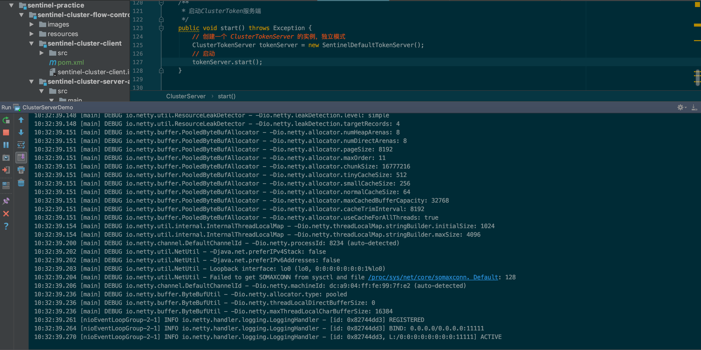

在 ~/logs/csp/sentinel-record.log 日志文件中将打印如下信息：

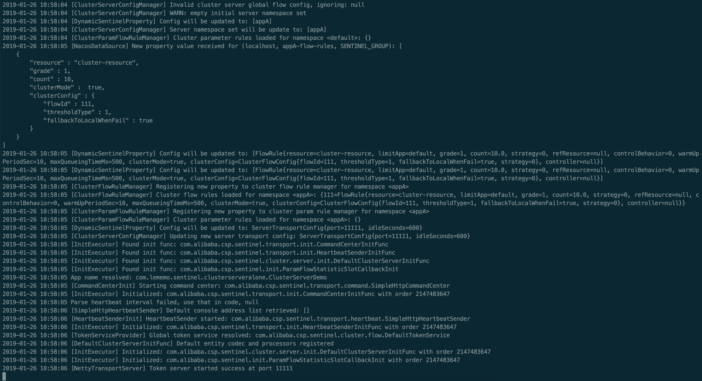


### 启动客户端

token server 启动好之后，就可以启动 token client了，我们启动两个 token client，我以一个为例来描述，另一个类似。

#### 引入客户端依赖

我们先引入集群流控客户端所需的相关依赖：

``` xml
<dependencies>
    <dependency>
        <groupId>com.alibaba.csp</groupId>
        <artifactId>sentinel-transport-simple-http</artifactId>
        <version>1.4.1</version>
    </dependency>
    <dependency>
        <groupId>com.alibaba.csp</groupId>
        <artifactId>sentinel-cluster-client-default</artifactId>
        <version>1.4.1</version>
    </dependency>
    <dependency>
        <groupId>com.alibaba.csp</groupId>
        <artifactId>sentinel-datasource-nacos</artifactId>
        <version>1.4.1</version>
    </dependency>
    <dependency>
        <groupId>org.apache.logging.log4j</groupId>
        <artifactId>log4j-slf4j-impl</artifactId>
        <version>2.9.1</version>
    </dependency>
</dependencies>
```

#### 客户端配置

我们需要为集群客户端指定服务端的 ip 和 port ，这样客户端启动之后就会连接上服务端。我们有三种方式可以设置客户端的配置信息。

- 硬编码

通过硬编码的方式，手动载入，如下列代码所示：

``` java
ClusterClientConfig clientConfig = new ClusterClientConfig();
clientConfig.setServerHost(CLUSTER_SERVER_HOST);
clientConfig.setServerPort(CLUSTER_SERVER_PORT);
ClusterClientConfigManager.applyNewConfig(clientConfig);
```

- 注册动态数据源

通过注册动态数据源，然后设置监听器的方式，自动载入，如下列代码所示：

``` java
String clientConfigDataId = "cluster-client-config";
// 初始化一个配置ClusterClientConfig的 Nacos 数据源
ReadableDataSource<String, ClusterClientConfig> ds = 
    new NacosDataSource<>(REMOTE_ADDRESS, GROUP_ID, clientConfigDataId,
        source -> JSON.parseObject(source, new TypeReference<ClusterClientConfig>() {}));
ClusterClientConfigManager.register2Property(ds.getProperty());
```

- 通过http接口

``` http
http://<ip>:<port>/cluster/client/modifyConfig?data=<config>
```

其中 data 是 JSON 格式的 ClusterClientConfig 对象的值

这里我选择第一，第二两种方式来设置客户端的配置信息。

#### 客户端限流规则

如果客户端和服务端之间的通讯中断，那么集群限流将退化成本地限流，客户端就需要通过本地的限流规则进行流控，所以我们还需要为客户端配置相应的限流规则，官方推荐的做法也是通过注册动态数据源的方式，这里我们仍然以 Nacos 作为我们的数据源来进行配置，如下面的代码所示：

``` java
private static final String APP_NAME = "appA";
private static final String FLOW_POSTFIX = "-flow-rules";
// 使用 Nacos 数据源作为配置中心，需要在 REMOTE_ADDRESS 上启动一个 Nacos 的服务
ReadableDataSource<String, List<FlowRule>> ds = 
    new NacosDataSource<>(REMOTE_ADDRESS, GROUP_ID, APP_NAME+FLOW_POSTFIX,
        source -> JSON.parseObject(source, new TypeReference<List<FlowRule>>() {}));
// 为集群客户端注册动态规则源
FlowRuleManager.register2Property(ds.getProperty());
```

具体的在 Nacos 中创建配置项的步骤，这里就不再继续描述了，服务端的规则如果已经创建过的话，客户端可以直接复用，只需要把 groupId 和 dataId 与服务端的保持一致即可，启动完成后可以通过以下 api 获取系统中的规则：

``` http
http://<ip>:<port>?getRules?type=flow
```

结果如下图所示：

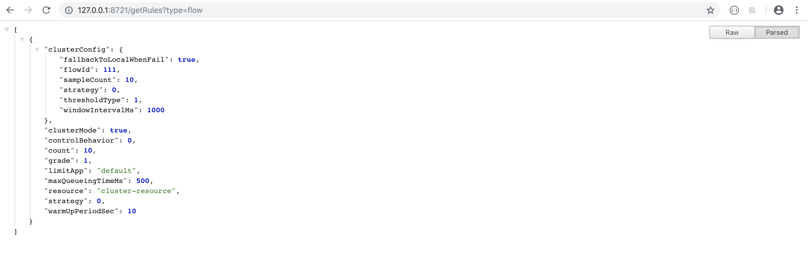

**PS：FlowRuleManager 是管理普通限流的，ParamFlowRuleManager 是管理热点参数限流的**

#### 代码中埋点

当以上的步骤都完成之后，我们就可以在客户端的代码中进行埋点了，然后启动客户端。

另外请在启动时加入以下启动参数，让客户端在启动后可以连接上 sentinel-dashboard：

```java
-Dproject.name=xxx -Dcsp.sentinel.dashboard.server=consoleIp:port
```

埋点的代码如下所示：

``` java
/**
 * 模拟流量请求该方法
 */
@GetMapping("/clusterFlow")
public @ResponseBody
String clusterFlow() {
    Entry entry = null;
    String retVal;
    try{
        entry = SphU.entry(RESOURCE_NAME, EntryType.IN,1);
        retVal = "passed";
    }catch(BlockException e){
        retVal = "blocked";
    }finally {
        if(entry!=null){
            entry.exit();
        }
    }
    return retVal;
}
```

#### 设置客户端模式(可选)

通过 API 将当前集群客户端的模式置为客户端模式：

``` http
http://<ip>:<port>/setClusterMode?mode=<xxx>
```

其中 mode 为 0 代表 client，1 代表 server。如下图所示：

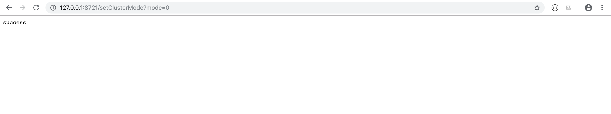

**PS：因为我是在同一台机器上模拟的，集群的服务端已经使用了 8720 的对外 api 端口，所以集群的客户端client1的对外 api 端口是 8721，以此类推 client2 对外的 api 端口为 8721。**

设置成功后，若客户端已经设置了服务端的配置，客户端将会自动连接到远程的 token server。

我们可以在 sentinel-record.log 日志中查看连接的相关日志。

#### 模拟请求

现在我们要来模拟请求，来触发客户端的初始化了，触发完成之后，客户端就会连接上 dashboard 了，执行如下请求：

``` http
http://127.0.0.1:7001/clusterFlow
```

如下图所示：

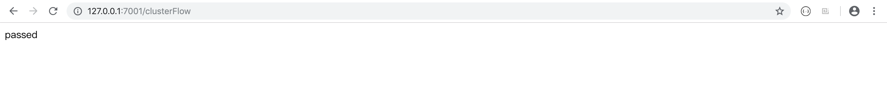


### 在控制台中设置 Token Server 和 Client

当上面的步骤都完成后，我们就可以在 Sentinel 控制台的【集群流控】页面中的 token server 列表页面管理分配 token server 了。

首先先看下 dashboard 中已经连接上来的机器列表吧，如下图所示：

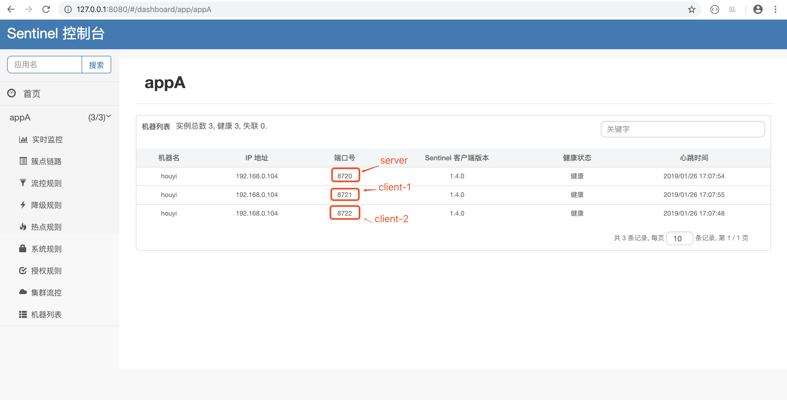

现在我们来创建一个 Token Server ，我启动了三个应用实例，其中 8720 端口对应的实例为 token server，选择 192.168.0.104:8720 这台为服务端，如下图所示：

选择其它两个为 cluster client，如下图所示：

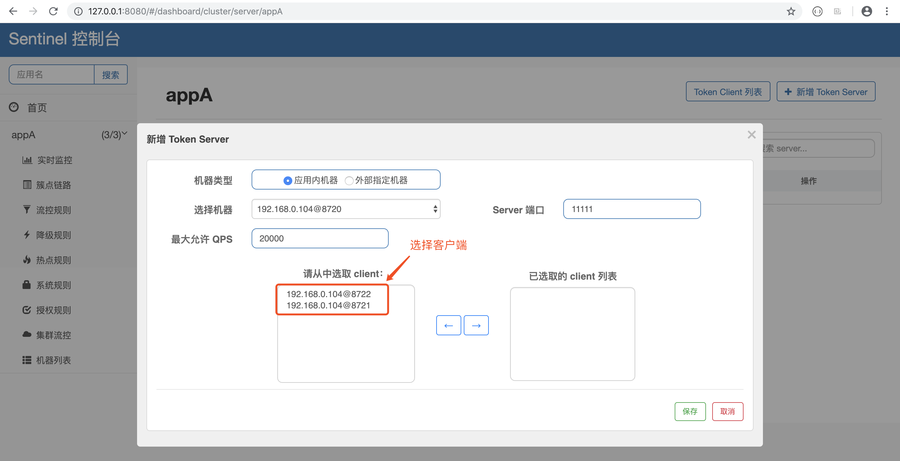

保存后推送，如下图所示：

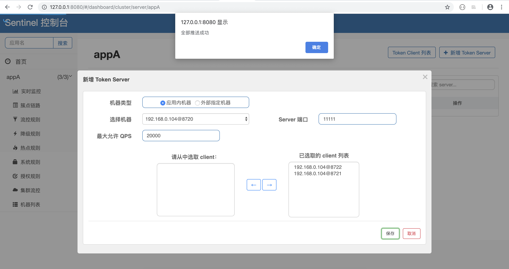

页面上机器的显示方式为 ip@commandPort，其中 commandPort 为应用端暴露给 Sentinel 控制台的端口。

选择好以后，点击【保存】按钮，刷新页面即可以看到 token server 分配成功：

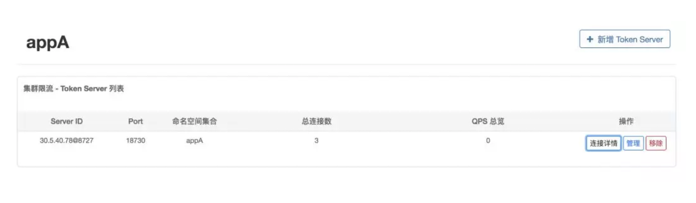

并且我们可以在页面上查看 token server 的连接情况，点击【连接详情】即可查看，如下图所示：

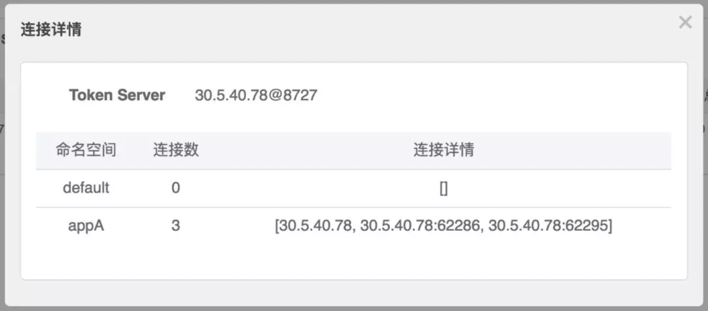

我们可以在【集群流控】页面的【Cluster Client列表】中查看具体的集群客户端，如下图所示：

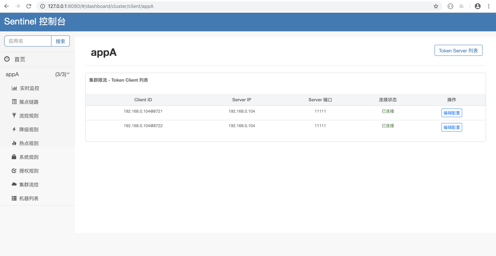

### 查看效果

通过 jmeter 模拟流量同时请求两台客户端机器，过一段时间后观察效果。


然后在监控页面看到对应资源的集群维度的总 qps ，如下图所示：

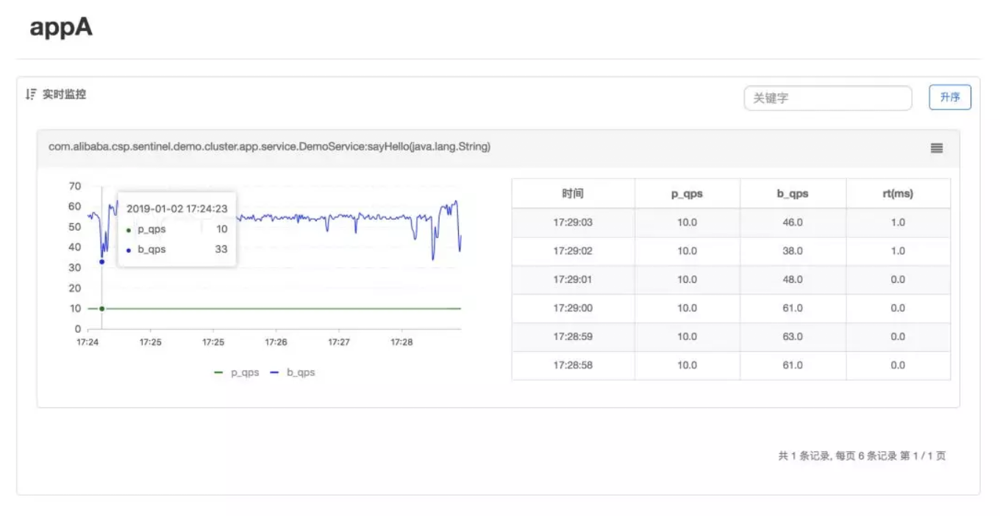

发现通过的 qps 并不是维持在10以内，而是超过了10。

#### 排查问题

首先我们直接查看 ${appName}-metrics.log 日志文件中打印的信息，在我的机器上有两个 metrics 的log文件，分别对应两个 cluster-client：

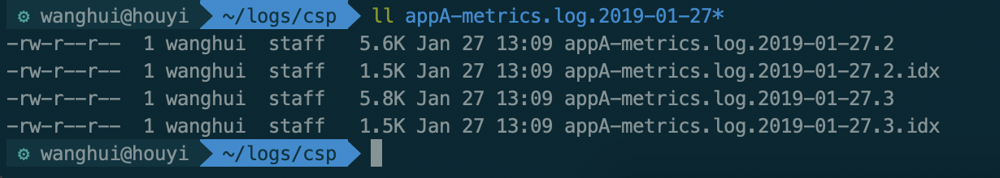

看下每个文件中具体的内容：


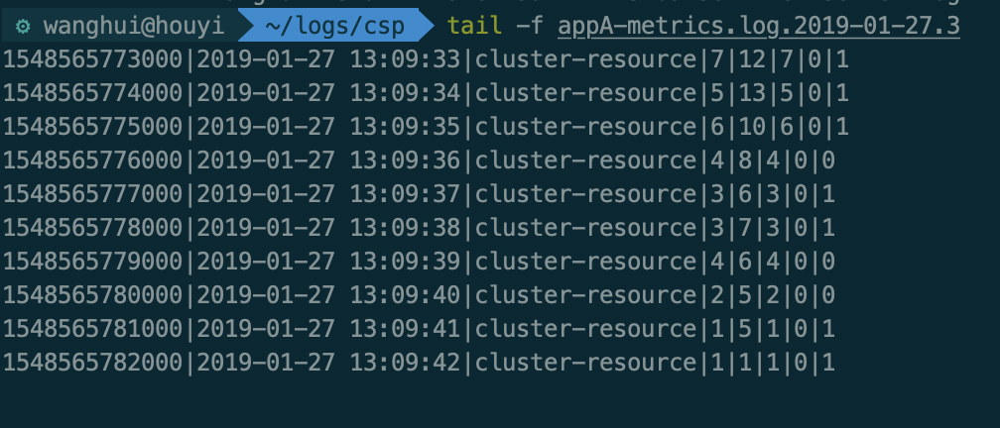

可以看到同一秒两个 client 通过的 qps 相加的结果是保持在10以下的。

那按照道理 dashboard 中是聚合的两个 client 的 qps 总和，不应该超过10才对，经过与 Sentinel 的开发人员：**乐有** 的讨论，他怀疑 dashboard 把 token-server 的值也统计进去了，我查看了实时数据返回的结果，如下图所示：

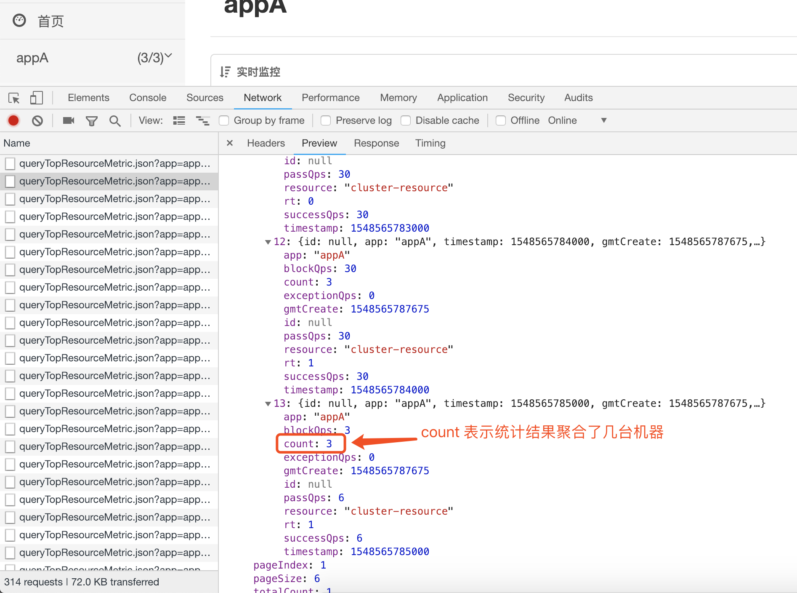

从结果中发现统计结果确实聚合了三台机器的统计值，再把 dashboard 请求 metrics 的结果打印出来看一下：

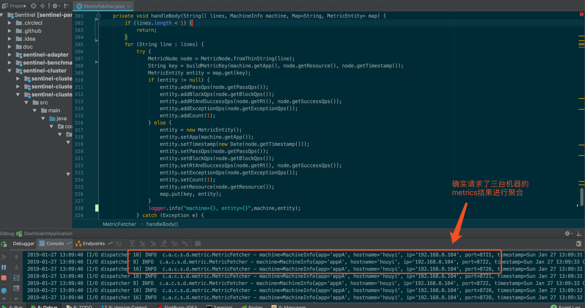

和 **乐有** 讨论过后，他也觉得很奇怪，8720 作为 token-server 是不应该有 metric 统计结果的，觉得可能是个 dashboard 的 bug吧，暂且先提个issue。

但是从两台 cluster-client 的 metric 日志中可以看出来，整个集群的 qps 是没有超过10的，这说明核心的功能没有问题。


### 步骤总结

- 先启动好 nacos 服务，并将集群限流规则发布到 nacos 中
- 启动好 dashboard，版本选择 1.4.1
- 启动独立模式运行的 token server，并配置与 dashboard 的连接，token server 会自动连接上 dashboard
- 启动两个 token client，配置与 token server / dashboard 的连接，需模拟一次流量请求，client 才会初始化并连接上 dashboard
- 通过 jmeter 模拟请求 token client 观察 dashboard 上的实时监控


### 避免踩坑

- 所有版本请使用 1.4.1 ，避免不必要的问题排查
- 如果在 token server列表中选择 client 时，未出现可选的 client 机器，请先对该 client 发送请求流量以触发 sentinel 的初始化，然后 client 才会连接上 dashboard
- token client 也需要配置限流规则，并且指定 clusterMode 为 true
- 当 token client 请求 token server 超时了，就会退化为本地限流模式


## 注意事项

集群流控能够精确地控制整个集群的 qps，结合单机限流兜底，可以更好地发挥流量控制的效果。

还有更多的场景等待大家发掘，比如：

- 在 API Gateway 处统计某个 api 的总访问量，并对某个 api 或服务的总 qps 进行限制
- Service Mesh 中对服务间的调用进行全局流控
- 集群内对热点商品的总访问频次进行限制

尽管集群流控比较好用，但它不是万能的，只有在确实有必要的场景下才推荐使用集群流控。

另外若在生产环境使用集群限流，管控端还需要关注以下的问题：

- Token Server 自动管理（分配/选举 Token Server）
- Token Server 高可用，在某个 server 不可用时自动 failover 到其它机器


## 我的公众号

如果你觉得该项目对您有帮助，欢迎您关注我的公众号「逅弈逐码」，了解更多原创文章。


