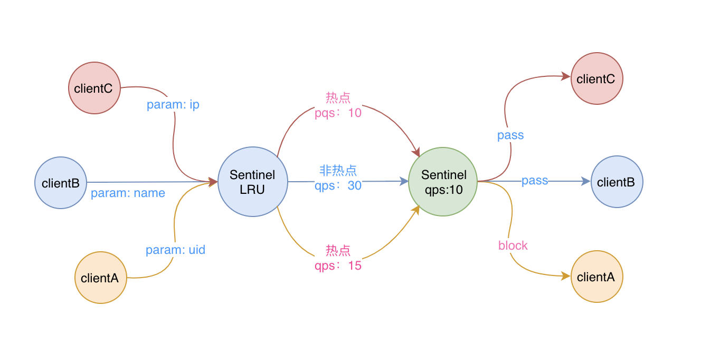
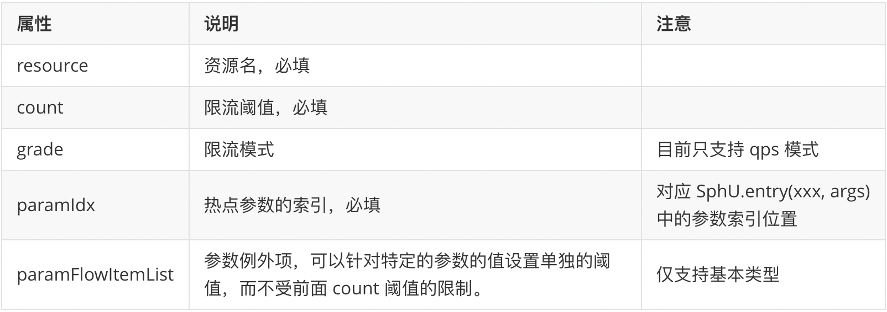
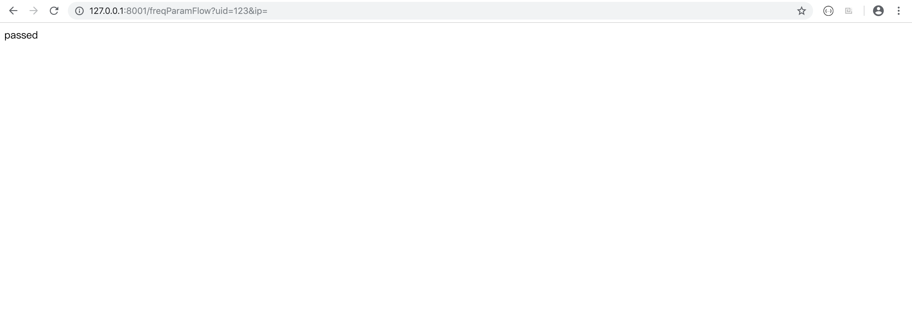
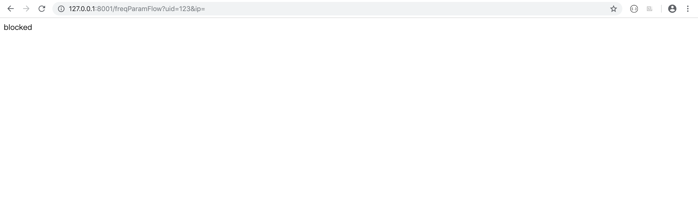
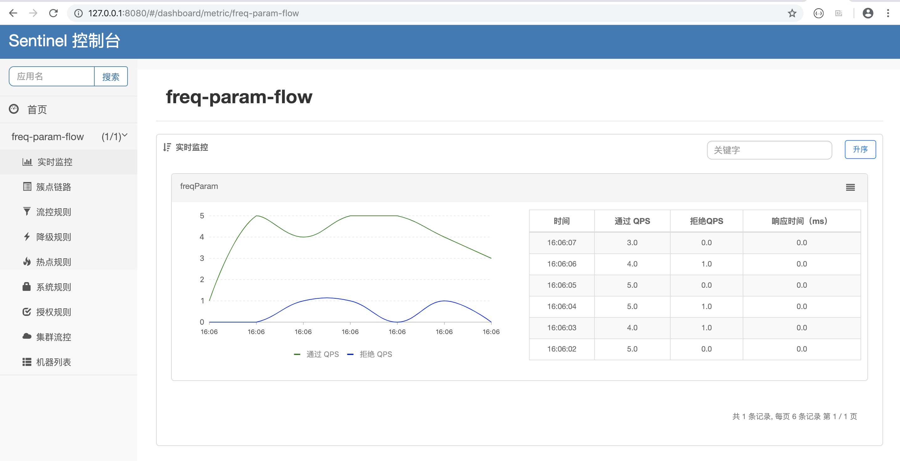
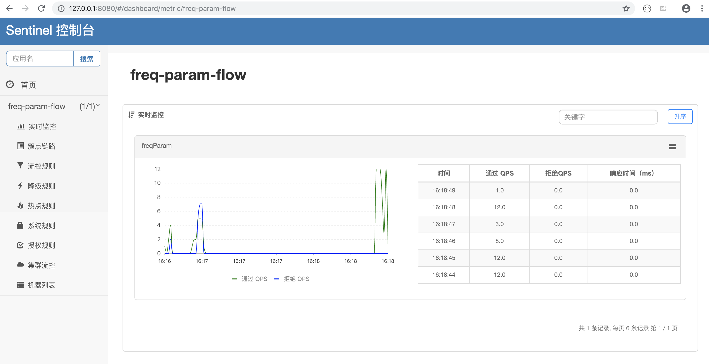

# Sentinel实战：如何对热点参数限流

我们已经对单机限流和集群限流有过一定了解了，但是他们都是针对一些固定的资源进行流控的，在实际的应用场景中我们可能会遇到各种复杂的情况，不可能通过固定的资源来进行限流。

比如我们想要对一段时间内频繁访问的用户 ID 进行限制，又或者我们想统计一段时间内最常购买的商品 ID 并针对商品 ID 进行限制。那这里的用户 ID 和商品 ID 都是可变的资源，通过原先的固定资源已经无法满足我们的需求了，这时我们就可以通过 Sentinel 为我们提供的 **热点参数限流** 来达到这样的效果。

## 什么是热点

首先我们需要知道什么是热点，热点就是访问非常频繁的参数。

例如我们大家都知道的爬虫，就是通过脚本去爬取其他网站的数据，一般防爬虫的常用方法之一就是限制爬虫的 IP，那对应到这里 IP 就是一种热点的参数。

那么 Sentinel 是怎么知道哪些参数是热点，哪些参数不是热点的呢？Sentinel 利用 LRU 策略，结合底层的滑动窗口机制来实现热点参数统计。LRU 策略可以统计单位时间内，最近最常访问的热点参数，而滑动窗口机制可以帮助统计每个参数的 qps。

PS：获取某种参数的 qps 最高的 topN 相关的代码在 HotParameterLeapArray 类的 getTopValues 方法中，有兴趣的可以去了解下。

说简单点就是，Sentinel 会先检查出提交过来的参数，哪些是热点的参数，然后在应用热点参数的限流规则，将qps 超过设定阈值的请求给 block 掉，整个过程如下图所示：



## 如何使用热点限流

现在我们知道了可以通过热点参数限流的方式，来动态的保护某些访问比较热的资源，或者是限制一些访问比较频繁的请求。现在让我们来看下怎样来使用热点参数限流吧。

### 引入依赖

第一步还是引入依赖，热点限流是在 sentinel-extension 模块中定义的，把热点限流当成一种扩展模块来使用，还不知道其中的用意。

引入下列的依赖：

``` xml
<dependency>
    <groupId>com.alibaba.csp</groupId>
    <artifactId>sentinel-parameter-flow-control</artifactId>
    <version>x.y.z</version>
</dependency>
```

### 定义资源

使用热点限流时，定义资源和普通限流的操作方式是一致的。例如我们可以定义资源名为：

``` java
/**
 * 热点限流的资源名
 */
private String resourceName = "freqParam";
```

### 定义规则

定义好资源之后，就可以来定义规则了，我们还是先用简单的硬编码的方式来演示，实际的使用过程中还是要通过控制台来定义规则的。

热点参数的规则是通过 ParamFlowRule 来定义的，跟流控的规则类 FlowRule 差不多，具体的属性如下表所示：



定义好规则之后，可以通过 ParamFlowRuleManager 的 loadRules 方法更新热点参数规则，如下所示：

``` java
// 定义热点限流的规则，对第一个参数设置 qps 限流模式，阈值为5
ParamFlowRule rule = new ParamFlowRule(resourceName)
        .setParamIdx(0)
        .setGrade(RuleConstant.FLOW_GRADE_QPS)
        .setCount(5);
ParamFlowRuleManager.loadRules(Collections.singletonList(rule));
```

### 埋点

我们定义好资源，也定义好规则了，最后一步就是在代码中埋点来使应用热点限流的规则了。

那么如何传入对应的参数来让 Sentinel 进行统计呢？我们可以通过 `SphU` 类里面几个 `entry` 重载方法来传入：

``` java
public static Entry entry(String name, EntryType type, int count, Object... args) throws BlockException

public static Entry entry(Method method, EntryType type, int count, Object... args) throws BlockException
```

其中最后的一串 args 就是要传入的参数，有多个就按照次序依次传入。

还是通过一个简单的 Controller 方法来进行埋点，如下所示：

``` java
/**
 * 热点参数限流
 */
@GetMapping("/freqParamFlow")
public @ResponseBody
String freqParamFlow(@RequestParam("uid") Long uid,@RequestParam("ip") Long ip) {
    Entry entry = null;
    String retVal;
    try{
        // 只对参数uid进行限流，参数ip不进行限制
        entry = SphU.entry(resourceName, EntryType.IN,1,uid);
        retVal = "passed";
    }catch(BlockException e){
        retVal = "blocked";
    }finally {
        if(entry!=null){
            entry.exit();
        }
    }
    return retVal;
}
```

### 查看效果

现在我们在浏览器中快速的刷新页面来请求该方法，可以看到如下两种返回结果：





再打开 dashboard 来查看实时的监控结果，如下图所示：



### 如果不传入参数

从上面的情况可以看出，我们已经对参数 uid 应用了热点限流的规则，并且也从模拟的结果中看到了效果。

如果我们把上述埋点的代码修改一下，将传入的 uid 参数移除，其他的地方都不变，改成如下所示：

``` java
// 不传入任何参数
entry = SphU.entry(resourceName, EntryType.IN,1);
```

再次启动后，重新刷新页面，发现所有的请求都 pass 了，从 dashboard 中看到的效果如下所示：



因为此时应用的是热点限流的规则，但是我们没有指定任何的热点参数，所以所有的请求都会被 pass 掉。


## 我的公众号

如果你觉得该项目对您有帮助，欢迎您关注我的公众号「逅弈逐码」，了解更多原创文章。

