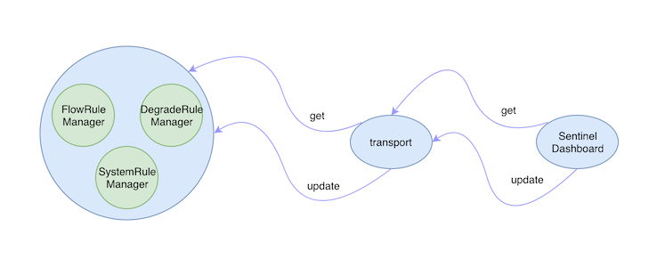
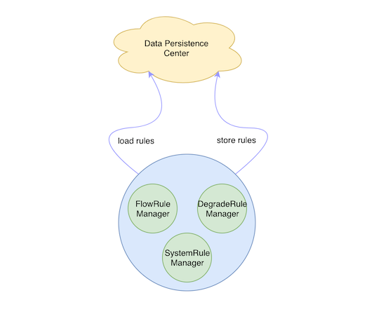
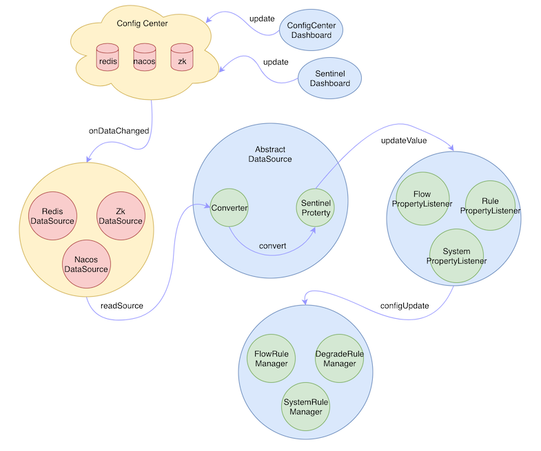

# Sentinel实战：规则持久化的5种方式

## 规则丢失

无论是通过硬编码的方式来更新规则，还是通过接入 Sentinel Dashboard 后，在页面上操作来更新规则，都无法避免一个问题，那就是服务重新后，规则就丢失了，因为默认情况下规则是保存在内存中的。

Dashboard 是通过 transport 模块来获取每个 Sentinel 客户端中的规则的，获取到的规则通过 RuleRepository 接口保存在 Dashboard 的内存中，如果在 Dashboard 页面中更改了某个规则，也会调用 transport 模块提供的接口将规则更新到客户端中去。

是想一种情况，客户端连接上 Dashboard 之后，我们在 Dashboard 上为客户端配置好了规则，并推送给了客户端。这时由于一些因素客户端出现异常，服务不可用了，当客户端恢复正常再次连接上 Dashboard 后，这时所有的规则都丢失了，我们还需要重新配置一遍规则，这肯定不是我们想要的。



如上图所示，当 Sentinel 的客户端挂掉之后，保存在各个 RuleManager 中的规则都会付之一炬，所以在生产中是绝对不能这么做的。

## 规则持久化原理

那我们有什么办法能解决这个问题呢，其实很简单，那就是把原本保存在 RuleManager 内存中的规则，持久化一份副本出去。这样下次客户端重启后，可以从持久化的副本中把数据 load 进内存中，这样就不会丢失规则了，如下图所示：



Sentinel 为我们提供了两个接口来实现规则的持久化，他们分别是：ReadableDataSource 和 WritableDataSource。

其中 WritableDataSource 不是我们本次关心的重点，或者说 WritableDataSource 并没有那么重要，因为通常各种持久化的数据源已经提供了具体的将数据持久化的方法了，我们只需要把数据从持久化的数据源中获取出来，转成我们需要的格式就可以了。

下面我们来看一下 ReadableDataSource 接口的具体的定义：

```java
public interface ReadableDataSource<S, T> {
	// 从数据源中读取原始的数据
    S readSource() throws Exception;
	// 将原始数据转换成我们所需的格式
    T loadConfig() throws Exception;
    // 获取该种数据源的SentinelProperty对象
    SentinelProperty<T> getProperty();
}
```

接口很简单，最重要的就是这三个方法，另外 Sentinel 还为我们提供了一个抽象类：AbstractDataSource，该抽象类中实现了两个方法，具体的数据源实现类只需要实现一个 readSource 方法即可，具体的代码如下：

```java
public abstract class AbstractDataSource<S, T> 
		implements ReadableDataSource<S, T> {
	// Converter接口负责转换数据
    protected final Converter<S, T> parser;
    // SentinelProperty接口负责触发PropertyListener
    // 的configUpdate方法的回调
    protected final SentinelProperty<T> property;

    public AbstractDataSource(Converter<S, T> parser) {
        if (parser == null) {
            throw new IllegalArgumentException("parser can't be null");
        }
        this.parser = parser;
        this.property = new DynamicSentinelProperty<T>();
    }
    @Override
    public T loadConfig() throws Exception {
        return loadConfig(readSource());
    }
    public T loadConfig(S conf) throws Exception {
        return parser.convert(conf);
    }
    @Override
    public SentinelProperty<T> getProperty() {
        return property;
    }
}
```

实际上每个具体的 DataSource 实现类需要做三件事：

- 实现 readSource 方法将数据源中的原始数据转换成我们可以处理的数据S
- 提供一个 Converter 来将数据S转换成最终的数据T
- 将最终的数据T更新到具体的 RuleManager 中去

我把规则是如何从数据源加载进 RuleManager 中去的完整流程浓缩成了下面这张图：



大家可以就着这张图对照着源码来看，可以很容易的弄明白这个过程，这里我就不再展开具体的源码讲了，有几点需要注意的是：

- 规则的持久化配置中心可以是redis、nacos、zk、file等等任何可以持久化的数据源，只要能保证更新规则时，客户端能得到通知即可
- 规则的更新可以通过 Sentinel Dashboard 也可以通过各个配置中心自己的更新接口来操作
- AbstractDataSource 中的 SentinelProperty 持有了一个 PropertyListener 接口，最终更新 RuleManager 中的规则是 PropertyListener 去做的

## 规则持久化

好了，知道了具体的原理了，下面我们就来讲解下如何来接入规则的持久化。

目前 Sentinel 中默认实现了5种规则持久化的方式，分别是：file、redis、nacos、zk和apollo。

下面我们对这5种方式一一进行了解，以持久化限流的规则为例。

### File

文件持久化有一个问题就是文件不像其他的配置中心，数据发生变更后会发出通知，使用文件来持久化的话就需要我们自己定时去扫描文件，来确定文件是否发现了变更。

文件数据源是通过 FileRefreshableDataSource 类来实现的，他是通过文件的最后更新时间来判断规则是否发生变更的。

首先需要引入依赖：

```xml
<dependency>
    <groupId>com.alibaba.csp</groupId>
    <artifactId>sentinel-datasource-extension</artifactId>
    <version>x.y.z</version>
</dependency>
```

接入的方法如下：

``` java
private void init() throws Exception {
	// 保存了限流规则的文件的地址
	String flowRuleName = yourFlowRuleFileName();
	Converter<String, List<FlowRule>> parser = source -> JSON.parseObject(source,new TypeReference<List<FlowRule>>() {});
    // 创建文件规则数据源
    FileRefreshableDataSource<List<FlowRule>> flowRuleDataSource = new FileRefreshableDataSource<>(flowRuleName, parser);
    // 将Property注册到 RuleManager 中去
    FlowRuleManager.register2Property(flowRuleDataSource.getProperty());
}
```

PS：需要注意的是，我们需要在系统启动的时候调用该数据源注册的方法，否则不会生效的。具体的方式有很多，可以借助 Spring 来初始化该方法，也可以自定义一个类来实现 Sentinel 中的 InitFunc 接口来完成初始化。

Sentinel 会在系统启动的时候通过 spi 来扫描 InitFunc 的实现类，并执行 InitFunc 的 init 方法，所以这也是一种可行的方法，如果我们的系统没有使用 Spring 的话，可以尝试这种方式。

### Redis

Redis 数据源的实现类是 RedisDataSource。

首先引入依赖：

```xml
<dependency>
    <groupId>com.alibaba.csp</groupId>
    <artifactId>sentinel-datasource-redis</artifactId>
    <version>x.y.z</version>
</dependency>
```

接入方法如下：

``` java
private void init() throws Exception {
	String redisHost = yourRedisHost();
	String redisPort = yourRedisPort();
    String ruleKey = yourRuleKey();
    String channel = yourChannel();
	Converter<String, List<FlowRule>> parser = source -> JSON.parseObject(source,new TypeReference<List<FlowRule>>() {});
    RedisConnectionConfig config = RedisConnectionConfig.builder()
        .withHost(redisHost)
        .withPort(redisPort)
        .build();
    ReadableDataSource<String, List<FlowRule>> redisDataSource = new RedisDataSource<>(config, ruleKey, channel, parser);
    FlowRuleManager.register2Property(redisDataSource.getProperty());
}
```

### Nacos

Nacos 数据源的实现类是 NacosDataSource。

首先引入依赖：

```xml
<dependency>
    <groupId>com.alibaba.csp</groupId>
    <artifactId>sentinel-datasource-nacos</artifactId>
    <version>x.y.z</version>
</dependency>
```

接入方法如下：

``` java
private void init() throws Exception {
	String remoteAddress = yourRemoteAddress();
	String groupId = yourGroupId();
    String dataId = yourDataId();
	Converter<String, List<FlowRule>> parser = source -> JSON.parseObject(source,new TypeReference<List<FlowRule>>() {});
    ReadableDataSource<String, List<FlowRule>> nacosDataSource = new NacosDataSource<>(remoteAddress, groupId, dataId, parser);
    FlowRuleManager.register2Property(nacosDataSource.getProperty());
}
```

### Zk

Zk 数据源的实现类是 ZookeeperDataSource。

首先引入依赖：

```xml
<dependency>
    <groupId>com.alibaba.csp</groupId>
    <artifactId>sentinel-datasource-zookeeper</artifactId>
    <version>x.y.z</version>
</dependency>
```

接入方法如下：

``` java
private void init() throws Exception {
	String remoteAddress = yourRemoteAddress();
	String path = yourPath();
	Converter<String, List<FlowRule>> parser = source -> JSON.parseObject(source,new TypeReference<List<FlowRule>>() {});
    ReadableDataSource<String, List<FlowRule>> zookeeperDataSource = new ZookeeperDataSource<>(remoteAddress, path, parser);
    FlowRuleManager.register2Property(zookeeperDataSource.getProperty());
}
```

### Apollo

Apollo 数据源的实现类是 ApolloDataSource。

首先引入依赖：

```xml
<dependency>
    <groupId>com.alibaba.csp</groupId>
    <artifactId>sentinel-datasource-apollo</artifactId>
    <version>x.y.z</version>
</dependency>
```

接入方法如下：

``` java
private void init() throws Exception {
	String namespaceName = yourNamespaceName();
	String ruleKey = yourRuleKey();
    String defaultRules = yourDefaultRules();
	Converter<String, List<FlowRule>> parser = source -> JSON.parseObject(source,new TypeReference<List<FlowRule>>() {});
    ReadableDataSource<String, List<FlowRule>> apolloDataSource = new ApolloDataSource<>(namespaceName, ruleKey, path, defaultRules);
    FlowRuleManager.register2Property(apolloDataSource.getProperty());
}
```

可以看到5中持久化的方式基本上大同小异，主要还是对接每种配置中心，实现数据的转换，并且监听配置中心的数据变化，当接收到数据变化后能够及时的将最新的规则更新到 RuleManager 中去就可以了。