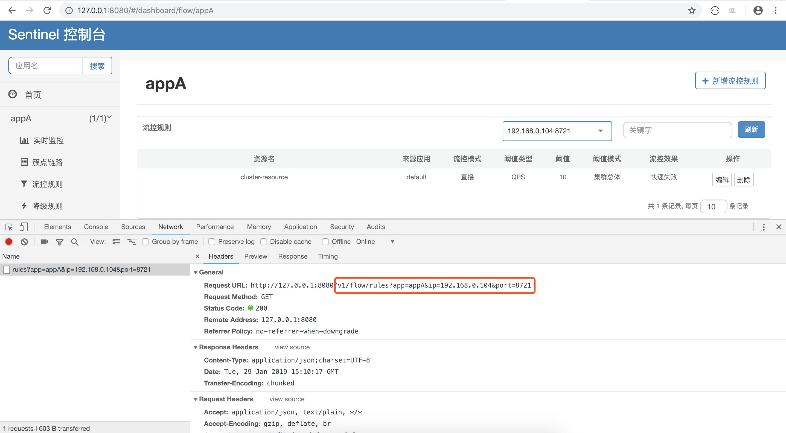
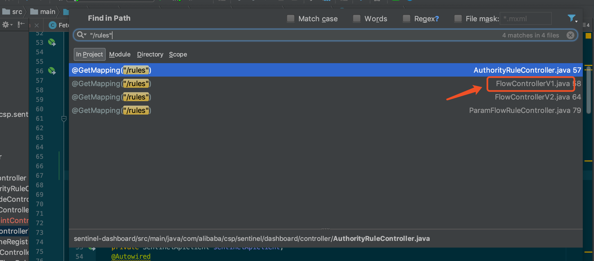
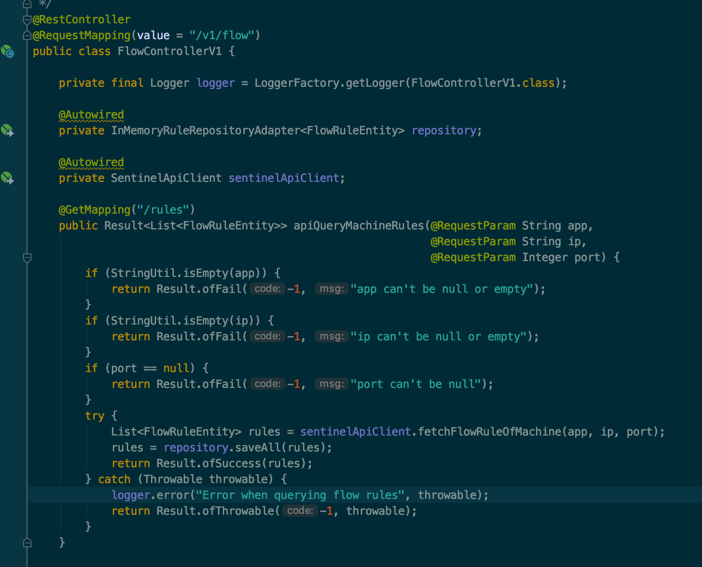
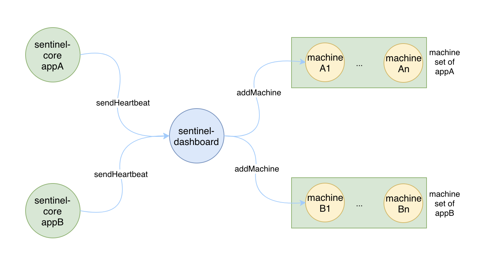
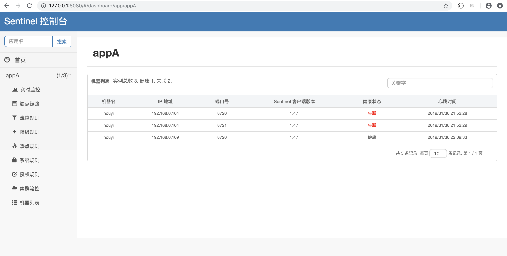
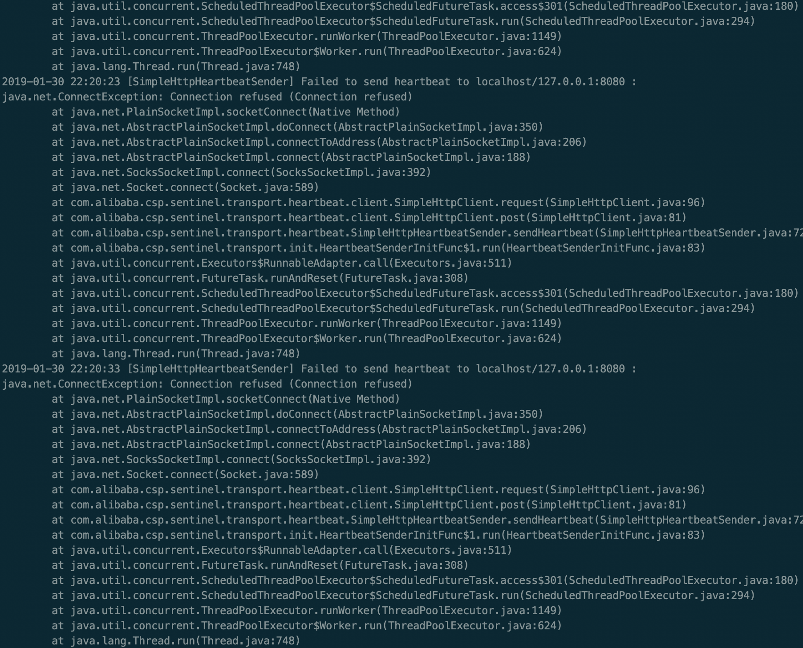
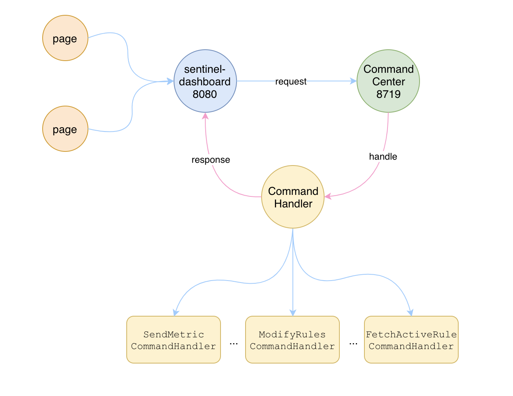

# Sentinel原理：控制台是如何获取到实时数据的

Sentinel 能够被大家所认可，除了他自身的轻量级，高性能，可扩展之外，跟控制台的好用和易用也有着莫大的关系，因为通过控制台极大的方便了我们日常的运维工作。

我们可以在控制台上操作各种限流、降级、系统保护的规则，也可以查看每个资源的实时数据，还能管理集群环境下的服务端与客户端机器。

但是控制台只是一个独立的 spring boot 应用，他本身是没有任何数据的，他的数据都是从其他的 sentinel 实例中获取的，那他是如何获取到这些数据的呢？带着这个疑问我们从源码中寻找答案。

最简单的方法莫过于启动一个控制台的实例，然后从页面上查看每个接口请求的url，然后再到 dashboard 的代码中去深挖下去。

怎么启动控制台，这里就不再详细描述了，大家可以看 [Sentinel实战：使用控制台管理规则](../../sentinel-practice/sentinel-manage-rule-with-dashboard/sentinel-manage-rule-with-dashboard.md) 这篇文章去了解下，简单的几步就可以启动一个控制台了。

我们就以一个简单的查看【流控规则】为例来描述，点击【流控规则】进入页面后，按F11打开network就可以看到请求的url了，如下图所示：



可以看到，请求的 url 是 /v1/flow/rules 我们直接在源码中全局搜索 /rules ，为什么不搜索 /v1/flow/rules 呢，因为有可能 url 被拆分成两部分，我们直接搜完整的 url 可能搜不到结果。如下图所示：



我们要找的应该就是 FlowControllerV1 这个类了，打开这个类看下类上修饰的值是不是 /v1/flow 如下图所示：



从图中可以看出来，dashboard 是通过一个叫 SentinelApiClient 的类去指定的 ip 和 port 处获取数据的。这个 ip 和 port 是前端页面直接提交给后端的，而前端页面又是通过 /app/{app}/machines.json 接口获取机器列表的。

## 连接 dashboard

这里的机器列表中展示的就是所有连接到 dashboard 上的 sentinel 的实例，包括普通限流的 sentinel-core 和集群模式下的 token-server 和 token-client。我们可以回想一下，一个 sentinel-core 的实例要接入 dashboard 的几个步骤：

1. 引入 dashboard 的依赖
2. 配置 dashboard 的 ip 和 port
3. 初始化 sentinel-core，连接 dashboard

sentinel-core 在初始化的时候，通过 JVM 参数中指定的 dashboard 的 ip 和 port，会主动向 dashboard 发起连接的请求，该请求是通过 HeartbeatSender 接口以心跳的方式发送的，并将自己的 ip 和 port 告知 dashboard。这里 sentinel-core 上报给 dashboard 的端口是 sentinel 对外暴露的自己的 CommandCenter 的端口。

HeartbeatSender 有两个实现类，一个是通过 http，另一个是通过 netty，我们看 http 的实现类：

> SimpleHttpHeartbeatSender.java

``` java
private final HeartbeatMessage heartBeat = new HeartbeatMessage();
private final SimpleHttpClient httpClient = new SimpleHttpClient();
@Override
public boolean sendHeartbeat() throws Exception {
    if (TransportConfig.getRuntimePort() <= 0) {
        RecordLog.info("[SimpleHttpHeartbeatSender] Runtime port not initialized, won't send heartbeat");
        return false;
    }
    InetSocketAddress addr = getAvailableAddress();
    if (addr == null) {
        return false;
    }
    SimpleHttpRequest request = new SimpleHttpRequest(addr, HEARTBEAT_PATH);
    request.setParams(heartBeat.generateCurrentMessage());
    try {
        SimpleHttpResponse response = httpClient.post(request);
        if (response.getStatusCode() == OK_STATUS) {
            return true;
        }
    } catch (Exception e) {
        RecordLog.warn("[SimpleHttpHeartbeatSender] Failed to send heartbeat to " + addr + " : ", e);
    }
    return false;
}
```

通过一个 HttpClient 向 dashboard 发送了自己的信息，包括 ip port 和版本号等信息。

其中 consoleHost 和 consolePort 的值就是从 JVM 参数 csp.sentinel.dashboard.server 中获取的。

dashboard 在接收到 sentinel-core 的连接之后，就会与 sentinel-core 建立连接，并将 sentinel-core 上报的 ip 和 port 的信息包装成一个 MachineInfo 对象，然后通过 SimpleMachineDiscovery 将该对象保存在一个 map 中，如下图所示：



## 定时发送心跳

sentinel-core 连接上 dashboard 之后，并不是就结束了，事实上 sentinel-core 是通过一个 ScheduledExecutorService 的定时任务，每隔 10 秒钟向 dashboard 发送一次心跳信息。发送心跳的目的主要是告诉 dashboard 我这台 sentinel 的实例还活着，你可以继续向我请求数据。

这也就是为什么 dashboard 中每个 app 对应的机器列表要用 Set 来保存的原因，如果用 List 来保存的话就可能存在同一台机器保存了多次的情况。

心跳可以维持双方之间的连接是正常的，但是也有可能因为各种原因，某一方或者双方都离线了，那他们之间的连接就丢失了。

1.sentinel-core 宕机

如果是 sentinel-core 宕机了，那么这时 dashboard 中保存在内存里面的机器列表还是存在的。目前 dashboard 只是在接收到 sentinel-core 发送过来的心跳包的时候更新一次机器列表，当 sentinel-core 宕机了，不再发送心跳数据的时候，dashboard 是没有将 “失联” 的 sentinel-core 实例给去除的。而是页面上每次查询的时候，会去用当前时间减去机器上次心跳包的时间，如果时间差大于 5 分钟了，才会将该机器标记为 “失联”。

所以我们在页面上的机器列表中，需要至少等到 5 分钟之后，才会将具体失联的 sentinel-core 的机器标记为 “失联”。如下图所示：



2.dashboard 宕机

如果 dashboard 宕机了，sentinel-core 的定时任务实际上是会一直请求下去的，只要 dashboard 恢复后就会自动重新连接上 dashboard，双方之间的连接又会恢复正常了，如果 dashboard 一直不恢复，那么 sentinel-core 就会一直报错，在 sentinel-record.log 中我们会看到如下的报错信息：



不过实际生产中，不可能出现 dashboard 宕机了一直没人去恢复的情况的，如果真出现这种情况的话，那就要吃故障了。

## 请求数据

当 dashboard 有了具体的 sentinel-core 实例的 ip 和 port 之后，就可以去请求所需要的数据了。

让我们再回到最开始的地方，我在页面上查询某一台机器的限流的规则时，是将该机器的 ip 和 port 以及 appName 都传给了服务端，服务端通过这些信息去具体的远程实例中请求所需的数据，拿到数据后再封装成 dashboard 所需的格式返回给前端页面进行展示。

具体请求限流规则列表的代码在 SentinelApiClient 中，如下所示：

> SentinelApiClient.java

``` java
public List<FlowRuleEntity> fetchFlowRuleOfMachine(String app, String ip, int port) {
    String url = "http://" + ip + ":" + port + "/" + GET_RULES_PATH + "?type=" + FLOW_RULE_TYPE;
    String body = httpGetContent(url);
    logger.info("FlowRule Body:{}", body);
    List<FlowRule> rules = RuleUtils.parseFlowRule(body);
    if (rules != null) {
        return rules.stream().map(rule -> FlowRuleEntity.fromFlowRule(app, ip, port, rule))
            .collect(Collectors.toList());
    } else {
        return null;
    }
}
```

可以看到也是通过一个 httpClient 请求的数据，然后再对结果进行转换，具体请求的过程是在 httpGetContent 方法中进行的，我们看下该方法，如下所示：

``` java
private String httpGetContent(String url) {
    final HttpGet httpGet = new HttpGet(url);
    final CountDownLatch latch = new CountDownLatch(1);
    final AtomicReference<String> reference = new AtomicReference<>();
    httpClient.execute(httpGet, new FutureCallback<HttpResponse>() {
        @Override
        public void completed(final HttpResponse response) {
            try {
                reference.set(getBody(response));
            } catch (Exception e) {
                logger.info("httpGetContent " + url + " error:", e);
            } finally {
                latch.countDown();
            }
        }
        @Override
        public void failed(final Exception ex) {
            latch.countDown();
            logger.info("httpGetContent " + url + " failed:", ex);
        }
        @Override
        public void cancelled() {
            latch.countDown();
        }
    });
    try {
        latch.await(5, TimeUnit.SECONDS);
    } catch (Exception e) {
        logger.info("wait http client error:", e);
    }
    return reference.get();
}
```

从代码中可以看到，是通过一个异步的 httpClient 再结合 CountDownLatch 等待 5 秒的超时时间去获取结果的。

获取数据的请求从 dashboard 中发出去了，那 sentinel-core 中是怎么进行相应处理的呢？看过我其他文章的同学肯定还记得， sentinel-core 在启动的时候，执行了一个 InitExecutor.init 的方法，该方法会触发所有 InitFunc 实现类的 init 方法，其中就包括两个最重要的实现类：

- HeartbeatSenderInitFunc
- CommandCenterInitFunc

HeartbeatSenderInitFunc 会启动一个 HeartbeatSender 来定时的向 dashboard 发送自己的心跳包，而 CommandCenterInitFunc 则会启动一个 CommandCenter 对外提供 sentinel-core 的数据服务，而这些数据服务是通过一个一个的 CommandHandler 来提供的，如下图所示：



## 总结

现在我们已经知道了 dashboard 是如何获取到实时数据的了，具体的流程如下所示：

1.首先 sentinel-core 向 dashboard 发送心跳包

2.dashboard 将 sentinel-core 的机器信息保存在内存中

3.dashboard 根据 sentinel-core 的机器信息通过 httpClient 获取实时的数据

4.sentinel-core 接收到请求之后，会找到具体的 CommandHandler 来处理

5.sentinel-core 将处理好的结果返回给 dashboard


## 思考

1.数据安全性

sentinel-dashboard 和 sentinel-core 之间的通讯是基于 http 的，没有进行加密或鉴权，可能会存在数据安全性的问题，不过这些数据并非是很机密的数据，对安全性要求并不是很高，另外增加了鉴权或加密之后，对于性能和实效性有一定的影响。

2.SentinelApiClient

目前所有的数据请求都是通过 SentinelApiClient 类去完成的，该类中充斥着大量的方法，都是发送 http 请求的。代码的可读性和可维护性不高，所以需要对该类进行重构，目前我能够想到的有两种方法：

1）通过将 sentinel-core 注册为 rpc 服务，dashboard 就像调用本地方法一样去调用 sentinel-core 中的方法，不过这样的话需要引入服务注册和发现的依赖了。

2）通过 netty 实现私有的协议，sentinel-core 通过 netty 启动一个 CommandCenter 来对外提供服务。dashboard 通过发送 Packet 来进行数据请求，sentinel-core 来处理 Packet。不过这种方法跟目前的做法没有太大的区别，唯一比较好的可能就是不需要为每种请求都写一个方法，只需要定义好具体的 Packet 就好了。


