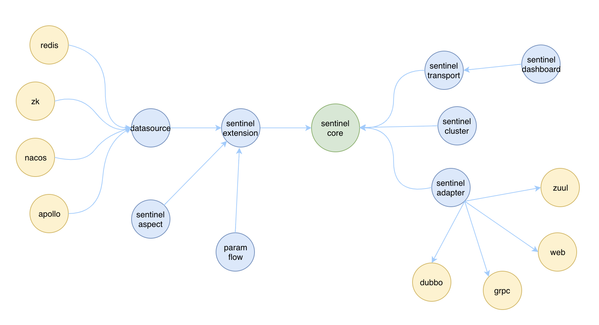
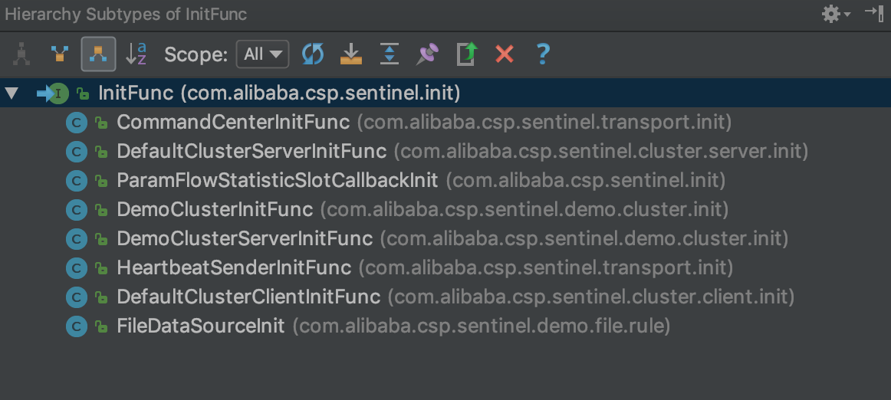
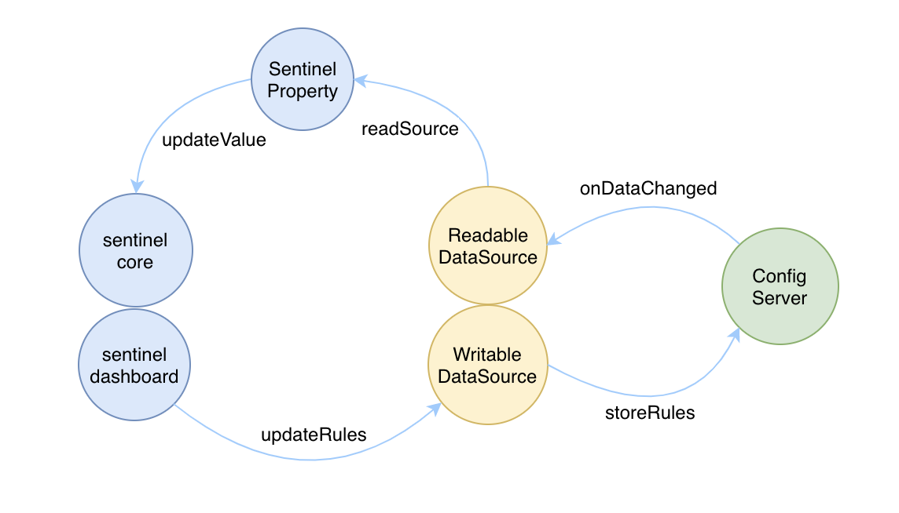
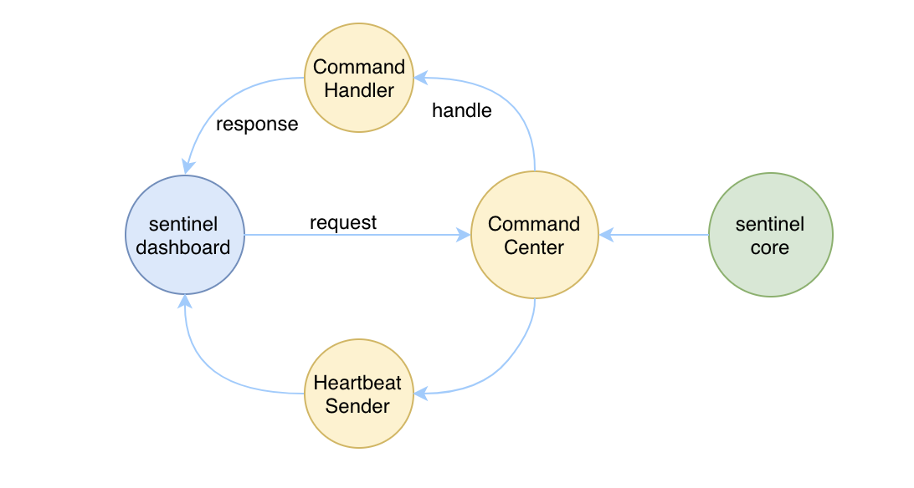
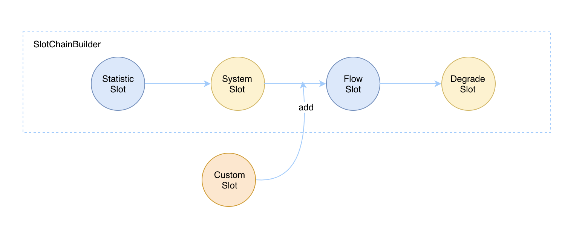

# Sentinel原理：扩展点

一个好的框架有一个很重要的特性就是扩展性要好，不能把系统写死，后期想要新增功能时，可以通过预留的扩展点进行扩展，而不是去修改原来的代码。

本篇文章我就来跟大家分享下 Sentinel 在扩展性这块是怎么做的，都有哪些扩展点。

## 模块设计

第一点从模块设计上，Sentinel 就充分考虑了扩展性，Sentinel 核心的功能其实就在 sentinel-core 模块中，要想在自己的系统中使用 Sentinel 最少只需要引入这一个依赖就够了。其他的都是为了框架的易用性和高可用性等做的扩展。

我们来看下 Sentinel 中都有哪些扩展的模块：

- sentinel-dashboard：一个通过 spring boot 实现的 web 应用，相当于是 Sentinel 的 OPS 工具，通过 dashboard 我们可以更方便的对规则进行调整、查询实时统计信息等，但是这并不是必须的，没有 dashboard 我们也能使用 Sentinel，甚至我们可以通过 Sentinel 提供的 api 来实现自己的 dashboard。
- sentinel-transport：一个 sentinel-core 和 sentinel-dashboard 通讯的桥梁，如果我们的应用接入了 Sentinel，并且也想通过 dashboard 来管理的话，那就需要引入 sentinel-transport 模块。
- sentinel-extension：一个 Sentinel 的扩展模块，主要是实现了规则的动态更新和持久化。另外热点参数限流也在这里实现的，除此之外注解的相关实现也是在这个模块中。
- sentinel-adapter：一个适配器的扩展，通过适配器可以很方便的为其他框架进行 Sentinel 的集成。
- sentinel-cluster：集群限流的扩展，通过引入这个模块可以在集群环境中使用 Sentinel。

除了 sentinel-core 之外，其他的模块基本上都是围绕着 sentinel-core 做了一些扩展，而且各个模块之间没有强耦合，是可插拔的，以下这张图可以简单的描述这个关系：



## 系统初始化

Sentinel 为我们提供了一个 InitFunc 接口来做系统的初始化工作，如果我们想要实现在系统初始化时就执行的逻辑，可以实现 InitFunc 接口。

目前 Sentinel 中有一些实现了 InitFunc 的类：



主要实现了以下这些系统初始化的工作：

- CommandCenter 的初始化
- HeartBeat 的初始化与心跳发送
- 集群服务端和客户端的初始化
- 热点限流中 StatisticSlot 回调的初始化

并且我们我们可以通过 @InitOrder 注解来指定 InitFunc 执行的顺序，order 的值越小越先执行。

InitFunc 是在首次调用 SphU.entry(KEY) 方法时触发的，注册的初始化函数会依次执行。

如果你不想把初始化的工作延后到第一次调用时触发，可以手动调用 InitExecutor.doInit() 函数，重复调用只会执行一次。

## 规则持久化

限流降级的规则，是通过调用 loadRules 方法加载进内存中的，而实际使用中，我们必须要对规则进行持久化，因为不进行持久化的话规则将会在系统重启时丢失。

那么 Sentinel 是如何做到，在扩展了动态规则加载的方法时，又不影响原先正常的规则加载的呢？我们看一下 FlowRuleManager 的 loadRules 方式就知道了：

``` java
private static SentinelProperty<List<FlowRule>> currentProperty 
= new DynamicSentinelProperty<List<FlowRule>>();
/**
 * Load {@link FlowRule}s, former rules will be replaced.
 *
 * @param rules new rules to load.
 */
public static void loadRules(List<FlowRule> rules) {
    currentProperty.updateValue(rules);
}
```

实际上是通过 DynamicSentinelProperty 的 updateValue 方法来动态更新规则的。

那么我们只需要在持久化的规则发生变更时，通过触发 SentinelProperty 的 updateValue 方法把更新后的规则注入进去就可以了。目前 SentinelProperty 有默认的实现，这一块我们不需要进行扩展，我们只需要实现监听每种持久化的数据源在发生数据变更时的事件，当接收到最新的数据时将它 update 进 FlowRuleManager 中即可。

所以我们需要抽象出读数据源和写数据源的两个接口：

- ReadableDataSource：读数据源负责监听持久化的数据源的变更，在接收到变更事件时将最新的数据更新
- WritableDataSource：写数据源负责将变更后的规则写入到持久化的数据源中

目前系统中只有一种文件数据源实现了 WritableDataSource 接口，其他的数据源只实现了 ReadableDataSource 接口。



## 网络通讯

sentinel-transport 模块中的功能基本上都是网络通讯相关的，而我们有很多的网络协议：http、tcp等，所以网络通讯这块肯定也要有可扩展的能力。目前 sentinel-transport-common 模块中抽象了3个接口作为扩展点：

- CommandCenter：该接口主要用来在 sentinel-core 中启动一个可以对外提供 api 接口的服务端，Sentinel 中默认有两个实现，分别是 http 和 netty。但是官方默认推荐的是使用 http 的实现。
- CommandHandler：该接口主要是用来处理接收到的请求的，不同的请求有不同的 handler 类来进行处理，我们可以实现我们自己的 CommandHandler 并注册到 SPI 配置文件中来为 CommandCenter 添加自定义的命令。
- HeartbeatSender：该接口主要是为 sentinel-core 用来向 sentinel-dashboard 发送心跳的，默认也有两个实现，分别是 http 和 netty。



## Slot链

Sentinel 内部是通过一系列的 slot 组成的 slot chain 来完成各种功能的，包括构建调用链、调用数据统计、规则检查等，各个 slot 之间的顺序非常重要。

Sentinel 将 SlotChainBuilder 作为 SPI 接口进行扩展，使得 Slot Chain 具备了扩展的能力。我们可以自行加入自定义的 slot 并编排 slot 间的顺序，从而可以给 Sentinel 添加自定义的功能。



## StatisticSlot回调

之前 StatisticSlot 里面包含了太多的逻辑，像普通 qps 和 热点参数 qps 的 addPass/addBlock 等逻辑统计都在 StatisticSlot 里面，各个逻辑都杂糅在一起，不利于扩展。

因此有必要为 StatisticSlot 抽象出一系列的 callback，从而使 StatisticSlot 具备基本的扩展能力，并将一系列的逻辑从 StatisticSlot 解耦出来，目前 Sentinel 提供了两种 callback：

- ProcessorSlotEntryCallback

  包含 onPass 和 onBlocked 两个回调函数，分别对应着请求在 pass 和 blocked 的时候执行。

- ProcessorSlotExitCallback

  包含 onExit 回调函数，对应着请求在 exit 的时候执行。

只需将实现的 callback 注册到 StatisticSlotCallbackRegistry 即可生效。


## 我的公众号

如果你觉得该项目对您有帮助，欢迎您关注我的公众号「逅弈逐码」，了解更多原创文章。


