# Sentinel原理：全解析

[Sentinel](https://github.com/alibaba/Sentinel) 是阿里中间件团队开源的，面向分布式服务架构的轻量级高可用流量控制组件，主要以流量为切入点，从流量控制、熔断降级、系统负载保护等多个维度来帮助用户保护服务的稳定性。

大家可能会问：Sentinel 和之前常用的熔断降级库 [Netflix Hystrix](https://github.com/netflix/hystrix) 有什么异同呢？

Sentinel 官网有一个对比的文章，这里摘抄一个总结的表格，具体的对比可以点此 [链接](https://github.com/alibaba/Sentinel/wiki/Sentinel-%E4%B8%8E-Hystrix-%E7%9A%84%E5%AF%B9%E6%AF%94) 查看。

| 对比内容       | Sentinel                                       | Hystrix                       |
| -------------- | ---------------------------------------------- | ----------------------------- |
| 隔离策略       | 信号量隔离                                     | 线程池隔离/信号量隔离         |
| 熔断降级策略   | 基于响应时间或失败比率                         | 基于失败比率                  |
| 实时指标实现   | 滑动窗口                                       | 滑动窗口（基于 RxJava）       |
| 规则配置       | 支持多种数据源                                 | 支持多种数据源                |
| 扩展性         | 多个扩展点                                     | 插件的形式                    |
| 基于注解的支持 | 支持                                           | 支持                          |
| 限流           | 基于 QPS，支持基于调用关系的限流               | 不支持                        |
| 流量整形       | 支持慢启动、匀速器模式                         | 不支持                        |
| 系统负载保护   | 支持                                           | 不支持                        |
| 控制台         | 开箱即用，可配置规则、查看秒级监控、机器发现等 | 不完善                        |
| 常见框架的适配 | Servlet、Spring Cloud、Dubbo、gRPC 等          | Servlet、Spring Cloud Netflix |

从对比的表格可以看到，Sentinel 比 Hystrix 在功能性上还要强大一些，本文让我们一起来了解下 Sentinel 的原理，揭开Sentinel的神秘面纱。

## 项目结构

将 Sentinel 的项目 fork 到自己的 github 库中，接着把源码 clone 到本地，然后开始源码阅读之旅吧，我称这个过程为「逐码」。

首先我们看一下 Sentinel 项目的整个结构：

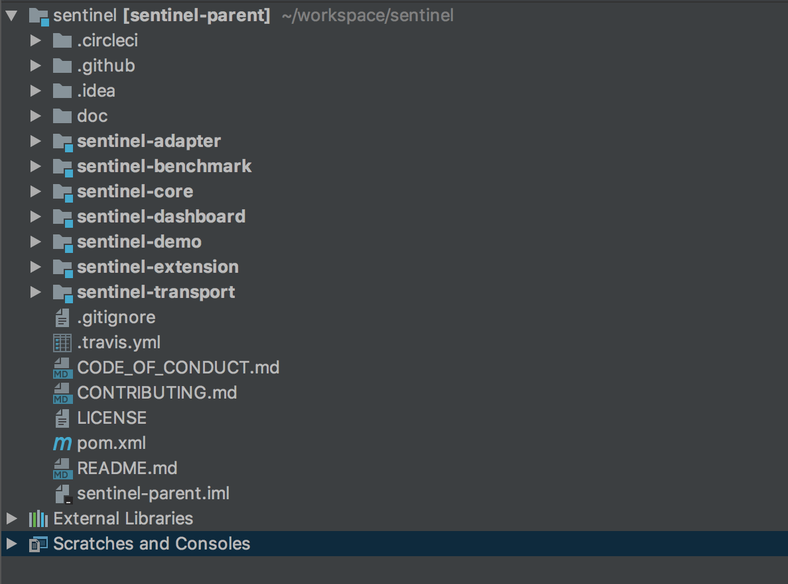

- sentinel-core 核心模块，限流、降级、系统保护等都在这里实现
- sentinel-dashboard 控制台模块，可以对连接上的sentinel客户端实现可视化的管理
- sentinel-transport 传输模块，提供了基本的监控服务端和客户端的API接口，以及一些基于不同库的实现
- sentinel-extension 扩展模块，主要对DataSource进行了部分扩展实现
- sentinel-adapter 适配器模块，主要实现了对一些常见框架的适配
- sentinel-demo 样例模块，可参考怎么使用sentinel进行限流、降级等
- sentinel-benchmark 基准测试模块，对核心代码的精确性提供基准测试

## 运行样例

基本上每个框架都会带有样例模块，有的叫example，有的叫demo，Sentinel也不例外。

那我们从 Sentinel 的 demo 中找一个例子运行下看看大致的情况吧，上面说过了 Sentinel 主要的核心功能是做限流、降级和系统保护，那我们就从“限流”开始看 Sentinel 的实现原理吧。

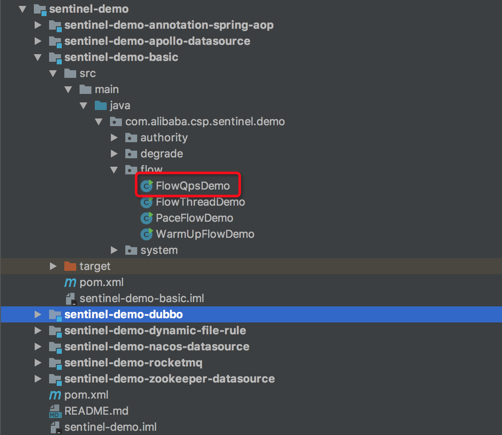

可以看到 sentinel-demo 模块中有很多不同的样例，我们找到basic模块下的flow包，这个包下面就是对应的限流的样例，但是限流也有很多种类型的限流，我们就找根据qps限流的类看吧，其他的限流方式原理上都大差不差。

``` java
public class FlowQpsDemo {

    private static final String KEY = "abc";

    private static AtomicInteger pass = new AtomicInteger();
    private static AtomicInteger block = new AtomicInteger();
    private static AtomicInteger total = new AtomicInteger();

    private static volatile boolean stop = false;

    private static final int threadCount = 32;

    private static int seconds = 30;

    public static void main(String[] args) throws Exception {
        initFlowQpsRule();

        tick();
        // first make the system run on a very low condition
        simulateTraffic();

        System.out.println("===== begin to do flow control");
        System.out.println("only 20 requests per second can pass");

    }

    private static void initFlowQpsRule() {
        List<FlowRule> rules = new ArrayList<FlowRule>();
        FlowRule rule1 = new FlowRule();
        rule1.setResource(KEY);
        // set limit qps to 20
        rule1.setCount(20);
        // 设置限流类型：根据qps
        rule1.setGrade(RuleConstant.FLOW_GRADE_QPS);
        rule1.setLimitApp("default");
        rules.add(rule1);
        // 加载限流的规则
        FlowRuleManager.loadRules(rules);
    }

    private static void simulateTraffic() {
        for (int i = 0; i < threadCount; i++) {
            Thread t = new Thread(new RunTask());
            t.setName("simulate-traffic-Task");
            t.start();
        }
    }

    private static void tick() {
        Thread timer = new Thread(new TimerTask());
        timer.setName("sentinel-timer-task");
        timer.start();
    }

    static class TimerTask implements Runnable {

        @Override
        public void run() {
            long start = System.currentTimeMillis();
            System.out.println("begin to statistic!!!");

            long oldTotal = 0;
            long oldPass = 0;
            long oldBlock = 0;
            while (!stop) {
                try {
                    TimeUnit.SECONDS.sleep(1);
                } catch (InterruptedException e) {
                }
                long globalTotal = total.get();
                long oneSecondTotal = globalTotal - oldTotal;
                oldTotal = globalTotal;

                long globalPass = pass.get();
                long oneSecondPass = globalPass - oldPass;
                oldPass = globalPass;

                long globalBlock = block.get();
                long oneSecondBlock = globalBlock - oldBlock;
                oldBlock = globalBlock;

                System.out.println(seconds + " send qps is: " + oneSecondTotal);
                System.out.println(TimeUtil.currentTimeMillis() + ", total:" + oneSecondTotal
                    + ", pass:" + oneSecondPass
                    + ", block:" + oneSecondBlock);

                if (seconds-- <= 0) {
                    stop = true;
                }
            }

            long cost = System.currentTimeMillis() - start;
            System.out.println("time cost: " + cost + " ms");
            System.out.println("total:" + total.get() + ", pass:" + pass.get()
                + ", block:" + block.get());
            System.exit(0);
        }
    }

    static class RunTask implements Runnable {
        @Override
        public void run() {
            while (!stop) {
                Entry entry = null;

                try {
                    entry = SphU.entry(KEY);
                    // token acquired, means pass
                    pass.addAndGet(1);
                } catch (BlockException e1) {
                    block.incrementAndGet();
                } catch (Exception e2) {
                    // biz exception
                } finally {
                    total.incrementAndGet();
                    if (entry != null) {
                        entry.exit();
                    }
                }

                Random random2 = new Random();
                try {
                    TimeUnit.MILLISECONDS.sleep(random2.nextInt(50));
                } catch (InterruptedException e) {
                    // ignore
                }
            }
        }
    }
}
```

执行上面的代码后，打印出如下的结果：

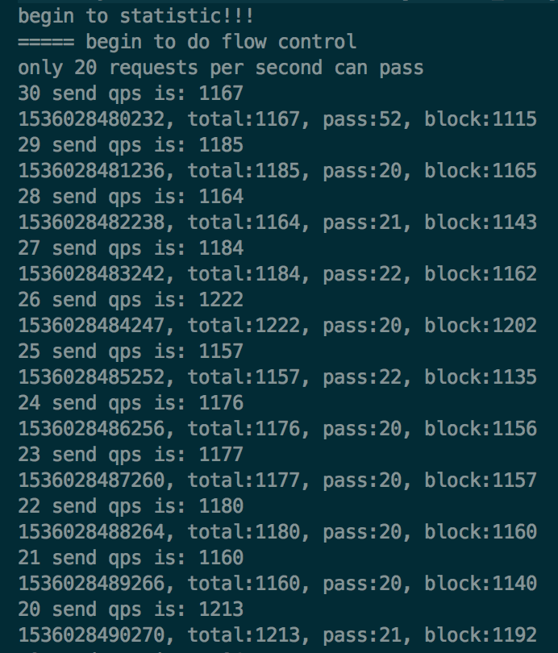

可以看到，上面的结果中，pass的数量和我们的预期并不相同，我们预期的是每秒允许pass的请求数是20个，但是目前有很多pass的请求数是超过20个的。

原因是，我们这里测试的代码使用了多线程，注意看 `threadCount` 的值，一共有32个线程来模拟，**而在RunTask的run方法中执行资源保护时，即在 `SphU.entry` 的内部是没有加锁的，所以就会导致在高并发下，pass的数量会高于20。**

可以用下面这个模型来描述下，有一个TimeTicker线程在做统计，每1秒钟做一次。有N个RunTask线程在模拟请求，被访问的business code被资源key保护着，根据规则，每秒只允许20个请求通过。

由于pass、block、total等计数器是全局共享的，而多个RunTask线程在执行SphU.entry申请获取entry时，内部没有锁保护，所以会存在pass的个数超过设定的阈值。

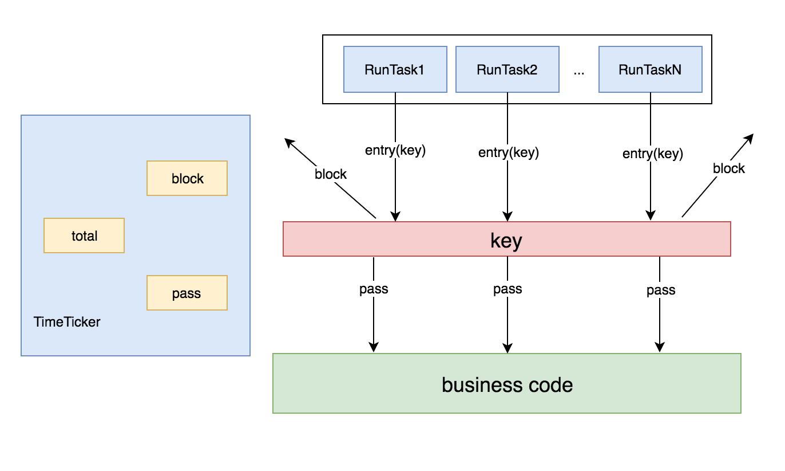

那为了证明在单线程下限流的正确性与可靠性，那我们的模型就应该变成了这样：

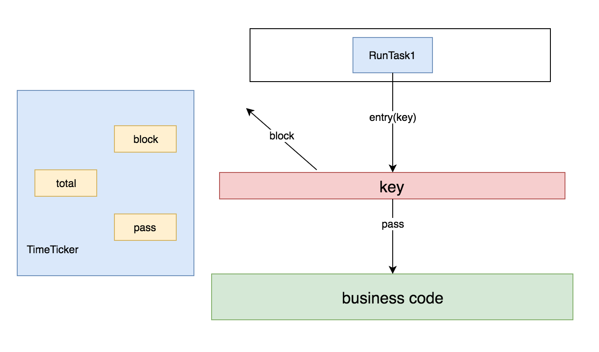

那接下来我把 `threadCount` 的值改为1，只有一个线程来执行这个方法，看下具体的限流结果，执行上面的代码后打印的结果如下：

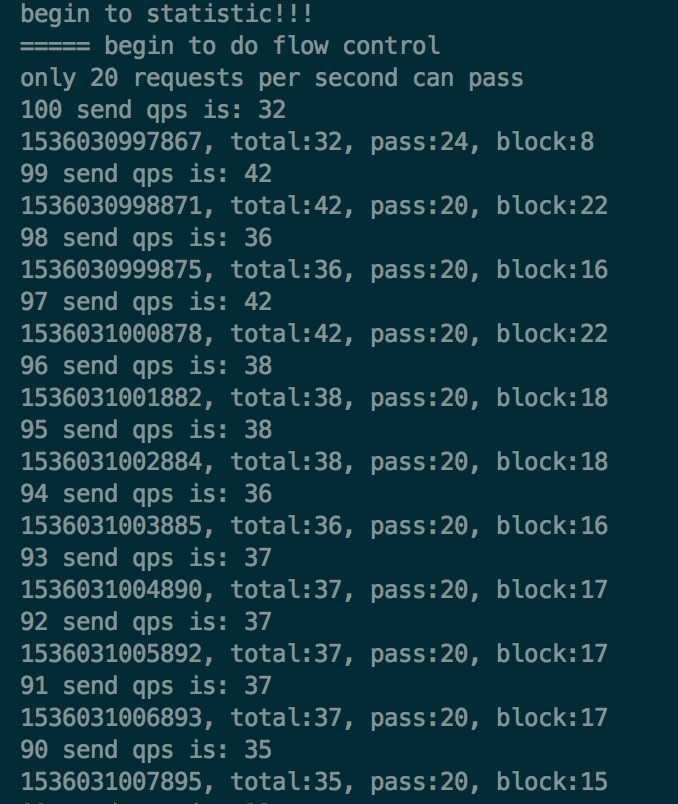

可以看到pass数基本上维持在20，但是第一次统计的pass值还是超过了20。这又是什么原因导致的呢？

其实仔细看下Demo中的代码可以发现，模拟请求是用的一个线程，统计结果是用的另外一个线程，统计线程每1秒钟统计一次结果，这两个线程之间是有时间上的误差的。从TimeTicker线程打印出来的时间戳可以看出来，虽然每隔一秒进行统计，但是当前打印时的时间和上一次的时间还是有误差的，不完全是1000ms的间隔。

要真正验证每秒限制20个请求，保证数据的精准性，需要做基准测试，这个不是本篇文章的重点，有兴趣的同学可以去了解下jmh，sentinel中的基准测试也是通过jmh做的。

## 深入原理

通过一个简单的示例程序，我们了解了sentinel可以对请求进行限流，除了限流外，还有降级和系统保护等功能。那现在我们就拨开云雾，深入源码内部去一窥sentinel的实现原理吧。

首先从入口开始：`SphU.entry()`  。这个方法会去申请一个entry，如果能够申请成功，则说明没有被限流，否则会抛出BlockException，表示已经被限流了。

从 `SphU.entry()` 方法往下执行会进入到 `Sph.entry()` ，Sph的默认实现类是 `CtSph` ，在CtSph中最终会执行到 `entry(ResourceWrapper resourceWrapper, int count, Object... args) throws BlockException` 这个方法。

我们来看一下这个方法的具体实现：

``` java
public Entry entry(ResourceWrapper resourceWrapper, int count, Object... args) throws BlockException {
    Context context = ContextUtil.getContext();
    if (context instanceof NullContext) {
        // Init the entry only. No rule checking will occur.
        return new CtEntry(resourceWrapper, null, context);
    }

    if (context == null) {
        context = MyContextUtil.myEnter(Constants.CONTEXT_DEFAULT_NAME, "", resourceWrapper.getType());
    }

    // Global switch is close, no rule checking will do.
    if (!Constants.ON) {
        return new CtEntry(resourceWrapper, null, context);
    }

    // 获取该资源对应的SlotChain
    ProcessorSlot<Object> chain = lookProcessChain(resourceWrapper);

    /*
     * Means processor cache size exceeds {@link Constants.MAX_SLOT_CHAIN_SIZE}, so no
     * rule checking will be done.
     */
    if (chain == null) {
        return new CtEntry(resourceWrapper, null, context);
    }

    Entry e = new CtEntry(resourceWrapper, chain, context);
    try {
    	// 执行Slot的entry方法
        chain.entry(context, resourceWrapper, null, count, args);
    } catch (BlockException e1) {
        e.exit(count, args);
        // 抛出BlockExecption
        throw e1;
    } catch (Throwable e1) {
        RecordLog.info("Sentinel unexpected exception", e1);
    }
    return e;
}
```

这个方法可以分为以下几个部分：

- 1.对参数和全局配置项做检测，如果不符合要求就直接返回了一个CtEntry对象，不会再进行后面的限流检测，否则进入下面的检测流程。
- 2.根据包装过的资源对象获取对应的SlotChain
- 3.执行SlotChain的entry方法
  - 3.1.如果SlotChain的entry方法抛出了BlockException，则将该异常继续向上抛出
  - 3.2.如果SlotChain的entry方法正常执行了，则最后会将该entry对象返回
- 4.如果上层方法捕获了BlockException，则说明请求被限流了，否则请求能正常执行

其中比较重要的是第2、3两个步骤，我们来分解一下这两个步骤。

### 创建SlotChain

首先看一下 lookProcessChain 的方法实现：

``` java
private ProcessorSlot<Object> lookProcessChain(ResourceWrapper resourceWrapper) {
    ProcessorSlotChain chain = chainMap.get(resourceWrapper);
    if (chain == null) {
        synchronized (LOCK) {
            chain = chainMap.get(resourceWrapper);
            if (chain == null) {
                // Entry size limit.
                if (chainMap.size() >= Constants.MAX_SLOT_CHAIN_SIZE) {
                    return null;
                }

                // 具体构造chain的方法
                chain = Env.slotsChainbuilder.build();
                Map<ResourceWrapper, ProcessorSlotChain> newMap = new HashMap<ResourceWrapper, ProcessorSlotChain>(chainMap.size() + 1);
                newMap.putAll(chainMap);
                newMap.put(resourceWrapper, chain);
                chainMap = newMap;
            }
        }
    }
    return chain;
}
```

该方法使用了一个HashMap做了缓存，key是资源对象。这里加了锁，并且做了 `double check` 。具体构造chain的方法是通过： `Env.slotsChainbuilder.build()` 这句代码创建的。那就进入这个方法看看吧。

``` java
public ProcessorSlotChain build() {
    ProcessorSlotChain chain = new DefaultProcessorSlotChain();
    chain.addLast(new NodeSelectorSlot());
    chain.addLast(new ClusterBuilderSlot());
    chain.addLast(new LogSlot());
    chain.addLast(new StatisticSlot());
    chain.addLast(new SystemSlot());
    chain.addLast(new AuthoritySlot());
    chain.addLast(new FlowSlot());
    chain.addLast(new DegradeSlot());

    return chain;
}
```

Chain 是链条的意思，从build的方法可看出，ProcessorSlotChain 是一个链表，里面添加了很多个 Slot。具体的实现需要到 DefaultProcessorSlotChain 中去看。

``` java
public class DefaultProcessorSlotChain extends ProcessorSlotChain {

    AbstractLinkedProcessorSlot<?> first = new AbstractLinkedProcessorSlot<Object>() {
        @Override
        public void entry(Context context, ResourceWrapper resourceWrapper, Object t, int count, Object... args)
            throws Throwable {
            super.fireEntry(context, resourceWrapper, t, count, args);
        }
        @Override
        public void exit(Context context, ResourceWrapper resourceWrapper, int count, Object... args) {
            super.fireExit(context, resourceWrapper, count, args);
        }
    };
    
    AbstractLinkedProcessorSlot<?> end = first;

    @Override
    public void addFirst(AbstractLinkedProcessorSlot<?> protocolProcessor) {
        protocolProcessor.setNext(first.getNext());
        first.setNext(protocolProcessor);
        if (end == first) {
            end = protocolProcessor;
        }
    }

    @Override
    public void addLast(AbstractLinkedProcessorSlot<?> protocolProcessor) {
        end.setNext(protocolProcessor);
        end = protocolProcessor;
    }
}
```

DefaultProcessorSlotChain中有两个AbstractLinkedProcessorSlot类型的变量：first和end，这就是链表的头结点和尾节点。

创建DefaultProcessorSlotChain对象时，首先创建了首节点，然后把首节点赋值给了尾节点，可以用下图表示：

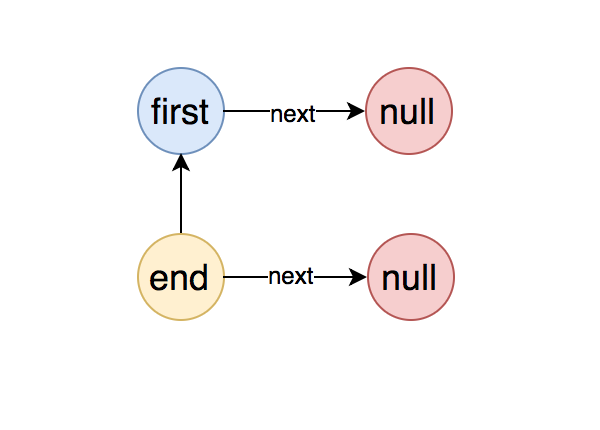

将第一个节点添加到链表中后，整个链表的结构变成了如下图这样：

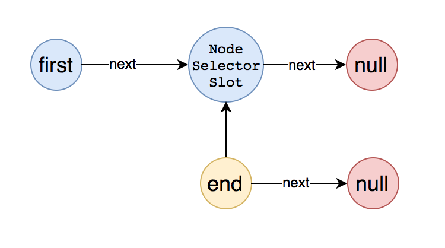

将所有的节点都加入到链表中后，整个链表的结构变成了如下图所示：

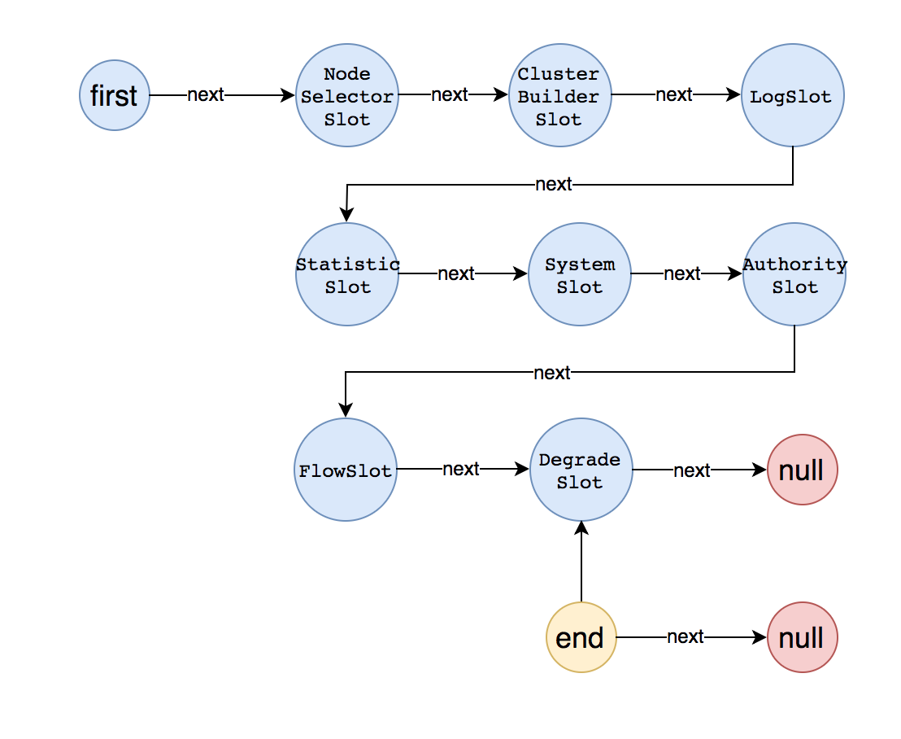

这样就将所有的Slot对象添加到了链表中去了，每一个Slot都是继承自AbstractLinkedProcessorSlot。而AbstractLinkedProcessorSlot是一种责任链的设计，每个对象中都有一个next属性，指向的是另一个AbstractLinkedProcessorSlot对象。其实责任链模式在很多框架中都有，比如Netty中是通过pipeline来实现的。

知道了SlotChain是如何创建的了，那接下来就要看下是如何执行Slot的entry方法的了。

### 执行SlotChain的entry方法

lookProcessChain方法获得的ProcessorSlotChain的实例是DefaultProcessorSlotChain，那么执行chain.entry方法，就会执行DefaultProcessorSlotChain的entry方法，而DefaultProcessorSlotChain的entry方法是这样的：

``` java
@Override
public void entry(Context context, ResourceWrapper resourceWrapper, Object t, int count, Object... args)
    throws Throwable {
    first.transformEntry(context, resourceWrapper, t, count, args);
}
```

也就是说，DefaultProcessorSlotChain的entry实际是执行的first属性的transformEntry方法。

而transformEntry方法会执行当前节点的entry方法，在DefaultProcessorSlotChain中first节点重写了entry方法，具体如下：

``` java
@Override
public void entry(Context context, ResourceWrapper resourceWrapper, Object t, int count, Object... args)
    throws Throwable {
    super.fireEntry(context, resourceWrapper, t, count, args);
}
```

first节点的entry方法，实际又是执行的super的fireEntry方法，那继续把目光转移到fireEntry方法，具体如下：

``` java
@Override
public void fireEntry(Context context, ResourceWrapper resourceWrapper, Object obj, int count, Object... args)
    throws Throwable {
    if (next != null) {
        next.transformEntry(context, resourceWrapper, obj, count, args);
    }
}
```

从这里可以看到，从fireEntry方法中就开始传递执行entry了，这里会执行当前节点的下一个节点transformEntry方法，上面已经分析过了，transformEntry方法会触发当前节点的entry，也就是说fireEntry方法实际是触发了下一个节点的entry方法。具体的流程如下图所示：

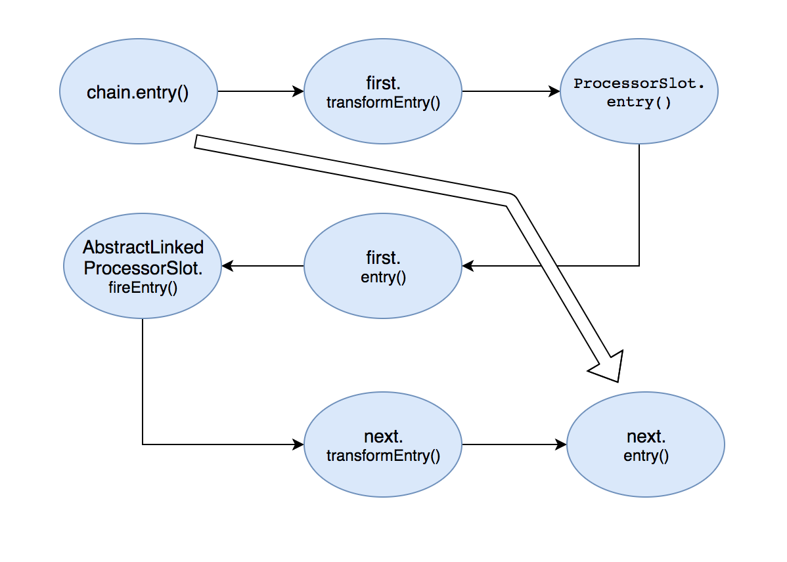

从图中可以看出，从最初的调用Chain的entry()方法，转变成了调用SlotChain中Slot的entry()方法。从上面的分析可以知道，SlotChain中的第一个Slot节点是NodeSelectorSlot。

### 执行Slot的entry方法

现在可以把目光转移到SlotChain中的第一个节点NodeSelectorSlot的entry方法中去了，具体的代码如下：

``` java
@Override
public void entry(Context context, ResourceWrapper resourceWrapper, Object obj, int count, Object... args)
    throws Throwable {
    
    DefaultNode node = map.get(context.getName());
    if (node == null) {
        synchronized (this) {
            node = map.get(context.getName());
            if (node == null) {
                node = Env.nodeBuilder.buildTreeNode(resourceWrapper, null);
                HashMap<String, DefaultNode> cacheMap = new HashMap<String, DefaultNode>(map.size());
                cacheMap.putAll(map);
                cacheMap.put(context.getName(), node);
                map = cacheMap;
            }
            // Build invocation tree
            ((DefaultNode)context.getLastNode()).addChild(node);
        }
    }

    context.setCurNode(node);
    // 由此触发下一个节点的entry方法
    fireEntry(context, resourceWrapper, node, count, args);
}
```

从代码中可以看到，NodeSelectorSlot节点做了一些自己的业务逻辑处理，具体的大家可以深入源码继续追踪，这里大概的介绍下每种Slot的功能职责：

- `NodeSelectorSlot` 负责收集资源的路径，并将这些资源的调用路径，以树状结构存储起来，用于根据调用路径来限流降级；
- `ClusterBuilderSlot` 则用于存储资源的统计信息以及调用者信息，例如该资源的 RT, QPS, thread count 等等，这些信息将用作为多维度限流，降级的依据；
- `StatistcSlot` 则用于记录，统计不同纬度的 runtime 信息；
- `FlowSlot` 则用于根据预设的限流规则，以及前面 slot 统计的状态，来进行限流；
- `AuthorizationSlot` 则根据黑白名单，来做黑白名单控制；
- `DegradeSlot` 则通过统计信息，以及预设的规则，来做熔断降级；
- `SystemSlot` 则通过系统的状态，例如 load1 等，来控制总的入口流量；

执行完业务逻辑处理后，调用了fireEntry()方法，由此触发了下一个节点的entry方法。此时我们就知道了sentinel的责任链就是这样传递的：每个Slot节点执行完自己的业务后，会调用fireEntry来触发下一个节点的entry方法。

所以可以将上面的图完整了，具体如下：

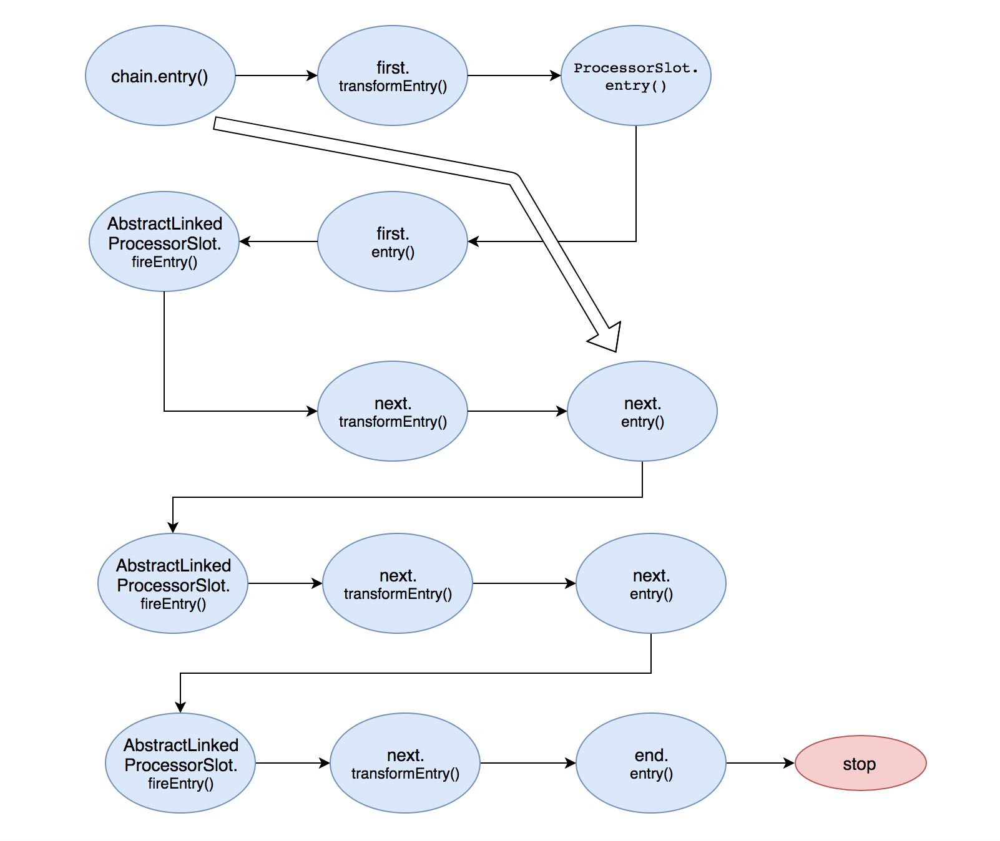

至此就通过SlotChain完成了对每个节点的entry()方法的调用，每个节点会根据创建的规则，进行自己的逻辑处理，当统计的结果达到设置的阈值时，就会触发限流、降级等事件，具体是抛出BlockException异常。

### 总结

sentinel主要是基于7种不同的Slot形成了一个链表，每个Slot都各司其职，自己做完分内的事之后，会把请求传递给下一个Slot，直到在某一个Slot中命中规则后抛出BlockException而终止。

前三个Slot负责做统计，后面的Slot负责根据统计的结果结合配置的规则进行具体的控制，是Block该请求还是放行。

控制的类型也有很多可选项：根据qps、线程数、冷启动等等。

然后基于这个核心的方法，衍生出了很多其他的功能： 

- 1、dashboard控制台，可以可视化的对每个连接过来的sentinel客户端 (通过发送heartbeat消息)进行控制，dashboard和客户端之间通过http协议进行通讯。 
- 2、规则的持久化，通过实现DataSource接口，可以通过不同的方式对配置的规则进行持久化，默认规则是在内存中的 
- 3、对主流的框架进行适配，包括servlet，dubbo，rRpc等

## Dashboard控制台

sentinel-dashboard是一个单独的应用，通过spring-boot进行启动，主要提供一个轻量级的控制台，它提供机器发现、单机资源实时监控、集群资源汇总，以及规则管理的功能。

我们只需要对应用进行简单的配置，就可以使用这些功能。

### 启动控制台

#### 下载代码并编译控制台

- 下载 [控制台](https://github.com/alibaba/Sentinel/tree/master/sentinel-dashboard) 工程
- 使用以下命令将代码打包成一个 fat jar: `mvn clean package`

#### 启动

使用如下命令启动编译后的控制台：

```sh
$ java -Dserver.port=8080 -Dcsp.sentinel.dashboard.server=localhost:8080 -jar target/sentinel-dashboard.jar
```

上述命令中我们指定了一个JVM参数，`-Dserver.port=8080` 用于指定 Spring Boot 启动端口为 `8080`。

### 客户端接入控制台

控制台启动后，客户端需要按照以下步骤接入到控制台。

#### 引入客户端jar包

通过 pom.xml 引入 jar 包:

```xml
<dependency>
    <groupId>com.alibaba.csp</groupId>
    <artifactId>sentinel-transport-simple-http</artifactId>
    <version>x.y.z</version>
</dependency>
```

#### 配置启动参数

启动时加入 JVM 参数 `-Dcsp.sentinel.dashboard.server=consoleIp:port` 指定控制台地址和端口。若启动多个应用，则需要通过 `-Dcsp.sentinel.api.port=xxxx` 指定客户端监控 API 的端口（默认是 8719）。

除了修改 JVM 参数，也可以通过配置文件取得同样的效果。更详细的信息可以参考 [启动配置项](https://github.com/alibaba/Sentinel/wiki/%E5%90%AF%E5%8A%A8%E9%85%8D%E7%BD%AE%E9%A1%B9)。

#### 触发客户端初始化

**确保客户端有访问量**，Sentinel 会在**客户端首次调用的时候**进行初始化，开始向控制台发送心跳包。

sentinel-dashboard是一个独立的web应用，可以接受客户端的连接，然后与客户端之间进行通讯，他们之间使用http协议进行通讯。他们之间的关系如下图所示：

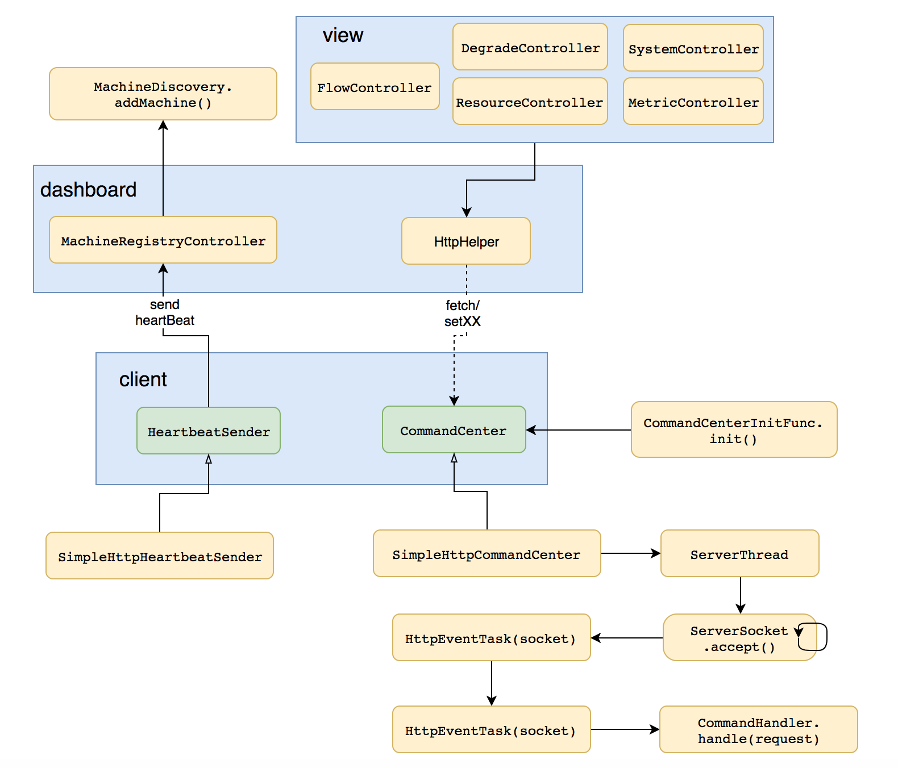

### dashboard

dashboard启动后会等待客户端的连接，具体的做法是在 MachineRegistryController 中有一个 receiveHeartBeat 的方法，客户端发送心跳消息，就是通过http请求这个方法。

dashboard接收到客户端的心跳消息后，会把客户端的传递过来的ip、port等信息封装成一个 MachineInfo 对象，然后将该对象通过 MachineDiscovery 接口的 addMachine 方法添加到一个ConcurrentHashMap中保存起来。

这里会有问题，因为客户端的信息是保存在dashboard的内存中的，所以当dashboard应用重启后，之前已经发送过来的客户端信息都会丢失掉。

### client

client在启动时，会通过 CommandCenterInitFunc 选择一个，并且只选择一个 CommandCenter 进行启动。

启动之前会通过spi的方式扫描获取到所有的 CommandHandler 的实现类，然后将所有的 CommandHandler 注册到一个 HashMap 中去，待后期使用。

**PS：考虑一下，为什么 CommandHandler 不需要做持久化，而是直接保存在内存中。**

注册完 CommandHandler 之后，紧接着就启动 CommandCenter 了，目前 CommandCenter 有两个实现类：

- SimpleHttpCommandCenter 通过ServerSocket启动一个服务端，接受socket连接
- NettyHttpCommandCenter 通过Netty启动一个服务端，接受channel连接

CommandCenter启动后，就等待dashboard发送消息过来了，当接收到消息后，会把消息通过具体的CommandHandler进行处理，然后将处理的结果返回给dashboard。

这里需要注意的是，dashboard 给 client 发送消息是通过异步的 httpClient 进行发送的，在 HttpHelper 类中。

然后通过一个 CountDownLatch 来等待消息的返回，然后获取结果，具体的代码如下：

``` java
private String httpGetContent(String url) {
    final HttpGet httpGet = new HttpGet(url);
    final CountDownLatch latch = new CountDownLatch(1);
    final AtomicReference<String> reference = new AtomicReference<>();
    httpclient.execute(httpGet, new FutureCallback<HttpResponse>() {
        @Override
        public void completed(final HttpResponse response) {
            try {
                reference.set(getBody(response));
            } catch (Exception e) {
                logger.info("httpGetContent " + url + " error:", e);
            } finally {
                latch.countDown();
            }
        }

        @Override
        public void failed(final Exception ex) {
            latch.countDown();
            logger.info("httpGetContent " + url + " failed:", ex);
        }

        @Override
        public void cancelled() {
            latch.countDown();
        }
    });
    try {
        latch.await(5, TimeUnit.SECONDS);
    } catch (Exception e) {
        logger.info("wait http client error:", e);
    }
    return reference.get();
}

```

## 主流框架的适配

Sentinel 也对一些主流的框架进行了适配，使得在使用主流框架时，也可以享受到 Sentinel 的保护。目前已经支持的适配器包括以下这些：

- Web Servlet
- Dubbo
- Spring Boot / Spring Cloud
- gRPC
- Apache RocketMQ

其实做适配就是通过那些主流框架的扩展点，然后在扩展点上加入sentinel限流降级的代码即可。拿Servlet的适配代码看一下，具体的代码是：

``` java
public class CommonFilter implements Filter {

    @Override
    public void init(FilterConfig filterConfig) {

    }

    @Override
    public void doFilter(ServletRequest request, ServletResponse response, FilterChain chain)
        throws IOException, ServletException {
        HttpServletRequest sRequest = (HttpServletRequest)request;
        Entry entry = null;

        try {
        	// 根据请求生成的资源
            String target = FilterUtil.filterTarget(sRequest);
            target = WebCallbackManager.getUrlCleaner().clean(target);

            // “申请”该资源
            ContextUtil.enter(target);
            entry = SphU.entry(target, EntryType.IN);

            // 如果能成功“申请”到资源，则说明未被限流
            // 则将请求放行
            chain.doFilter(request, response);
        } catch (BlockException e) {
        	// 否则如果捕获了BlockException异常，说明请求被限流了
        	// 则将请求重定向到一个默认的页面
            HttpServletResponse sResponse = (HttpServletResponse)response;
            WebCallbackManager.getUrlBlockHandler().blocked(sRequest, sResponse);
        } catch (IOException e2) {
            // 省略部分代码
        } finally {
            if (entry != null) {
                entry.exit();
            }
            ContextUtil.exit();
        }
    }

    @Override
    public void destroy() {

    }
}
```

通过Servlet的Filter进行扩展，实现一个Filter，然后在doFilter方法中对请求进行限流控制，如果请求被限流则将请求重定向到一个默认页面，否则将请求放行给下一个Filter。

## 规则持久化，动态化

Sentinel 的理念是开发者只需要关注资源的定义，当资源定义成功，可以动态增加各种流控降级规则。

Sentinel 提供两种方式修改规则：

- 通过 API 直接修改 ( loadRules )
- 通过 DataSource 适配不同数据源修改

通过 API 修改比较直观，可以通过以下三个 API 修改不同的规则：

```
FlowRuleManager.loadRules(List<FlowRule> rules); // 修改流控规则
DegradeRuleManager.loadRules(List<DegradeRule> rules); // 修改降级规则
SystemRuleManager.loadRules(List<SystemRule> rules); // 修改系统规则
```

### DataSource 扩展

上述 loadRules() 方法只接受内存态的规则对象，但应用重启后内存中的规则就会丢失，更多的时候规则最好能够存储在文件、数据库或者配置中心中。

DataSource  接口给我们提供了对接任意配置源的能力。相比直接通过 API 修改规则，实现 DataSource 接口是更加可靠的做法。

官方**推荐通过控制台设置规则后将规则推送到统一的规则中心，用户只需要实现 DataSource 接口，来监听规则中心的规则变化，以实时获取变更的规则**。

DataSource 拓展常见的实现方式有：

- **拉模式**：客户端主动向某个规则管理中心定期轮询拉取规则，这个规则中心可以是 SQL、文件，甚至是 VCS 等。这样做的方式是简单，缺点是无法及时获取变更；
- **推模式**：规则中心统一推送，客户端通过注册监听器的方式时刻监听变化，比如使用 [Nacos](https://github.com/alibaba/nacos)、Zookeeper 等配置中心。这种方式有更好的实时性和一致性保证。


至此，Sentinel 的基本情况都已经分析了，更加详细的内容，可以继续阅读源码来研究。


## 我的公众号

如果你觉得该项目对您有帮助，欢迎您关注我的公众号「逅弈逐码」，了解更多原创文章。

