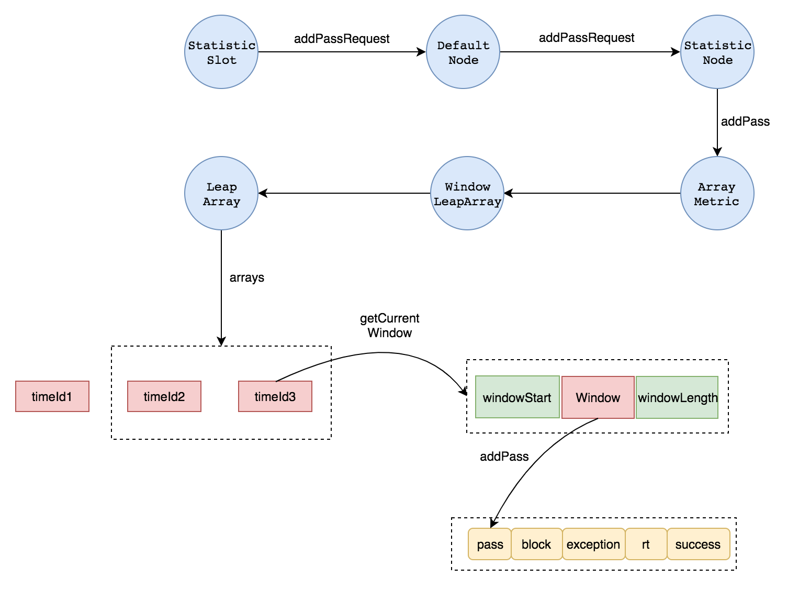
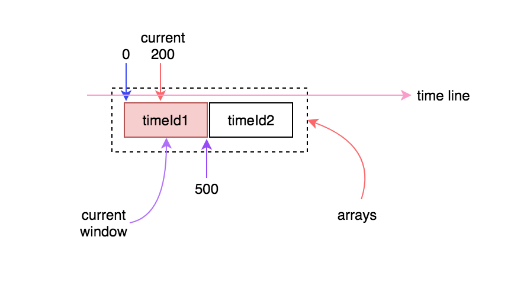
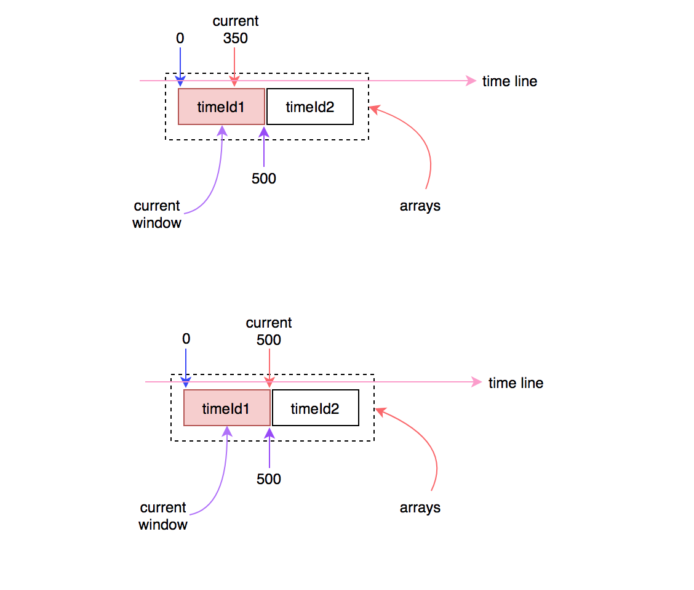
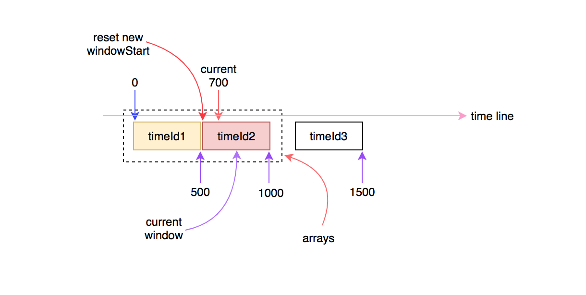
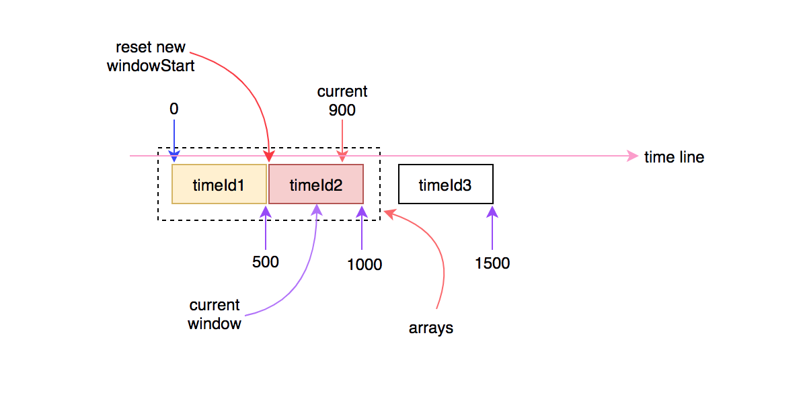
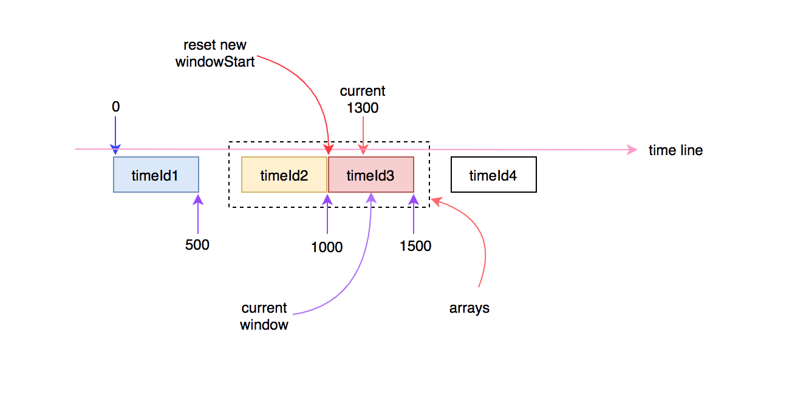

# Sentinel原理：滑动窗口

上篇文章中，我们了解了 Sentinel 是如何构造资源调用链的，以及每种Slot的具体作用，其中最重要的一个Slot非StatisticSlot莫属，因为他做的事是其他所有的Slot的基础。包括各种限流，熔断的规则，都是基于StatisticSlot统计出来的结果进行规则校验的。本篇文章我将深入研究下 Sentinel 是如何进行qps等指标的统计的，首先要确定的一点是，sentinel是基于滑动时间窗口来实现的。

我们已经知道了Slot是从第一个往后一直传递到最后一个的，且当信息传递到StatisticSlot时，这里就开始进行统计了，统计的结果又会被后续的Slot所采用，作为规则校验的依据。我们先来看一段非常熟悉的代码，就是StatisticSlot中的entry方法：

``` java
@Override
public void entry(Context context, ResourceWrapper resourceWrapper, DefaultNode node, int count, Object... args) throws Throwable {
    try {
        // 触发下一个Slot的entry方法
        fireEntry(context, resourceWrapper, node, count, args);
        // 如果能通过SlotChain中后面的Slot的entry方法，说明没有被限流或降级
        // 统计信息
        node.increaseThreadNum();
        node.addPassRequest();
        // 省略部分代码
    } catch (BlockException e) {
        context.getCurEntry().setError(e);
        // Add block count.
        node.increaseBlockedQps();
        // 省略部分代码
        throw e;
    } catch (Throwable e) {
        context.getCurEntry().setError(e);
        // Should not happen
        node.increaseExceptionQps();
        // 省略部分代码
        throw e;
    }
}
```

上面的代码注释写的已经很清晰了，简单的来说，StatisticSlot中就是做了三件事：

- 1.通过node中的当前的实时统计指标信息进行规则校验
- 2.如果通过了校验，则重新更新node中的实时指标数据
- 3.如果被block或出现了异常了，则重新更新node中block的指标或异常指标

从上面的代码中可以很清晰的看到，所有的实时指标的统计都是在node中进行的。这里我们拿qps的指标进行分析，看sentinel是怎么统计出qps的，这里可以事先透露下他是通过滑动时间窗口来统计的，而滑动窗口就是本篇文章的重点。

### DefaultNode和ClusterNode

我们可以看到 `node.addPassRequest()` 这段代码是在fireEntry执行之后执行的，这意味着，当前请求通过了sentinel的流控等规则，此时需要将当次请求记录下来，也就是执行  `node.addPassRequest()` 这行代码，现在我们进入这个代码看看。具体的代码如下所示：

``` java
@Override
public void addPassRequest() {
	super.addPassRequest();
	this.clusterNode.addPassRequest();
}
```

首先我们知道这里的node是一个 `DefaultNode` 实例，这里特别补充一个 `DefaultNode` 和 `ClusterNode` 的区别：

DefaultNode：保存着某个resource在某个context中的实时指标，每个DefaultNode都指向一个ClusterNode

ClusterNode：保存着某个resource在所有的context中实时指标的总和，同样的resource会共享同一个ClusterNode，不管他在哪个context中

### StatisticNode

好了，知道了他们的区别后，我们再来看上面的代码，其实都是执行的 `StatisticNode` 对象的 `addPassRequest` 方法。进入这个方法中看下具体的代码：

``` java

private transient Metric rollingCounterInSecond = new ArrayMetric(1000 / SampleCountProperty.sampleCount, IntervalProperty.INTERVAL);

private transient Metric rollingCounterInMinute = new ArrayMetric(1000, 2 * 60);

@Override
public void addPassRequest() {
    rollingCounterInSecond.addPass();
    rollingCounterInMinute.addPass();
}
```

### Metric

从代码中我们可以看到，具体的增加pass指标是通过一个叫 `Metric` 的接口进行操作的，并且是通过 `ArrayMetric` 这种实现类，现在我们在进入 `ArrayMetric` 中看一下。具体的代码如下所示：

``` java
private final WindowLeapArray data;

public ArrayMetric(int windowLength, int interval) {
    this.data = new WindowLeapArray(windowLength, interval);
}

@Override
public void addPass() {
    WindowWrap<Window> wrap = data.currentWindow();
    wrap.value().addPass();
}
```

### LeapArray和Window

本以为在ArrayMetric中应该可以看到具体的统计操作了，谁知道又出现了一个叫 `WindowLeapArray` 的类，不过从名字上看有点 **「窗口」** 的意思了。继续跟代码，发现 `wrap.value().addPass()` 是执行的 `wrap` 对象所包装的 `Window` 对象的 `addPass` 方法，这里就是最终的增加qps中q的值的地方了。进入 `Window` 类中看一下，具体的代码如下：

``` java
private final LongAdder pass = new LongAdder();
private final LongAdder block = new LongAdder();
private final LongAdder exception = new LongAdder();
private final LongAdder rt = new LongAdder();
private final LongAdder success = new LongAdder();

public void addPass() {
    pass.add(1L);
}
public void addException() {
    exception.add(1L);
}
public void addBlock() {
    block.add(1L);
}
public void addSuccess() {
    success.add(1L);
}
public void addRT(long rt) {
    this.rt.add(rt);

    // Not thread-safe, but it's okay.
    if (rt < minRt) {
        minRt = rt;
    }
}
```

看到这里是不是就放心了，原来 `Window` 是通过 `LongAdder` 来保存各种指标的值的，看到 `LongAdder` 是不是立刻就想到 `AtomicLong` 了？但是这里为什么不用 `AtomicLong` ，而是用 `LongAdder` 呢？主要是 `LongAdder` 在高并发下有更好的吞吐量，代价是花费了更多的空间，典型的以空间换时间。

## 完整的流程

分析到这里我们已经把指标统计的完整链路理清楚了，可以用下面这张图来表示整个过程：



有人可能会问了，你不是要分析滑动窗口的吗？搞了半天只画了一张图，而且图上还多了一个 `timeId` 之类的东西，这个根本没在上面出现过。

好了，现在我们就可以来分析具体的滑动窗口了，这里的 `timeId` 是用来表示一个 `WindowWrap` 对象的时间id。为什么要用 `timeId` 来表示呢？我们可以看到每一个 `WindowWrap` 对象由三个部分组成：

- **windowStart:** 时间窗口的开始时间，单位是毫秒
- **windowLength:** 时间窗口的长度，单位是毫秒
- **value:** 时间窗口的内容，在 `WindowWrap` 中是用泛型表示这个值的，但实际上就是 `Window` 类

我们先大致的了解下时间窗口的构成，后面会再来分析 **timeId** 的作用。首先一个时间窗口是用来在某个固定时间长度内保存一些统计值的虚拟概念。有了这个概念后，我们就可以通过时间窗口来计算统计一段时间内的诸如：qps，rt，threadNum等指标了。

## 继续深入

我们再回到 `ArrayMetric` 中看一下：

``` java
private final WindowLeapArray data;

public ArrayMetric(int windowLength, int interval) {
    this.data = new WindowLeapArray(windowLength, interval);
}
```

首先创建了一个 `WindowLeapArray` 对象，看一下  `WindowLeapArray`  类的代码：

```java
public class WindowLeapArray extends LeapArray<Window> {
	public WindowLeapArray(int windowLengthInMs, int intervalInSec) {
	    super(windowLengthInMs, intervalInSec);
	}
}  
```

该对象的构造方法有两个参数：

- `windowLengthInMs` ：一个用毫秒做单位的时间窗口的长度
-  `intervalInSec` ，一个用秒做单位的时间间隔，这个时间间隔具体是做什么的，下面会分析。

然后 `WindowLeapArray` 继承自  `LeapArray` ，在初始化  `WindowLeapArray`  的时候，直接调用了父类的构造方法，再来看一下父类  `LeapArray` 的代码：

``` java
public abstract class LeapArray<T> {

    // 时间窗口的长度
    protected int windowLength;
    // 采样窗口的个数
    protected int sampleCount;
    // 以毫秒为单位的时间间隔
    protected int intervalInMs;

    // 采样的时间窗口数组
    protected AtomicReferenceArray<WindowWrap<T>> array;

    /**
     * LeapArray对象
     * @param windowLength 时间窗口的长度，单位：毫秒
     * @param intervalInSec 统计的间隔，单位：秒
     */
    public LeapArray(int windowLength, int intervalInSec) {
        this.windowLength = windowLength;
        // 时间窗口的采样个数，默认为2个采样窗口
        this.sampleCount = intervalInSec * 1000 / windowLength;
        this.intervalInMs = intervalInSec * 1000;

        this.array = new AtomicReferenceArray<WindowWrap<T>>(sampleCount);
    }
}
```

可以很清晰的看出来在 `LeapArray` 中创建了一个 `AtomicReferenceArray` 数组，用来对时间窗口中的统计值进行采样。通过采样的统计值再计算出平均值，就是我们需要的最终的实时指标的值了。

可以看到我在上面的代码中通过注释，标明了默认采样的时间窗口的个数是2个，这个值是怎么得到的呢？我们回忆一下 `LeapArray` 对象创建，是通过在 `StatisticNode` 中，new了一个 `ArrayMetric` ，然后将参数一路往上传递后创建的：

``` java
private transient Metric rollingCounterInSecond = new ArrayMetric(1000 / SampleCountProperty.sampleCount,IntervalProperty.INTERVAL);
```

`SampleCountProperty.sampleCount` 的默认值是2，所以第一个参数 `windowLengthInMs` 的值是 500ms，那么1秒钟是1000ms，每个时间窗口的长度是500ms，也就是说总共分了两个采样的时间窗口。

现在继续回到 `ArrayMetric.addPass()` 方法：

``` java
@Override
public void addPass() {
    WindowWrap<Window> wrap = data.currentWindow();
    wrap.value().addPass();
}
```

### 获取当前Window

我们已经分析了 `wrap.value().addPass()` ，现在只需要分析清楚 `data.currentWindow()` 具体做了什么，拿到了当前时间窗口就可以 了。继续深入代码，最终定位到下面的代码：

``` java
@Override
public WindowWrap<Window> currentWindow(long time) {
    long timeId = time / windowLength;
    // Calculate current index.
    int idx = (int)(timeId % array.length());

    // Cut the time to current window start.
    long time = time - time % windowLength;

    while (true) {
        WindowWrap<Window> old = array.get(idx);
        if (old == null) {
            WindowWrap<Window> window = new WindowWrap<Window>(windowLength, time, new Window());
            if (array.compareAndSet(idx, null, window)) {
                return window;
            } else {
                Thread.yield();
            }
        } else if (time == old.windowStart()) {
            return old;
        } else if (time > old.windowStart()) {
            if (addLock.tryLock()) {
                try {
                    // if (old is deprecated) then [LOCK] resetTo currentTime.
                    return resetWindowTo(old, time);
                } finally {
                    addLock.unlock();
                }
            } else {
                Thread.yield();
            }
        } else if (time < old.windowStart()) {
            // Cannot go through here.
            return new WindowWrap<Window>(windowLength, time, new Window());
        }
    }
}
```

初次看到这段代码时，可能会觉得有点懵，但是细细的分析一下，实际可以把他分成以下几步：

- 1.根据当前时间，算出该时间的timeId，并根据timeId算出当前窗口在采样窗口数组中的索引idx
- 2.根据当前时间算出当前窗口的应该对应的开始时间time，以毫秒为单位
- 3.根据索引idx，在采样窗口数组中取得一个时间窗口old
- 4.循环判断知道获取到一个当前时间窗口
  - 4.1.如果old为空，则创建一个时间窗口，并将它插入到array的第idx个位置，array上面已经分析过了，是一个 `AtomicReferenceArray` 
  - 4.2.如果当前窗口的开始时间time与old的开始时间相等，那么说明old就是当前时间窗口，直接返回old
  - 4.3.如果当前窗口的开始时间time大于old的开始时间，则说明old窗口已经过时了，将old的开始时间更新为最新值：time，下个循环中会在步骤4.2中返回
  - 4.4.如果当前窗口的开始时间time小于old的开始时间，实际上这种情况是不可能存在的，因为time是当前时间，old是过去的一个时间

上面的代码有个比较容易混淆的地方，就是计算出来的当前时间窗口的开始时间，没有使用一个新的变量来表示，而是直接用time来表示。

另外timeId是会随着时间的增长而增加，当前时间每增长一个windowLength的长度，timeId就加1。但是idx不会增长，只会在0和1之间变换，因为array数组的长度是2，只有两个采样时间窗口。至于为什么默认只有两个采样窗口，个人觉得因为sentinel是比较轻量的框架。时间窗口中保存着很多统计数据，如果时间窗口过多的话，一方面会占用过多内存，另一方面时间窗口过多就意味着时间窗口的长度会变小，如果时间窗口长度变小，就会导致时间窗口过于频繁的滑动。

经过分析，加上注释，并将表示当前窗口开始时间的time变量，重命名成其他变量，使得代码更具可读性，调整后的代码如下：

``` java
@Override
public WindowWrap<Window> currentWindow(long time) {
    // time每增加一个windowLength的长度，timeId就会增加1，时间窗口就会往前滑动一个
    long timeId = time / windowLength;
    // Calculate current index.
    // idx被分成[0,arrayLength-1]中的某一个数，作为array数组中的索引
    int idx = (int)(timeId % array.length());

    // Cut the time to current window start.
    long currentWindowStart = time - time % windowLength;

    while (true) {
        // 从采样数组中根据索引获取缓存的时间窗口
        WindowWrap<Window> old = array.get(idx);
        // array数组长度不宜过大，否则old很多情况下都命中不了，就会创建很多个WindowWrap对象
        if (old == null) {
            // 如果没有获取到，则创建一个新的
            WindowWrap<Window> window = new WindowWrap<Window>(windowLength, currentWindowStart, new Window());
            // 通过CAS将新窗口设置到数组中去
            if (array.compareAndSet(idx, null, window)) {
                // 如果能设置成功，则将该窗口返回
                return window;
            } else {
                // 否则当前线程让出时间片，等待
                Thread.yield();
            }
        // 如果当前窗口的开始时间与old的开始时间相等，则直接返回old窗口
        } else if (currentWindowStart == old.windowStart()) {
            return old;
        // 如果当前时间窗口的开始时间已经超过了old窗口的开始时间，则放弃old窗口
        // 并将time设置为新的时间窗口的开始时间，此时窗口向前滑动
        } else if (currentWindowStart > old.windowStart()) {
            if (addLock.tryLock()) {
                try {
                    // if (old is deprecated) then [LOCK] resetTo currentTime.
                    return resetWindowTo(old, currentWindowStart);
                } finally {
                    addLock.unlock();
                }
            } else {
                Thread.yield();
            }
        // 这个条件不可能存在
        } else if (currentWindowStart < old.windowStart()) {
            // Cannot go through here.
            return new WindowWrap<Window>(windowLength, currentWindowStart, new Window());
        }
    }
}
```

### 图解窗口滑动的过程

为了更好的理解，下面我用几幅图来描述下这个过程。



初始的时候arrays数组中只有一个窗口(可能是第一个，也可能是第二个)，每个时间窗口的长度是500ms，这就意味着只要当前时间与时间窗口的差值在500ms之内，时间窗口就不会向前滑动。例如，假如当前时间走到300或者500时，当前时间窗口仍然是相同的那个：



时间继续往前走，当超过500ms时，时间窗口就会向前滑动到下一个，这时就会更新当前窗口的开始时间：



时间继续往前走，只要不超过1000ms，则当前窗口不会发生变化：



当时间继续往前走，当前时间超过1000ms时，就会再次进入下一个时间窗口，此时arrays数组中的窗口将会有一个失效，会有另一个新的窗口进行替换：



以此类推随着时间的流逝，时间窗口也在发生变化，在当前时间点中进入的请求，会被统计到当前时间对应的时间窗口中。计算qps时，会用当前采样的时间窗口中对应的指标统计值除以时间间隔，就是具体的qps。具体的代码在StatisticNode中：

``` java
@Override
public long totalQps() {
    return passQps() + blockedQps();
}

@Override
public long blockedQps() {
    return rollingCounterInSecond.block() / IntervalProperty.INTERVAL;
}

@Override
public long passQps() {
    return rollingCounterInSecond.pass() / IntervalProperty.INTERVAL;
}
```

到这里就基本上把滑动窗口的原理分析清楚了，还有不清楚的地方，最好能够借助代码继续分析下，最好的做法就是debug，这里贴一下笔者在分析 `currentWindow` 方法时采取的测试代码：

``` java
public static void main(String[] args) throws InterruptedException {
    int windowLength = 500;
    int arrayLength = 2;
    calculate(windowLength,arrayLength);

    Thread.sleep(100);
    calculate(windowLength,arrayLength);

    Thread.sleep(200);
    calculate(windowLength,arrayLength);

    Thread.sleep(200);
    calculate(windowLength,arrayLength);

    Thread.sleep(500);
    calculate(windowLength,arrayLength);

    Thread.sleep(500);
    calculate(windowLength,arrayLength);

    Thread.sleep(500);
    calculate(windowLength,arrayLength);

    Thread.sleep(500);
    calculate(windowLength,arrayLength);

    Thread.sleep(500);
    calculate(windowLength,arrayLength);
}

private static void calculate(int windowLength,int arrayLength){
    long time = System.currentTimeMillis();
    long timeId = time/windowLength;
    long currentWindowStart = time - time % windowLength;
    int idx = (int)(timeId % arrayLength);
	System.out.println("time="+time+",currentWindowStart="+currentWindowStart+",timeId="+timeId+",idx="+idx);
}
```

这里假设时间窗口的长度为500ms，数组的大小为2，当前时间作为输入参数，计算出当前时间窗口的timeId、windowStart、idx等值。执行上面的代码后，将打印出如下的结果：

``` java
time=1540629334619,currentWindowStart=1540629334500,timeId=3081258669,idx=1
time=1540629334721,currentWindowStart=1540629334500,timeId=3081258669,idx=1
time=1540629334924,currentWindowStart=1540629334500,timeId=3081258669,idx=1
time=1540629335129,currentWindowStart=1540629335000,timeId=3081258670,idx=0
time=1540629335633,currentWindowStart=1540629335500,timeId=3081258671,idx=1
time=1540629336137,currentWindowStart=1540629336000,timeId=3081258672,idx=0
time=1540629336641,currentWindowStart=1540629336500,timeId=3081258673,idx=1
time=1540629337145,currentWindowStart=1540629337000,timeId=3081258674,idx=0
time=1540629337649,currentWindowStart=1540629337500,timeId=3081258675,idx=1
```

可以看出来，windowStart每增加500ms，timeId就加1，这时就是时间窗口发生滑动的时候。


