# Sentinel原理：调用链

我们已经知道了 Sentinel 实现限流降级的原理，其核心就是一堆 Slot 组成的调用链。

每个Slot执行完业务逻辑处理后，会调用fireEntry()方法，该方法将会触发下一个节点的entry方法，下一个节点又会调用他的fireEntry，以此类推直到最后一个Slot，由此就形成了sentinel的责任链。

这里大概的介绍下每种Slot的功能职责：

- `NodeSelectorSlot` 负责收集资源的路径，并将这些资源的调用路径，以树状结构存储起来，用于根据调用路径来限流降级；
- `ClusterBuilderSlot` 则用于存储资源的统计信息以及调用者信息，例如该资源的 RT, QPS, thread count 等等，这些信息将用作为多维度限流，降级的依据；
- `StatistcSlot` 则用于记录，统计不同维度的 runtime 信息；
- `SystemSlot` 则通过系统的状态，例如 load1 等，来控制总的入口流量；
- `AuthoritySlot` 则根据黑白名单，来做黑白名单控制；
- `FlowSlot` 则用于根据预设的限流规则，以及前面 slot 统计的状态，来进行限流；
- `DegradeSlot` 则通过统计信息，以及预设的规则，来做熔断降级；


下面我们就来详细研究下这些Slot的原理。

## NodeSelectorSlot

`NodeSelectorSlot` 是用来构造调用链的，具体的是将资源的调用路径，封装成一个一个的节点，再组成一个树状的结构来形成一个完整的调用链，`NodeSelectorSlot `是所有Slot中最关键也是最复杂的一个Slot，这里涉及到以下几个核心的概念：

- Resource 

资源是 Sentinel 的关键概念。它可以是 Java 应用程序中的任何内容，例如，由应用程序提供的服务，或由应用程序调用的其它服务，甚至可以是一段代码。

只要通过 Sentinel API 定义的代码，就是资源，能够被 Sentinel 保护起来。大部分情况下，可以使用方法签名，URL，甚至服务名称作为资源名来标示资源。

简单来说，资源就是 Sentinel 用来保护系统的一个媒介。源码中用来包装资源的类是：`com.alibaba.csp.sentinel.slotchain.ResourceWrapper`，他有两个子类：`StringResourceWrapper` 和 `MethodResourceWrapper`，通过名字就知道可以将一段字符串或一个方法包装为一个资源。

打个比方，我有一个服务A，请求非常多，经常会被陡增的流量冲垮，为了防止这种情况，简单的做法，我们可以定义一个 Sentinel 的资源，通过该资源来对请求进行调整，使得允许通过的请求不会把服务A搞崩溃。

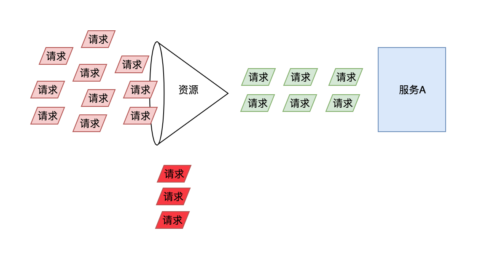

每个资源的状态也是不同的，这取决于资源后端的服务，有的资源可能比较稳定，有的资源可能不太稳定。那么在整个调用链中，Sentinel 需要对不稳定资源进行控制。当调用链路中某个资源出现不稳定，例如，表现为 timeout，或者异常比例升高的时候，则对这个资源的调用进行限制，并让请求快速失败，避免影响到其它的资源，最终导致雪崩的后果。

- Context

上下文是一个用来保存调用链当前状态的元数据的类，每次进入一个资源时，就会创建一个上下文。**相同的资源名可能会创建多个上下文。**一个Context中包含了三个核心的对象：

1）当前调用链的根节点：EntranceNode

2）当前的入口：Entry

3）当前入口所关联的节点：Node

上下文中只会保存一个当前正在处理的入口Entry，另外还会保存调用链的根节点。**需要注意的是，每次进入一个新的资源时，都会创建一个新的上下文。**

- Entry

每次调用 `SphU#entry()` 都会生成一个Entry入口，该入口中会保存了以下数据：入口的创建时间，当前入口所关联的节点，当前入口所关联的调用源对应的节点。Entry是一个抽象类，他只有一个实现类，在CtSph中的一个静态类：CtEntry

- Node

节点是用来保存某个资源的各种实时统计信息的，他是一个接口，通过访问节点，就可以获取到对应资源的实时状态，以此为依据进行限流和降级操作。

可能看到这里，大家还是比较懵，这么多类到底有什么用，接下来就让我们更进一步，挖掘一下这些类的作用，在这之前，我先给大家展示一下他们之间的关系，如下图所示：

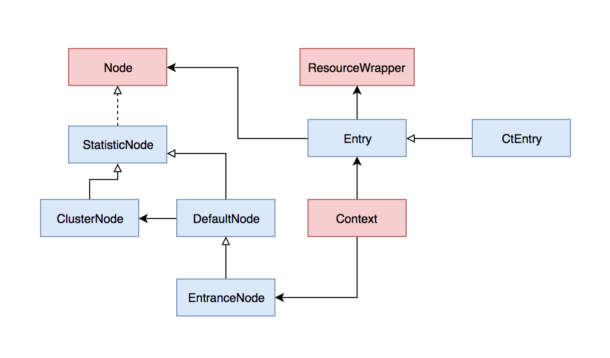

这里把几种Node的作用先大概介绍下：

| 节点          | 作用                                                         |
| ------------- | ------------------------------------------------------------ |
| StatisticNode | 执行具体的资源统计操作                                       |
| DefaultNode   | 该节点持有指定上下文中指定资源的统计信息，当在同一个上下文中多次调用entry方法时，该节点可能下会创建有一系列的子节点。<br />另外每个DefaultNode中会关联一个ClusterNode |
| ClusterNode   | 该节点中保存了资源的总体的运行时统计信息，包括rt，线程数，qps等等，相同的资源会全局共享同一个ClusterNode，不管他属于哪个上下文 |
| EntranceNode  | 该节点表示一棵调用链树的入口节点，通过他可以获取调用链树中所有的子节点 |


### Context的创建与销毁

首先我们要清楚的一点就是，每次执行entry()方法，试图冲破一个资源时，都会生成一个上下文。这个上下文中会保存着调用链的根节点和当前的入口。

Context是通过ContextUtil创建的，具体的方法是trueEnter，代码如下：

``` java
protected static Context trueEnter(String name, String origin) {
    // 先从ThreadLocal中获取
    Context context = contextHolder.get();
    if (context == null) {
        // 如果ThreadLocal中获取不到Context
        // 则根据name从map中获取根节点，只要是相同的资源名，就能直接从map中获取到node
        Map<String, DefaultNode> localCacheNameMap = contextNameNodeMap;
        DefaultNode node = localCacheNameMap.get(name);
        if (node == null) {
            // 省略部分代码
            try {
                LOCK.lock();
                node = contextNameNodeMap.get(name);
                if (node == null) {
                    // 省略部分代码
                    // 创建一个新的入口节点
                    node = new EntranceNode(new StringResourceWrapper(name, EntryType.IN), null);
                    Constants.ROOT.addChild(node);
                    // 省略部分代码
                }
            } finally {
                LOCK.unlock();
            }
        }
        // 创建一个新的Context，并设置Context的根节点，即设置EntranceNode
        context = new Context(node, name);
        context.setOrigin(origin);
        // 将该Context保存到ThreadLocal中去
        contextHolder.set(context);
    }
    return context;
}
```

上面的代码中我省略了部分代码，只保留了核心的部分。从源码中还是可以比较清晰的看出生成Context的过程：

- 1.先从ThreadLocal中获取，如果能获取到直接返回，如果获取不到则继续第2步
- 2.从一个static的map中根据上下文的名称获取，如果能获取到则直接返回，否则继续第3步
- 3.加锁后进行一次double check，如果还是没能从map中获取到，则创建一个EntranceNode，并把该EntranceNode添加到一个全局的ROOT节点中去，然后将该节点添加到map中去(这部分代码在上述代码中省略了)
- 4.根据EntranceNode创建一个上下文，并将该上下文保存到ThreadLocal中去，下一个请求可以直接获取

那保存在ThreadLocal中的上下文什么时候会清除呢？从代码中可以看到具体的清除工作在ContextUtil的exit方法中，当执行该方法时，会将保存在ThreadLocal中的context对象清除，具体的代码非常简单，这里就不贴代码了。

那ContextUtil.exit方法什么时候会被调用呢？有两种情况：一是主动调用ContextUtil.exit的时候，二是当一个入口Entry要退出，执行该Entry的trueExit方法的时候，此时会触发ContextUtil.exit的方法。但是有一个前提，就是当前Entry的父Entry为null时，此时说明该Entry已经是最顶层的根节点了，可以清除context。

### 调用链树

当在一个上下文中多次调用了 SphU#entry() 方法时，就会创建一棵调用链树。具体的代码在entry方法中创建CtEntry对象时：

``` java
CtEntry(ResourceWrapper resourceWrapper, ProcessorSlot<Object> chain, Context context) {
    super(resourceWrapper);
    this.chain = chain;
    this.context = context;
    // 获取「上下文」中上一次的入口
    parent = context.getCurEntry();
    if (parent != null) {
        // 然后将当前入口设置为上一次入口的子节点
        ((CtEntry)parent).child = this;
    }
    // 设置「上下文」的当前入口为该类本身
    context.setCurEntry(this);
}
```

这里可能看代码没有那么直观，可以用一些图形来描述一下这个过程。

#### 构造树干

##### 创建context

context的创建在上面已经分析过了，初始化的时候，context中的curEntry属性是没有值的，如下图所示：

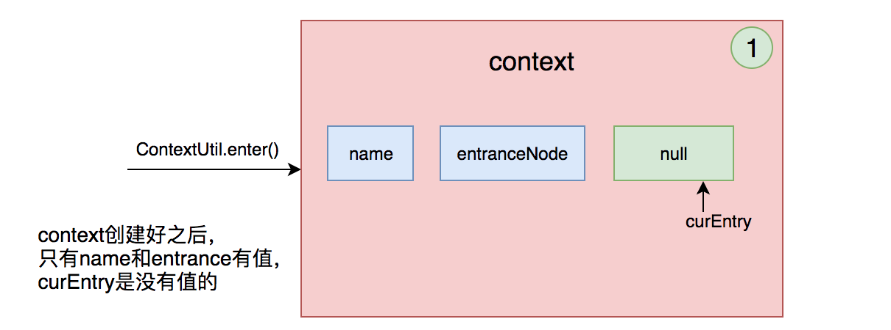

##### 创建Entry

每创建一个新的Entry对象时，都会重新设置context的curEntry，并将context原来的curEntry设置为该新Entry对象的父节点，如下图所示：

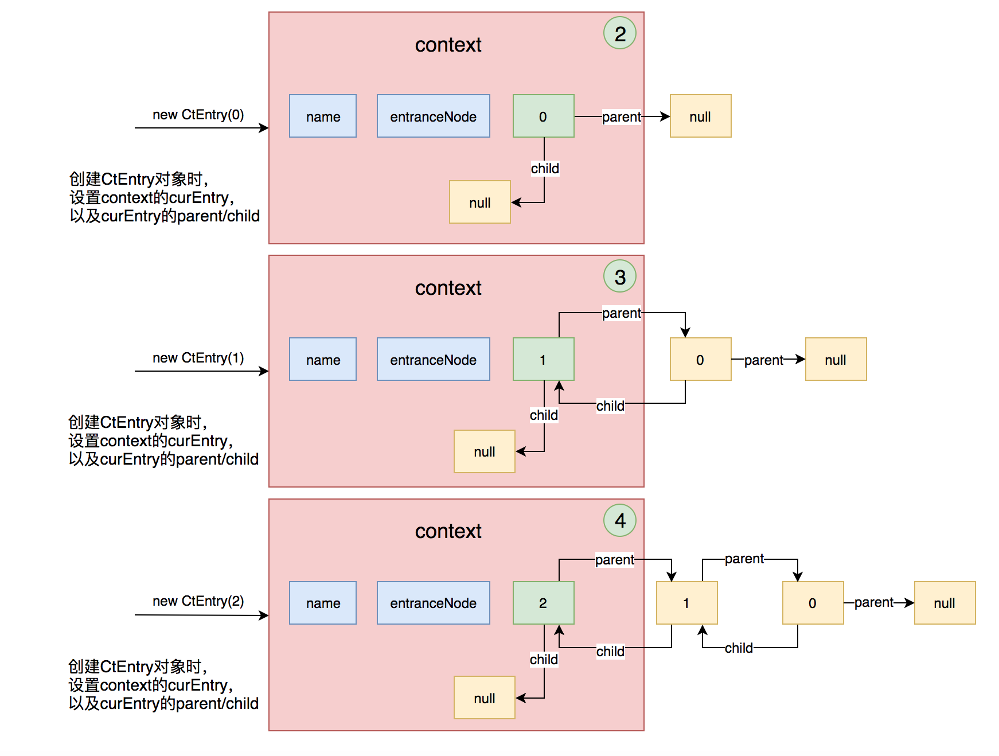


##### 退出Entry

某个Entry退出时，将会重新设置context的curEntry，当该Entry是最顶层的一个入口时，将会把ThreadLocal中保存的context也清除掉，如下图所示：

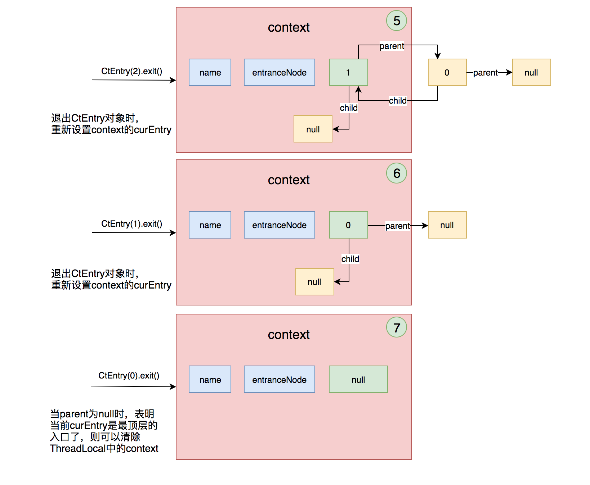

#### 构造叶子节点

上面的过程是构造了一棵调用链的树，但是这棵树只有树干，没有叶子，那叶子节点是在什么时候创建的呢？DefaultNode就是叶子节点，在叶子节点中保存着目标资源在当前状态下的统计信息。通过分析，我们知道了叶子节点是在NodeSelectorSlot的entry方法中创建的。具体的代码如下：

``` java
@Override
public void entry(Context context, ResourceWrapper resourceWrapper, Object obj, int count, Object... args) throws Throwable {
    // 根据「上下文」的名称获取DefaultNode
    // 多线程环境下，每个线程都会创建一个context，
    // 只要资源名相同，则context的名称也相同，那么获取到的节点就相同
    DefaultNode node = map.get(context.getName());
    if (node == null) {
        synchronized (this) {
            node = map.get(context.getName());
            if (node == null) {
                // 如果当前「上下文」中没有该节点，则创建一个DefaultNode节点
                node = Env.nodeBuilder.buildTreeNode(resourceWrapper, null);
                // 省略部分代码
            }
            // 将当前node作为「上下文」的最后一个节点的子节点添加进去
            // 如果context的curEntry.parent.curNode为null，则添加到entranceNode中去
            // 否则添加到context的curEntry.parent.curNode中去
            ((DefaultNode)context.getLastNode()).addChild(node);
        }
    }
    // 将该节点设置为「上下文」中的当前节点
    // 实际是将当前节点赋值给context中curEntry的curNode
    // 在Context的getLastNode中会用到在此处设置的curNode
    context.setCurNode(node);
    fireEntry(context, resourceWrapper, node, count, args);
}
```

上面的代码可以分解成下面这些步骤：
1）获取当前上下文对应的DefaultNode，如果没有的话会为当前的调用新生成一个DefaultNode节点，它的作用是对资源进行各种统计度量以便进行流控；
2）将新创建的DefaultNode节点，添加到context中，作为「entranceNode」或者「curEntry.parent.curNode」的子节点；
3）将DefaultNode节点，添加到context中，作为「curEntry」的curNode。

上面的第2步，不是每次都会执行。我们先看第3步，把当前DefaultNode设置为context的curNode，实际上是把当前节点赋值给context中curEntry的curNode，用图形表示就是这样：

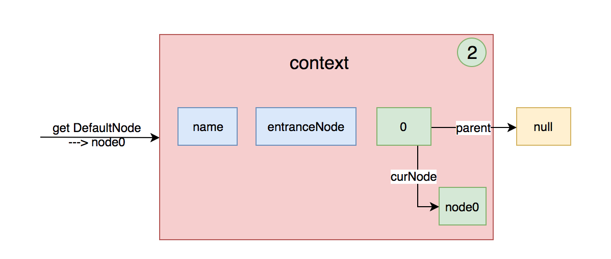

多次创建不同的Entry，并且执行NodeSelectorSlot的entry方法后，就会变成这样一棵调用链树：

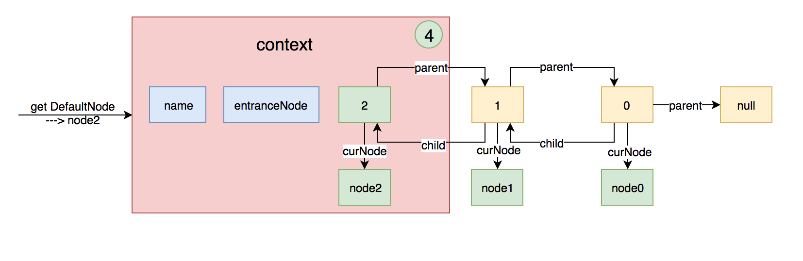

**PS：这里图中的node0，node1，node2可能是相同的node，因为在同一个context中从map中获取的node是同一个，这里只是为了表述的更清楚所以用了不同的节点名。**

##### 保存子节点

上面已经分析了叶子节点的构造过程，叶子节点是保存在各个Entry的curNode属性中的。

我们知道context中只保存了入口节点和当前Entry，那子节点是什么时候保存的呢，其实子节点就是上面代码中的第2步中保存的。

下面我们来分析上面的第2步的情况：

第一次调用NodeSelectorSlot的entry方法时，map中肯定是没有DefaultNode的，那就会进入第2步中，创建一个node，创建完成后会把该节点加入到context的lastNode的子节点中去。我们先看一下context的getLastNode方法：

``` java
public Node getLastNode() {
    // 如果curEntry不存在时，返回entranceNode
    // 否则返回curEntry的lastNode，
    // 需要注意的是curEntry的lastNode是获取的parent的curNode，
    // 如果每次进入的资源不同，就会每次都创建一个CtEntry，则parent为null，
    // 所以curEntry.getLastNode()也为null
    if (curEntry != null && curEntry.getLastNode() != null) {
        return curEntry.getLastNode();
    } else {
        return entranceNode;
    }
}
```

代码中我们可以知道，lastNode的值可能是context中的entranceNode也可能是curEntry.parent.curNode，但是他们都是「DefaultNode」类型的节点，DefaultNode的所有子节点是保存在一个HashSet中的。

第一次调用getLastNode方法时，context中curEntry是null，因为curEntry是在第3步中才赋值的。所以，lastNode最初的值就是context的entranceNode。那么将node添加到entranceNode的子节点中去之后就变成了下面这样：

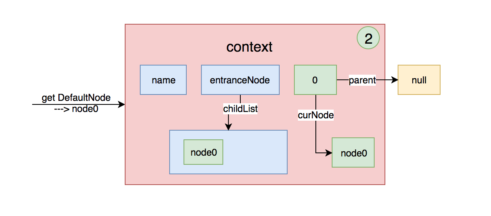

紧接着再进入一次，资源名不同，会再次生成一个新的Entry，上面的图形就变成下图这样：

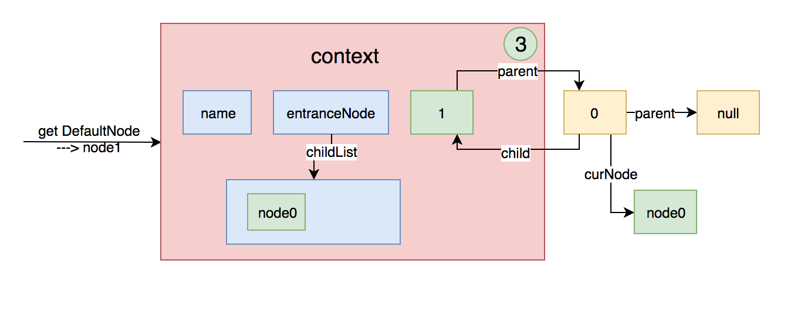

此时再次调用context的getLastNode方法，因为此时curEntry的parent不再是null了，所以获取到的lastNode是curEntry.parent.curNode，在上图中可以很方便的看出，这个节点就是**node0**。那么把当前节点node1添加到lastNode的子节点中去，上面的图形就变成下图这样：

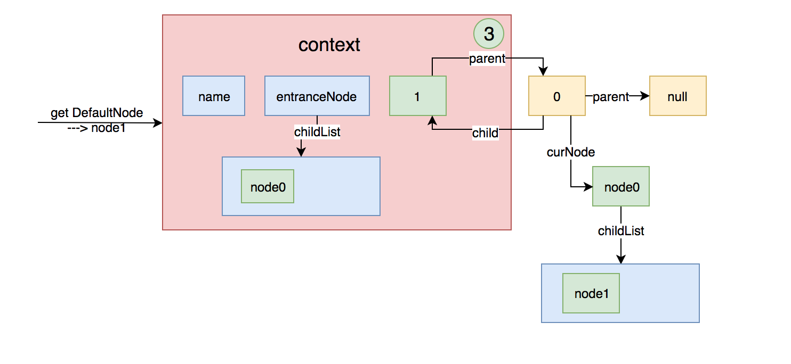

然后将当前node设置给context的curNode，上面的图形就变成下图这样：

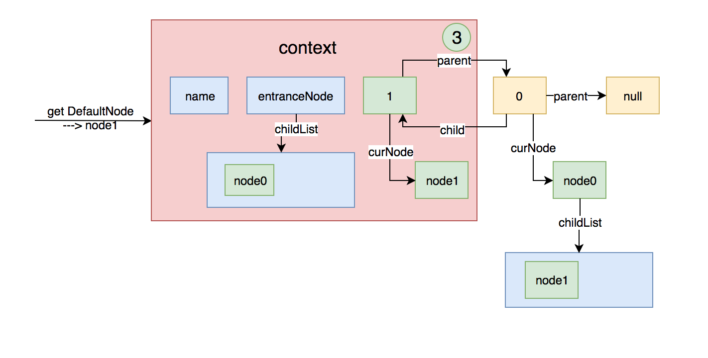

假如再创建一个Entry，然后再进入一次不同的资源名，上面的图就变成下面这样：

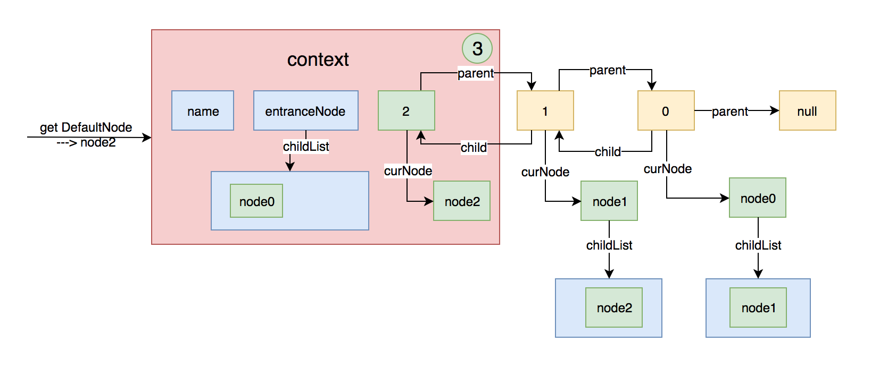

至此NodeSelectorSlot的基本功能已经大致分析清楚了。

**PS：以上的分析是基于每次执行SphU.entry(name)时，资源名都是不一样的前提下。如果资源名都一样的话，那么生成的node都相同，则只会再第一次把node加入到entranceNode的子节点中去，其他的时候，只会创建一个新的Entry，然后替换context中的curEntry的值。**

## ClusterBuilderSlot

NodeSelectorSlot的entry方法执行完之后，会调用fireEntry方法，此时会触发ClusterBuilderSlot的entry方法。

ClusterBuilderSlot的entry方法比较简单，具体代码如下：

``` java
@Override
public void entry(Context context, ResourceWrapper resourceWrapper, DefaultNode node, int count, Object... args) throws Throwable {
    if (clusterNode == null) {
        synchronized (lock) {
            if (clusterNode == null) {
                // Create the cluster node.
                clusterNode = Env.nodeBuilder.buildClusterNode();
                // 将clusterNode保存到全局的map中去
                HashMap<ResourceWrapper, ClusterNode> newMap = new HashMap<ResourceWrapper, ClusterNode>(16);
                newMap.putAll(clusterNodeMap);
                newMap.put(node.getId(), clusterNode);

                clusterNodeMap = newMap;
            }
        }
    }
    // 将clusterNode塞到DefaultNode中去
    node.setClusterNode(clusterNode);

    // 省略部分代码

    fireEntry(context, resourceWrapper, node, count, args);
}
```

NodeSelectorSlot的职责比较简单，主要做了两件事：

一、为每个资源创建一个clusterNode，然后把clusterNode塞到DefaultNode中去

二、将clusterNode保持到全局的map中去，用资源作为map的key

**PS：一个资源只有一个ClusterNode，但是可以有多个DefaultNode**

## StatistcSlot

StatisticSlot负责来统计资源的实时状态，具体的代码如下：

``` java
@Override
public void entry(Context context, ResourceWrapper resourceWrapper, DefaultNode node, int count, Object... args) throws Throwable {
    try {
        // 触发下一个Slot的entry方法
        fireEntry(context, resourceWrapper, node, count, args);
        // 如果能通过SlotChain中后面的Slot的entry方法，说明没有被限流或降级
        // 统计信息
        node.increaseThreadNum();
        node.addPassRequest();
        // 省略部分代码
    } catch (BlockException e) {
        context.getCurEntry().setError(e);
        // Add block count.
        node.increaseBlockedQps();
        // 省略部分代码
        throw e;
    } catch (Throwable e) {
        context.getCurEntry().setError(e);
        // Should not happen
        node.increaseExceptionQps();
        // 省略部分代码
        throw e;
    }
}

@Override
public void exit(Context context, ResourceWrapper resourceWrapper, int count, Object... args) {
    DefaultNode node = (DefaultNode)context.getCurNode();
    if (context.getCurEntry().getError() == null) {
        long rt = TimeUtil.currentTimeMillis() - context.getCurEntry().getCreateTime();
        if (rt > Constants.TIME_DROP_VALVE) {
            rt = Constants.TIME_DROP_VALVE;
        }
        node.rt(rt);
        // 省略部分代码
        node.decreaseThreadNum();
		// 省略部分代码
    } 
    fireExit(context, resourceWrapper, count);
}
```

代码分成了两部分，第一部分是entry方法，该方法首先会触发后续slot的entry方法，即SystemSlot、FlowSlot、DegradeSlot等的规则，如果规则不通过，就会抛出BlockException，则会在node中统计被block的数量。反之会在node中统计通过的请求数和线程数等信息。第二部分是在exit方法中，当退出该Entry入口时，会统计rt的时间，并减少线程数。

这些统计的实时数据会被后续的校验规则所使用，具体的统计方式是通过 `滑动窗口` 来实现的。后面我会详细分析滑动窗口的原理。

## SystemSlot

SystemSlot就是根据总的请求统计信息，来做流控，主要是防止系统被搞垮，具体的代码如下：

``` java
@Override
public void entry(Context context, ResourceWrapper resourceWrapper, DefaultNode node, int count, Object... args)
    throws Throwable {
    SystemRuleManager.checkSystem(resourceWrapper);
    fireEntry(context, resourceWrapper, node, count, args);
}

public static void checkSystem(ResourceWrapper resourceWrapper) throws BlockException {
    // 省略部分代码
    // total qps
    double currentQps = Constants.ENTRY_NODE.successQps();
    if (currentQps > qps) {
        throw new SystemBlockException(resourceWrapper.getName(), "qps");
    }
    // total thread
    int currentThread = Constants.ENTRY_NODE.curThreadNum();
    if (currentThread > maxThread) {
        throw new SystemBlockException(resourceWrapper.getName(), "thread");
    }
    double rt = Constants.ENTRY_NODE.avgRt();
    if (rt > maxRt) {
        throw new SystemBlockException(resourceWrapper.getName(), "rt");
    }
    // 完全按照RT,BBR算法来
    if (highestSystemLoadIsSet && getCurrentSystemAvgLoad() > highestSystemLoad) {
        if (currentThread > 1 &&
            currentThread > Constants.ENTRY_NODE.maxSuccessQps() * Constants.ENTRY_NODE.minRt() / 1000) {
            throw new SystemBlockException(resourceWrapper.getName(), "load");
        }
    }
}
```

其中的Constants.ENTRY_NODE是一个全局的ClusterNode，该节点的值是在StatisticsSlot中进行统计的。

## AuthoritySlot

AuthoritySlot做的事也比较简单，主要是根据黑白名单进行过滤，只要有一条规则校验不通过，就抛出异常。

``` java
@Override
public void entry(Context context, ResourceWrapper resourceWrapper, DefaultNode node, int count, Object... args) throws Throwable {
    AuthorityRuleManager.checkAuthority(resourceWrapper, context, node, count);
    fireEntry(context, resourceWrapper, node, count, args);
}

public static void checkAuthority(ResourceWrapper resource, Context context, DefaultNode node, int count) throws BlockException {
    if (authorityRules == null) {
        return;
    }
    // 根据资源名称获取相应的规则
    List<AuthorityRule> rules = authorityRules.get(resource.getName());
    if (rules == null) {
        return;
    }
    for (AuthorityRule rule : rules) {
        // 只要有一条规则校验不通过，就抛出AuthorityException
        if (!rule.passCheck(context, node, count)) {
            throw new AuthorityException(context.getOrigin());
        }
    }
}
```

## FlowSlot

FlowSlot主要是根据前面统计好的信息，与设置的限流规则进行匹配校验，如果规则校验不通过则进行限流，具体的代码如下：

``` java
@Override
public void entry(Context context, ResourceWrapper resourceWrapper, DefaultNode node, int count, Object... args) throws Throwable {
    FlowRuleManager.checkFlow(resourceWrapper, context, node, count);
    fireEntry(context, resourceWrapper, node, count, args);
}

public static void checkFlow(ResourceWrapper resource, Context context, DefaultNode node, int count) throws BlockException {
    List<FlowRule> rules = flowRules.get(resource.getName());
    if (rules != null) {
        for (FlowRule rule : rules) {
            if (!rule.passCheck(context, node, count)) {
                throw new FlowException(rule.getLimitApp());
            }
        }
    }
}
```

## DegradeSlot

DegradeSlot主要是根据前面统计好的信息，与设置的降级规则进行匹配校验，如果规则校验不通过则进行降级，具体的代码如下：

``` java
@Override
public void entry(Context context, ResourceWrapper resourceWrapper, DefaultNode node, int count, Object... args) throws Throwable {
    DegradeRuleManager.checkDegrade(resourceWrapper, context, node, count);
    fireEntry(context, resourceWrapper, node, count, args);
}

public static void checkDegrade(ResourceWrapper resource, Context context, DefaultNode node, int count) throws BlockException {
    List<DegradeRule> rules = degradeRules.get(resource.getName());
    if (rules != null) {
        for (DegradeRule rule : rules) {
            if (!rule.passCheck(context, node, count)) {
                throw new DegradeException(rule.getLimitApp());
            }
        }
    }
}
```

## 总结

sentinel的限流降级等功能，主要是通过一个SlotChain实现的。在链式插槽中，有7个核心的Slot，这些Slot各司其职，可以分为以下几种类型：

一、进行资源调用路径构造的NodeSelectorSlot和ClusterBuilderSlot

二、进行资源的实时状态统计的StatisticsSlot

三、进行系统保护，限流，降级等规则校验的SystemSlot、AuthoritySlot、FlowSlot、DegradeSlot

后面几个Slot依赖于前面几个Slot统计的结果。至此，每种Slot的功能已经基本分析清楚了。

